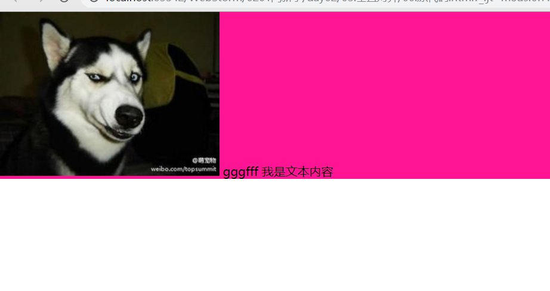

[TOC]

# inline-block元素问题and 解决方案

## 1.0 常见的 inline-block 元素

```js
<!--
    inline-block本身有哪些问题:
    	- 布局时, 容易出现底部 缝隙  和  左右缝隙问题. (可以通过img 元素来观察)
        img, input, button,  video, audio, canvas
    inline-block 元素处理的时候, 可以当做 inline 元素处理,即可以当做文字处理.
-->
```


## 1.1  inline-block 元素缝隙问题 and 原理

> **原理:**  因为 inline-block 元素是 行内块儿元素, 通常也说是 inline 行内元素. 在处理 inline-block 元素的时候, 通常会把 inline-block 元素 当做 inline 元素处理, 即可以当做 文字处理. **而浏览器是有 默认字体和行高的,并且行高和字体会有一个比例问题,  inline-block 元素的底部缝隙其实就是文本字体的行高的下半部分. 因此会出现inline-block 的底部缝隙这个问题.** 
>
> 1. 当 inline-block 元素 和 文本元素同时布局的时候,  inline-block 元素默认是与 文字的 基线对齐的. 所以会出现 inline-block 元素的底部会有一个 缝隙. 从而影响到布局样式的美观性. (最常见 img 元素可以看到)
> 2.  **会出现的问题如下代码 和 图例演示:** 

> **默认未处理之前的代码:**

```js
<head>
    <meta charset="UTF-8">
    <title>probeGene</title>
    <style>
        * {
            margin: 0;
            padding: 0;
        }
        #box {
            background-color: deeppink;
        }
        img {

        }
    </style>
</head>
<body>

<div id="box">
    
    gggfff 我是文本内容
</div>
</body>
```

> **会出现的问题图示:**



## 1.2 解决方案:

### 1.2.1 方案一: 通过设置行高来解决

> **下边代码中:**  line-height 16 和 0 两种写法都可以, 但是 写 16 的时候还是会有一个 浏览器最小字体的影响, 有一点点儿小间隙 

```js
<style>
        * {
            margin: 0;
            padding: 0;
        }
        #box {
            background-color: deeppink;
			 /* 底部缝隙处理方案 1*/
            /* line-height: 16px; /* 16  和 0 两种写法都可以 */
            line-height: 0;  
        }
        img {

        }
    </style>
</head>
<body>

<div id="box">
    
    gggfff 我是文本内容
</div>
```

### 1.2.2 方案二: 通过 设置字体为 0 来实现

> **给当前父元素设置 font-size 为 0.**

> **原理:** 字体为 0 时 , 行高 乘以 字体0, 就没有了行高, 因此就不会因为行高而出现底部缝隙问题.
>
> **代码块如下:**

```js
<head>
    <meta charset="UTF-8">
    <title>probeGene</title>
    <style>
        * {
            margin: 0;
            padding: 0;
        }
        #box {
            background-color: deeppink;
            font-size: 0;
        }
        img {

        }
    </style>
</head>
<body>
<div id="box">
    
    gggfff 我是文本内容
</div>
</body>
```

### 1.2.3 方案三: 给当前 inline-block 元素浮动

> ```
> 给当前 inline=-block 自身元素设置 浮动
> 然后解决 浮动之后的高度塌陷问题.
> ```

> **代码实现:** 

```js
<head>
    <meta charset="UTF-8">
    <title>probeGene</title>
    <style>
        * {
            margin: 0;
            padding: 0;
        }
        #box {
            background-color: deeppink;
        }
        img {
            float: left;
        }
        .clearfix:after {
            content: '';
            display: block;
            clear: both;
        }
    </style>
</head>
<body>
<div id="box" class="clearfix">
    
    gggfff 我是文本内容
</div>
</body>
```

### 1.2.4 方案四: 通过给 inline-block元素设置样式

1. **注意: vertical-align 这个属性必须给 inline-block 元素设置** 

> **所以在 用的时候, 通常如下两句样式  同时书写:**
>
> ```js
> display: inline-block;
> vertical-align: bottom;
> ```

2. **vertical-align: 的值的几种用法:** 

> ```js
> /*display: inline-block;*/
> /*vertical-align: baseline; !* 基线*!*/
> /*vertical-align: bottom;   !* 底线 *!*/
> /*vertical-align: top;    !* 文字和inline-block 顶部对齐*!*/
> /*vertical-align: middle;  !* 图片与文字垂直对齐 *!*/
> ```

>**核心样式:** 
>
>```js
>/* 这两个属性要一块儿记, 用的时候最好一块儿写, 避免其他元素转换 inline-block 元素忘记转换而出问题 */
>
>display: inline-block;
>vertical-align: baseline;
>```

> **代码实现:** 

```js
<head>
    <meta charset="UTF-8">
    <title>probeGene</title>
    <style>
        * {
            margin: 0;
            padding: 0;
        }
        #box {
            background-color: deeppink;
            
        }
        img {
            display: inline-block;
            vertical-align: bottom;  /* 设置 middle也可以*/
        }
    </style>
</head>
<body>

<div id="box">
    
    gggfff 我是文本内容
</div>

```

## 1.3 inline-block 元素左右空隙问题

> **原理:**  inline-block 元素相当于 文字处理, 但是在 html中, 文字中间的 空格 和 回车, 会引起 文字中间的空隙, inline-block 元素在书写标签的时候, 通常会上下书写标签元素, 所以会有回车符, 在html中会显示出一个空格为, 从而显示出 inline-block 元素中间的 左右缝隙问题

> **解决方案:** 
>
> 1. 注释掉空格, 
> 2. img 等inline-block 元素中间不写空格.

### 1.  **注释掉空格:** 

> **代码实现:**

```js
<head>
    <meta charset="UTF-8">
    <title>probeGene</title>
    <style>
        * {
            margin: 0;
            padding: 0;
        }
        #box {
            background-color: deeppink;
            overflow: hidden;
        }
        img {
            float: left;
        }
    </style>
</head>
<body>
<div id="box">
    <!-- 这里开始注释掉空格,不能删掉 和 移动注释位置
 --><!-- 这里开始注释掉空格, 不能删掉 和 移动注释位置
 -->
</div>
</body>
```

### 2. 把 inline-block 元素标签拆开书写:

> **代码实现如下:**

```js
<head>
    <meta charset="UTF-8">
    <title>probeGene</title>
    <style>
        * {
            margin: 0;
            padding: 0;
        }
        #box {
            background-color: deeppink;
            overflow: hidden;
        }
        img {
            float: left;
        }
    </style>
</head>
<body>
<div id="box">
    
</div>
</body>
```


