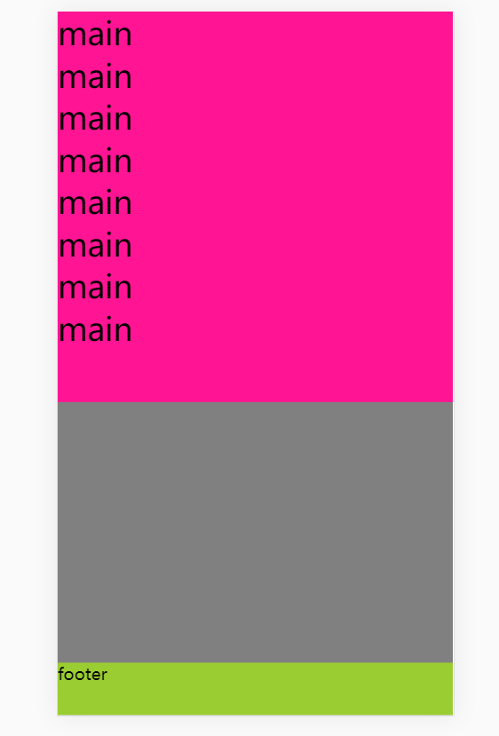

[TOC]

# 常见重点布局

## 0.1 需要掌握的重点布局

>1. **粘连布局:**  移动端常用
>2. **圣杯布局:**  
>3. **等高布局:**
>4. **双飞翼布局:**

# 1.粘连布局

> **粘连布局通常会用在移动端**. 需要加 meta 标签

> :triangular_flag_on_post:  html,  body 默认高度是 0
>
> :triangular_flag_on_post:   块儿元素没有条件的时候,  **宽度和 高度的  百分比是参照父元素 取值**的
>
> :triangular_flag_on_post: **负外边距不能盖住文字.**

### 1.1.1 粘连布局结构注意点

> 1.  footer 结构必须是一个**独立的结构,**  与 **wrap 没有任何的嵌套**关系,而是兄弟元素关系. (实际上 footer 始终是 紧挨着 内容区域)
>
> 2.  footer 要使用 margin 为 负值来确定 位置
> 3.  wrap 区域必须要 被自己的子元素撑开, [100%, 最大值由内容撑开)

### 1.1.2 粘连布局 代码块儿

```js
<head>
    <meta charset="UTF-8">
    <meta name="viewport" content="width=device-width,initial-scale=1,user-scalable=no">
    <title>probeGene</title>
    <style>
        * {
            margin: 0;
            padding: 0;
        }
        /**
            html,  和 body 的默认高度是 0
         */
        html, body {
            height: 100%; /* 这里 百分比参照屏幕区 */
        }
        #wrap {
            width: 100%;
            /* 宽度和高度的 百分比是参照父元素取值的*/
            /*height: 100%;*/

            /* 元素最小高度 为 100% ,屏幕的高度 */
            min-height: 100%;
            background-color: grey;
        }
        #main {
            background-color: deeppink;
            font-size: 30px;
            /* 给 bottom 设置 padding, 让 footer文本不被 main文本重叠 */
            padding-bottom: 50px;
        }
        #footer {
            margin-top: -50px;
            background-color: yellowgreen;
            width: 100%;
            height: 50px;
        }
    </style>
</head>
<body>
<!--模拟屏幕区: 由于移动端浏览器众多,所以 html, body操作不一样
    为了避免操作 html 和 body, 通常自己写最外层块儿 模拟屏幕区域
    div 的模拟屏幕区和 移动设备同大小.
 -->
<div id="wrap">
    <div id="main">
        main<br>
        main<br>
        main<br>
        main<br>
        main<br>
        main<br>
        main<br>
        main<br>
        main<br>
        main<br>
        main<br>
        main<br>
        main<br>
        main<br>
        main<br>
        main<br>
        main<br>
        main<br>
        main<br>
        main<br>
    </div>
</div>
<div id="footer">
    footer
</div>
</body>
```

### 1.1.3 粘连布局样式如下

> 当内容过多, 超出当前屏幕时, footer 的内容始终紧贴 main 区域在下边.



# 2. 三列布局 

> 三列布局中重要的两种布局, 需要掌握.
>
> 1. **圣杯布局** 
> 2. **双飞翼布局**

## 2.1 三列布局之(定位)  --> 问题: 

**缺点:**   当出现滚动条时, 内容区域在滚动条后边  会有显示, 而且内容区 仍旧被压缩. (不推荐使用).

```js
<head>
    <meta charset="UTF-8">
    <title>probeGene</title>
    <style>
        * {
            margin: 0;
            padding: 0;
        }
        body {
            /*
               min-width:一般宽度设置为: 左边宽 * 2 + 右边宽度
             */
            min-width: 600px ;
        }
        #left, #right {
            width: 200px;
            height: 200px;
            background-color: deeppink;
        }
        #left {
            position: absolute;
            top: 0;
            left: 0;
        }
        #right {
            position: absolute;
            top: 0;
            right: 0;
        }
        #middle {
            height: 200px;
            background-color: yellowgreen;
            padding: 0 200px;
        }
    </style>
</head>
<body>
<div id="left">left</div>
<div id="middle">middle</div>
<div id="right">right</div>
</body>

```

## 2.2 三列布局之(浮动)   -->  问题:

**缺点:**  一旦有在布局元素之前有 文字出现, 会导致布局错乱, 导致扩展性不太好.   (不推荐)

```js
<head>
    <meta charset="UTF-8">
    <title>probeGene</title>
    <style>
        * {
            margin: 0;
            padding: 0;
        }
        body {
            /*
               min-width:一般宽度设置为: 左边宽 * 2 + 右边宽度
             */
            min-width: 600px ;
        }
        #left, #right {
            width: 200px;
            height: 200px;
            background-color: deeppink;
        }
        #left {
            float: left;
        }
        #right {
            /* 因为 right 区域需要浮动,而 浮动不会超过它的相邻兄弟元素,
            所以在 html元素中, 需要和 middle区域的元素 交换位置*/
            float: right;
        }
        #middle {
            height: 200px;
            background-color: yellowgreen;
        }
    </style>
</head>
<body>
<span>666</span>  <!-- -->
<div id="left">left</div>
<div id="right">right</div>
<div id="middle">middle</div>
</body>
```

# 3: 圣杯布局

> **圣杯布局主要掌握 等高的代码实现即可.**  第一个代码实现主要是为了展示问题.

## 3.1 圣杯布局 需求步骤如下

:triangular_flag_on_post::triangular_flag_on_post: **​圣杯布局需求:**

> 1. 两边固定, 中间自适应.
> 2.  先加载 middle 内容
> 3. 等高布局 (未实现)

:triangular_flag_on_post::triangular_flag_on_post: **​圣杯布局 步骤:** 

> 1. 布局:  有头, 有尾,  有内容.  先加载 middle 内容.
> 2. 通过浮动方式, 让三个元素在一行显示, 出现高度塌陷, 解决高度塌陷问题.
> 3. left 区域元素上去:  margin-left: -100%;  right 也设置 margin-left: -;  
> 4. middle 区域内容没有显示, 给middle的父级元素加上一个 padding值, 上下为 0 , 左右为 left 和 right 元素的宽度.
> 5. 使用相对定位的方式 把 left 和 right 拉回 原位置.
> 6.  给 header, content, footer 的共同父元素添加 最小宽度: min-width: ;
> 7.  **问题:**  **left ,  middle, right 元素的等高问题 还未解决**.         (因为现在这种方式 left 区域 和 right 区域的高度是写死的, 不会有什么问题, 假若不写固定高度, 让元素 由 内容撑开, 当left,  middle, right 的 内容不相同高的时候, 会出现布局问题.)

## 3.2  圣杯布局代码实现 

```js
<head>
    <meta charset="UTF-8">
    <title>probeGene</title>
    <style>
        * {
            margin: 0;
            padding: 0;
        }
        body {
            /* 添加最小宽度 */
            min-width: 600px;
        }
        #header,#footer {
            width: 100%; 
            height: 50px;
            background-color: grey;
            text-align: center;
            line-height: 50px;
        }
        #content {
            padding: 0 200px;
        }
        #left, #right {
            width: 200px;
            height: 200px;
            background-color: deeppink;

        }
        #middle {
            height: 200px;
            background-color: yellowgreen;
            width: 100%;
        }
        #left, #right, #middle {
            float: left;
        }
        #left {
            margin-left: -100%;
            position: relative;
            left: -200px;
        }
        #right {
            margin-left: -200px;
            position: relative;
            /* 向里移动为 正值, 向外移动为 负值,所以此时right为负值*/
            right: -200px;
        }
        .clearfix:after {
            content: '';
            display: block;
            clear: both;
        }

    </style>
</head>
<body>

<div id="header">header</div>
<div id="content" class="clearfix">
    <div id="middle">middle</div>
    <div id="left">left</div>
    <div id="right">right</div>
</div>
<div id="footer">footer</div>

</body>

```

## 3.3 圣杯布局(等高代码实现 )

```js
<head>
    <meta charset="UTF-8">
    <title>probeGene</title>
    <style>
        * {
            margin: 0;
            padding: 0;
        }
        body {
            /* 添加最小宽度 */
            min-width: 600px;
        }
        #header,#footer {
            width: 100%; 
            height: 50px;
            background-color: grey;
            text-align: center;
            line-height: 50px;
        }
        #content {
            padding: 0 200px;
            overflow: hidden;
        }
        #left, #right {
            width: 200px;
            height: 200px;
            background-color: deeppink;

        }
        #middle {
            height: 200px;
            background-color: yellowgreen;
            width: 100%;
        }
        #left, #right, #middle {
            float: left;
            padding-bottom: 99999px;
            margin-bottom: -99999px;
        }
        #left {
            margin-left: -100%;
            position: relative;
            left: -200px;
        }
        #right {
            margin-left: -200px;
            position: relative;
            /* 向里移动为 正值, 向外移动为 负值,所以此时right为负值*/
            right: -200px;
        }
        /*.clearfix:after {*/
        /*    content: '';*/
        /*    display: block;*/
        /*    clear: both;*/
        /*}*/

    </style>
</head>
<body>

<div id="header">header</div>
<div id="content" class="clearfix">
    <div id="middle">middle</div>
    <div id="left">left</div>
    <div id="right">right</div>
</div>
<div id="footer">footer</div>

</body>

```

# 4. 等高布局:

:triangular_flag_on_post::triangular_flag_on_post: ​  **伪等高​布局 的两句核心代码:**

> padding-bottom: 99999px;
>
> margin-bottom:  -99999px;
>
> 
>
> **SUMMARY:**  因为一般不知道具体哪一列的 元素多, 所以一般在每一列中都添加上述两句 核心样式. 然后再处理其他样式.

## 4.1 伪等高布局实现目的

> 伪等高布局是为了实现不同列元素不同高的时候, 会出现背景颜色不一致的情况. 所以为了都让元素**看起来是等高的**. 采用伪等高布局来实现.

## 4.2 伪等高布局代码实现

```js
<head>
    <meta charset="UTF-8">
    <title>probeGene</title>
    <style>
        * {
            margin: 0;
            padding: 0;
        }
        #wrap {
            width: 500px;
            border: 5px solid;
            margin: 0 auto;

            /* overflow: hidden; 既解决了文字溢出, 也开启了BFC解决了
            高度塌陷, 所以下边的 伪元素清除 高度塌陷可以不用*/
            overflow: hidden;
        }
        #left {
            float: left;
            width: 200px;
            background-color: deeppink;
            /* 通常为了防止不知道具体哪边儿元素多, 最后在
               left 区域 和 right 区域都写上 padding-bottom
               和 margin-bottom 来实现伪等高
            */
            /* 如果有多列, 那就在每一列都添加上 如下两句样式 ..*/
            padding-bottom: 99999px;
            margin-bottom: -99999px;
        }
        #right {
            float: right;
            width: 300px;;
            background-color: greenyellow;

            padding-bottom: 99999px;
            /* 根据 margin-bottom 来调整 left 区域元素 和 right 区域元素
               距离 父元素底部边框的距离, 让距离逐渐减小, 截掉不等高的部分.
             */
            /* 通常 margin-bottom: 添加给 高度超出的元素.
                然后父元素 overflow: hidden;*/
            margin-bottom: -99999px;
        }
        
      	/* .clearfix:after {
            content: '';
            display: block;
            clear: both;
        }
      */
    </style>
</head>
<body>
<div id="wrap" class="clearfix">
    <div id="left">
        left<br>
        left<br>
        left<br>
        left<br>
    </div>
    <div id="right">
        right <br>
    </div>
</div>
</body>
```

# 5. 双飞翼布局:

## 5.1 双飞翼布局的步骤

>前面的步骤 和 圣杯布局的处理方式相同, 在 处理middle内容的部分不同.

> **双飞翼布局 VS 圣杯布局:**
>
> - 圣杯布局 和 双飞翼布局, 唯一不同的是, middle区域的处理方式不同,其他地方有相同的处理方式.
> - **优点:** 内容部分(中间列) 优先加载, 结构上仅仅添加了一个父级容器,  任何一列都可以作为最高列
> - **缺点:** 多写了一个 html 结构.

```js
<!--
1.两种布局方式都是把主列放在文档流最前面，使主列优先加载。
2.两种布局方式在实现上也有相同之处，都是让三列浮动，然后通过负外边距形成三列布局。
3.两种布局方式的不同之处在于如何处理中间主列的位置：
                    圣杯布局是利用父容器的左、右内边距+定位；
                    双飞翼布局是把主列嵌套在div后利用主列的
	#middle-inner{
            margin-left: 200px;  /* 左边元素的宽度 */
            margin-right: 200px;  /* 右边儿元素的 宽度 */
        }
-->
```

## 5.2 双飞翼布局代码实现

```js
<head>
    <meta charset="UTF-8">
    <title>Title</title>
    <style type="text/css">
        * {
            margin: 0;
            padding: 0;
        }
        body{
            min-width: 600px;
        }
        #header,#footer{
            width: 100%;
            height: 50px;
            background: grey;
            text-align: center;
            line-height: 50px;
        }
        #content{
            overflow: hidden;
        }
        #left,#right,#middle{
            float: left;

            padding-bottom: 10000px;
            margin-bottom: -10000px;
        }
        #left,#right{
            width: 200px;
            background: pink;
        }
        #left{
            margin-left: -100%;
        }
        #right{
            margin-left: -200px;
        }
        #middle{
            width: 100%;
            background: greenyellow;
        }
        #middle-inner{
            margin-left: 200px;
            margin-right: 200px;
        }

        /*.clearfix::after{*/
            /*content: '';*/
            /*display: block;*/
            /*clear: both;*/
        /*}*/
    </style>
</head>
<body>

<div id="header">header</div>
<div id="content" class="clearfix">
    <div id="middle">
        <div id="middle-inner">
            middle
        </div>
    </div>

    <div id="left">
        left<br>
        left<br>
        left<br>
        left<br>
        left<br>
    </div>

    <div id="right">right</div>
</div>
<div id="footer">footer</div>
</body>
```


