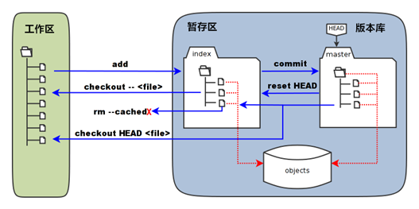
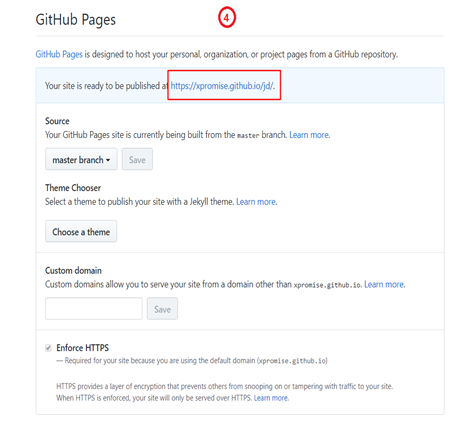

[TOC]

# 1. Git 学习

## 0.0 Git 最基本几个命令

```js

* git config --global user.name "username"  //配置用户名
* git config --global user.email "xx@gmail.com" //配置邮箱
* git init  //初始化生成一个本地仓库 
* git add .   //添加到暂存区 
* git commit –m "message"  //提交到本地仓库 

* git remote add origin url  //添加远程仓库关联
* git remote rm  origin url  // 删除远程仓库关联

* git push origin master  //推送本地master分支到远程master分支 
* git checkout -b dev  //创建一个开发分支并切换到新分支 
* git push ogigin dev  //推送本地dev分支到远程dev分支
* git pull origin dev  //从远程dev分支拉取到本地dev分支
* git clone url  //将远程仓库克隆下载到本地
* git checkout -b dev origin/dev // 克隆仓库后切换到dev分支


# 删除远程仓库关联
* git remote     // 先查看远程关联的仓库是什么
* git remote rm  远程仓库别名    // 删除远程仓库关联		 
```

## 1.0 Git的起源

1. "自由主义教皇" 林纳斯.托瓦兹
   - Linux 之父
   - Git

2.  Git 是什么?
   - Git是世界上最先进的分布式版本控制 (没有之一)

## 2.0 Git的使用

### 2.1.1 Git的安装

- Windows版的Git，从https://git-scm.com/download/win下载然后按默认选项安装即可
- 安装完成后，右键打开菜单栏找到“Git”->“Git Bash”，蹦出一个类似命令行窗口的东西，就说明Git安装成功！

### 2.1.2 安装完初步配置Git

> 进入 右键  Git bash命令行, 在命令行配置

```js
git config --global user.name "your name"  // 配置你自己的用户名

git config --global user.email "你的邮箱"  // 填写你自己的邮箱


// 查看配置的姓名
git config user.name

// 查看配置的 邮箱
git config user.email

// 因为 Git是分布式版本控制系统, 所以,每个机器都必须自报家门: 你的名字和 Email 地址
```


## 3.0 基础命令

### 3.1.1 常用的Linux命令

```js
mkdir 文件夹名字 							// 新建文件夹

cd	xxx  进入xxx 目录

cd ../  或 cd ..							// 返回上一级目录

ls					// 列出当前文件夹中,所有文件

pwd					// 展示当前目录

cat	x.txt			// 展示文本内容

clear					//清屏
```

### 1.1.2 文本编辑命令

```js
1. vi   xxx.txt	// 新建文件或打开文件(visual editor)

	2. 输入 i   进入文本编辑模式, 编写文本
	3. 按Esc  然后 :wq 		// 此过程是保存并退出文本编辑模式
	4. 按Esc  然后 :q!     //  此过程是不保存退出
```

## 4.0 创建版本库

1. 新建本地版本库

   > - 创建成功会提示:  initialized empty Git repository  in   文件路径
   > - 你还会发现目录上多出一个.git的文件夹,这个文件夹是Git来跟踪管理版本库的，不要去修改和删除这个文件里的内容。

2. git add  x.xx  添加指定文件到暂存区中

   - 如果成功不会有任何提示

   - 可能会出现的错误或警告

     > 1. 如果没有执行初始化 git init 命令, 会提示 :
     >
     > ```js
     > 2. - > 1.  fatal: Not a git repository (or any of the parent directories): .git
     > ```
     >
     > 2. 如果操作的文件不存在, 会提示
     >
     > ```js
     > fatal: pathspec 'x.txt' did not match any files
     > ```
     >
     > 3. 可能会出现警告，`warning: LF will be
     >    replaced by CRLF in a.txt，` 这是由于 Linux 和 window换行符不一致导致的. 解决方式:
     >
     > ```js
     > git config --global core.autocrlf false
     > ```
     >
     > 该命令表示, 不再提示换行符问题, 保持原貌.

3. 怎么查看文件有没有添加成功呢?

   - git  status
     - 红色表示在工作区.
     - 绿色表示在 暂存区
     - 没有任何显示代表所有文件位于版本区

4.  git commit -m 'xxx'   提交暂存区所有文件到版本区

   - 提交成功会提示:

     ```js
      [master (root-commit) 88bbb64] first commit
      	1 file changed, 2 insertions(+)
      	create mode 100644 x.txt
     ```

   - 如果只输入 git commit 会出现问题, 这是需要  Esc + :q!  退出即可.

5. 理解工作区 + 暂存区 + 版本区

   - 工作区（working Directory）：简单的理解——你在电脑里能看到的目录。

   - 暂存区（stage）：介于工作区和版本区中间，工作区到版本区的“必经之路” 

   - 版本库（Repository）：工作区有一个隐藏目录.git，准确的来说这个不算工作区，而是Git的版本库。
     - 第一步是用git add把文件添加进暂存区。
     - 第二步是用git commit把暂存区的所有内容提交到当前版本库。

### 4.1.1 差异对比命令

```js
git diff 							: 比较工作区 与 暂存区
git diff --cached 		: 比较暂存区 与 版本区
git diff master 			: 比较版本区 与 工作区

```

### 4.1.2 日志 + 版本号

```js
git log   :显示从最近到最远的所有提交日志，如一次显示不完整，按下回车键继续查看，直到出现END标识，使用q退出log显示窗口。

git reflog  ：显示每次提交（commit）的commit id

```

### 4.1.3  版本回退+版本穿梭+版本撤销

```js
git reset --hard HEAD^    版本回退（回退一次提交）

git reset --hard Obfafd    回退到指定Obfafd的commit id版本

git reset HEAD   		用版本库中的文件去替换暂存区的全部文件。

git checkout -- x.txt    	用暂存区指定文件去替换工作区的指定文件（危险）

git checkout HEAD x.txt  用版本库中的文件替换暂存区和工作区的文件（危险）

git rm --cached x.txt 		从暂存区删除文件

```

### 4.1.4 删除文件

```js
git rm x.txt    // 删除文件

git rm -r --cached a/2.txt //删除a目录下的2.txt文件   

git rm -r --cached a     // 删除a目录

git commit -m "删除a目录下的2.txt文件" 

git push
git rm  -r  xxxx   // 删除 指定目录 即: 文件夹

# Git 不支持删除远程仓库的目录, 可以删除文件
```

> **Git 的完整示意图如下:**




### 4.1.5 git 分支

```js
git checkout -b dev   创建dev分支，并切换到dev分支

git branch   查看当前分支
git checkout master 切换分支

git merge dev  合并dev分支到当前分支
git branch -d dev  删除指定分支

git diff branch1 branch2 	显示出两个分支之间所有有差异的文件的详细差异

git diff branch1 branch2 --stat 显示出两个分支之间所有有差异的文件列表

git diff branch1 branch2 xxx  显示指定文件的详细差异

```

## 5.0 版本冲突

1. 合并分支时，如果在同一个文件，在同一个地方，都修改了或新增内容会引起版本冲突。
2. 解决版本冲突最好的办法是借助IDE解决，简单且高效。

## 6.0 版本控制系统的区别

### 6.1.1 集中式版本控制系统

> 代表有SVN、CVS
>
> ​       集中式版本控制系统，版本库是集中存放在中央服务器的，每个开发人员电脑里只有其中一个版本。

### 6.1.2 分布式版本控制系统

> 代表有Git、BitKeeper
>
> ​	每个开发人员电脑里都有一个完整的版本库。同时，它也需要一台充当“中央服务器”的电脑，来方便“交换”大家的代码修改。

### 6.1.3  集中式与分布式的区别

| 类别      项目                           | 集中式版本控制系统                                           | 分布式版本控制系统                   |
| ---------------------------------------- | ------------------------------------------------------------ | ------------------------------------ |
| 主要区别                                 | 每个开发者只有应用代码库的一个版本。                         | 每个开发者都有整个代码库的所有版本。 |
| 在离线状态下开发者无法进行版本管理开发。 | 在离线状态下开发者可以进行版本管理开发, 等到有网时再push到仓库中。 |                                      |

## 7.0 Git 命令总结

### 7.0.1 Git常用命令

:triangular_flag_on_post::triangular_flag_on_post: ​  **Git学习顺序 流程命令总结**

> 1. **Git 第一次安装后需要配置用户名密码** 
> 2. **创建本地版本库**
> 3. **查看文件状态**
> 4. **差异对比**
> 5. **查看日志和版本号**
> 6. **版本回退 和 版本穿梭 + 版本撤销**

```js
#1. 配置用户名 & 密码 
  git config --global user.name "你想要配置的用户名"
  git config --global user.email "你想要配置的邮箱"

  // 查看用户名和密码 (不写后面的用户名密码就可以查看)
  git config --global user.name
  git config --global user.email

#2. 创建本地版本库
	git init						// 会出现一个 .git命令
  
  git add a.txt				// 添加到暂存区中
	git add *
  git add . 
  
	git commit -m '提交信息'    // 添加到版本区

#3. 查看文件状态
	git status

#4. 差异对比
	git diff			// 比较工作区和暂存区
  git diff --cached		// 比较暂存区和版本区
  git diff --master		//比较版本区和工作区

#5. 查看日志和版本号
	git log
  git reflog

#6.版本回退, 版本穿梭, 版本撤销
	git reset --hard HEAD^
  git reset --hard 版本号
 	git rm --cached x.txt    // 从暂存区删除文件

#7. 删除文件	
	git rm x.txt					// 删除文件
	git rm -r 文件夹名字    // 删除文件夹

```

### 7.0.2 Git 分支

```js
git checkout -b dev		// 创建分支
git branch 					// 查看当前分支
git checkout master		// 切换分支
git merge dev				// 合并dev 分支到当前分支
git branch -d dev		// 删除指定分支


git diff branch1 branch2	// 显示出两个分支之间所有有差异的文件的详细差异
git diff branch1 branch2 --stat // 显示两个分支之间所有有差异的文件列表

```

### 7.0.3 Git 和 GitHub 关联学习

> 1. **创建本地库,关联远程库**
> 2. **推送内容到远程库**
> 3. **克隆远程仓库内容**
> 4. **更新拉取远程库内容到本地库** 

```js
# 本地创建一个仓库,远程GitHub手动创建一个仓库
	/**
		1. remote 
		2. add 
		3. origin 远程库的别名(默认origin,可以自己改,但一般不再改) 
		4. https 远程库地址
	// git remote add Gene git@github.com:ProbeGene/repo1.git
	// 因为往远程库上推送的时候, git push Gene master 还要用到别名, 怕后期会遗忘自己所改过的别名, 所以一般不再改别名,而是用默认的 origin别名, 就直接可以推送到远程的仓库, 不用再多次复制远程库的地址 . . .
	*/

#1. 关联 本地库 和 远程库
	git remote add origin git@github.com:ProbeGene/repo1.git

/**
	1. push 推送
	2. origin 远程库别名, 正常推送需要用到远程库地址,有了别名直接用别名就可以
	3. master 远程库一般不会只有一个分支, 所以最后需要指定把内容提交到哪个分支
*/
#2. 推送本地库内容 到 远程库
	git push origin master  // 把本地库内容推送给远程origin库的master分支
 	git push origin dev			// 把本地库内容推送到远程origin库的dev分支 

  
#3. 远程库复制克隆到本地库
	git clone git@github.com:ProbeGene/repo2.git // 或者是https 地址

#4. 远程更新后, 拉取 更新本地库内容
	/*
		1. pull  拉取
		2. origin  指定拉取的是哪个仓库(仓库别名代替了 仓库地址使用)
		3. master 说明指定拉取的是哪个分支下的内容
	*/
	git pull origin master
  

```


### 7.1.1 Linux 常用命令总结

```js
mkdir demo				// 创建一个demo空文件夹
pwd：						 // 显示当前目录的路径

cat index.html		// 查看 index.html 等文件的内容

git init：//把当前的目录变成可以管理的git仓库，生成隐藏的.git文件夹

git add inedx.html//把index.html文件添加到暂存区

git commit -m “提交说明” //提交文件 -m后面的是本次提交说明

git status		//查看仓库状态
git log			//查看历史记录


git reset --hard HEAD^：往上回退一个版本

git reflog：查看历史记录的版本号id

git checkout -- index.html：把index.html文件在工作区的修改全部撤销

git rm index.html：删除inedx.html文件

git remote add origin https://github.com/xxxxx/a.git 关联一个远程库（origin是远程库的别名，可以更改）

git push -u origin master：把当前分支推送到远程库master分支（第一次推送要追加-u，以后可以不用追加）

git clone https://github.com/xxxxx   克隆远程库到本地（第一次获取代码时使用）

git checkout -b dev：创建一个新的dev分支 并切换到dev分支上

git branch：查看当前所有的分支以及现在所处分支

git checkout dev：切换到dev分支

git merge dev：把dev分支合并到当前分支

git branch -d dev：删除dev分支

git remote    //查看远程库信息
git remote -v  // 查看远程库的详细信息
git pull origin master //将远程库的master分支内容拉取到本地的当前分支,并自动合并
git push origin master  //把本地当前分支内容推送给远程master分支
```

7.2 不小心关联错了仓库怎么办

```js
* 暴力解决：删除.git，重新建立本地仓库

* 优雅解决：git remote remove origi  //再在重新关联仓库
```

### 7.2 pull和fetch的区别？

1. git pull origin master

   > 将远程仓库的master分支上代码版本复制/合并到本地master分支上

2. git fetch origin master:dev

   > 新建了一个dev分支，将远程仓库的master分支上代码版本复制到dev分支上就一定不会产生冲突.
   >
   > git diff master dev 对比两分支内容，观察会不会产生冲突, 如果会，先解决，在合并分支。如果不会，就直接合并分支

## 8.0. Git 常见错误总结

1. **关于分支的一个小问题**

```js
1. 在主分支什么文件都没有的时候, 开一个新的分支, 会出现无法切换为主分支的情况

```

2. **git中操作分支的两个小问题** 

```js
git checkout -b dev
	vi a.txt
		i
    插入内容
    Esc
    :wq   //保存退出
    

```


# 2. GitHub 学习

## 1.0 GitHub 是什么?

- GitHub是一个Git项目托管网站。

### 1.0.1. GitHub能做什么？

> - 能够分享你的代码或者其他开发人员配合一起开发。
>
> - GitHub是一个基于Git的代码托管平台，Git并不像SVN那样有一个中心服务器。目前我们使用到的Git命令都是在本地执行，你就需要将数据放到一台其他开发人员能够连接的服务器上。

## 1.1 GitHub远程仓库的使用

#### 1.1.1 本地仓库内容推送给远程仓库

1.   **新建本地仓库** 

```js
	git init
	git add .
	git commit -m “first commit”
```

2. **新建远程库**

```js
第一步:   先在 GitHub上New repository
```

3. **本地仓库和远程仓库进行关联**

```js
// 注意, 后面的 https 改成你自己的git仓库

git remote add origin https://github.com/ProbeGene/Geneblog.git	
```

4. **把本地仓库内容推送到远程仓库中**

```js
1. git push -u origin master （首次加-u）

2. 我们第一次推送master分支时，加上了-u参数，Git不但会把本地的master分支内容推送到远程新的master分支，还会把本地master分支和远程的master分支关联起来，在以后的推送时可以简化命令git push origin master。

3. 备注：若在成功推送过一次代码后，电脑不能够自动记住github的账户和密码，执行以下命令解决：
 git config --global credential.helper store

```

#### 1.1.2 远程仓库有内容克隆到本地进行开发

1. **克隆远程仓库到本地**

```js
// https 仓库是你自己的仓库地址
git clone https://github.com/ProbeGene/Geneblog.git	
```

#### 1.1.3 本地有内容，远程有内容，更新不同的内容

```js
git pull origin master   // 将远程仓库拉到本地来
```

## 2.1 配置SSH与使用

> 1. 输入cd ~/.ssh，由于你的本地Git仓库和GitHub仓库之间的传输是通过SSH加密的，所以我们需要配置验证信息
>
>    - No such file or directory 表示第一次
>
> 2. 创建SSH Key：
>
>    ```js
>    ssh-keygen -t rsa -C "xxx@xxx.com"  // 你自己的邮箱
>    ```
>
>    - 它会在 ~/ 下(C盘用户目录的 ssh文件夹里也可以找到)生成 .ssh 文件夹, 进去打开 id_rsa.pub 文件,复制里面的全部内容.
>    - 将其复制到你的 GitHub 里的 SSH keys 中
>
> 3. 使用 SSH
>
> ```js
>  git remote add origin git@github.com:ProbeGene/XXX.git // 你自己的SSH
> 
> git clone git@github.com:ProbeGene/xxx.git
> ```
>
> 

## 3.0 GitHub 其他功能

### 3.1.1 Fork


> - 将别人的项目clone一份，但是owner变成自己，这样你就可以在遵守open source license的前提下任意修改这个项目了。
> - 相当于你在原项目的主分支上又建立了一个分支，你可以在该分支上任意修改如果想将你得修改合并到元项目中式，可以pull request，这样原项目的作者就可以将你修改的东西合并到原项目的主分支上去，这样你就为开源项目贡献了代码，开源项目就会在大家的努力下不断地壮大和完善。

### 3.1.2 GitHub Pages

1. **推送本地代码到GitHub仓库**

   - **创建本地仓库**

     ```js
     git init
     git add .
     git commit -m "xxx" 
     ```

   - **登录 GitHub在GitHub上 创建GitHub远程仓库**

   - **本地仓库关联远程仓库** 

     ```js
     git remote add origin git@github.com:ProbeGene/xxx.git
     ```

   - **推送本地更新** 

     ```js
     git push -u origin master
     ```

2.  **配置GitHub Pages选项**





3.   **需要注意的问题**

   - 目录第一层需要有一个index.html文件作为启动文件，命名不可更改。

   


