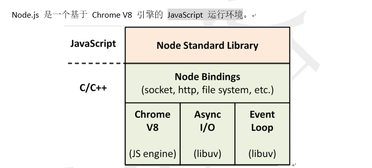

[TOC]

## 1. 1 Node

### 1.0 Node.js 简介

1. **Node.JS 是什么?**



2. **Node.js 有什么特点?** 

### 1.1.1 Node 中函数的特点

```js
/*
* 1.Node中任何一个模块（js文件）都被一个外层函数所包裹
*     function (exports, require, module, __filename, __dirname) {}
*         exports：用于暴露模块
*         require：用于引入模块
*         module：用于暴露模块
*         __filename：当前文件所在的路径（绝对）
*         __dirname：当前文件所在文件夹的路径（绝对）
*
*  2.为什么要有这个外层函数（这个外层函数有什么作用？）
*     1.隐藏内部实现。
*     2.支持CommonJs的模块化
* */

console.log(__filename);
console.log(__dirname);
```

### 1.2.1 Node 中的global

```js
//1.对于浏览器端而言，js由哪几部分组成？
/*
*  1.BOM 浏览器对象模型 -------- 很多的API（location，history）
*  2.DOM 文档对象模型 ---------- 很多的API（对DOM的增删改查）
*  3.ES规范 -------------------- ES5、ES6.....
*/

//2.Node端js由几部分组成？
/*
*   1.没有了BOM -----  因为服务器不需要（服务端没有浏览器对象）
*   2.没有了DOM -----  因为没有浏览器窗口
*   3.几乎包含了所有的ES规范
*   4.没有了window，但是取而代之的是一个叫做global的全局变量。
* */

console.log(global)
```

### 1.3.1 Buffer 缓冲器

#### 1.3.1.1 Buffer 是什么?

```js
1.Buffer是什么？
*    1.它是一个类似于数组的对象，用于存储数据（存储的是二进制数据）。
*    2.Buffer的效率很高，存储和读取很快，直接对计算机的内存进行操作。
*    3.Buffer的大小一旦确定了，不可修改。
*    4.每个元素占用内存的大小为1字节。
*    5.Buffer是Node中的非常核心的模块，无需下载、无需引入即可使用
```

### 1.4.1 Node 中文件写操作

#### 1.4.1.1简单文件写入

```js
/*
* 1.Node中的文件系统：
*     1.在NodeJs中有一个文件系统，所谓的文件系统，就是对计算机中的文件进行增删改查等操作。
*     2.在NodeJs中，给我们提供了一个模块，叫做fs模块，专门用户操作文件。
*     3.fs模块是Node的核心模块，使用的时候，要引入进来，不用下载安装。
*
* 2.简单文件写入（异步）：
*     fs.writeFile(file, data[, options], callback)
*             --file：文件路径+文件名
*             --data：要写入的数据
*             --options:配置选项（可选参数）
*                   --flag：打开文件要进行的操作,默认是w
*                         'w'：直接写入
*                         'a'：追加
*                   --mode：文件权限的限制，默认值是0o666
*                         --0o111：文件可被执行
*                         --0o222：文件可被写入
*                         --0o444：文件可被读取
*                   --encoding：默认值utf8
*             --callback：回调函数
*                   --err
*
* 备注：在Node中有一个设计原则：错误优先。
*
* 不足之处：简单文件写入是一次性把所有要写入的数据加载到内存中，对于比较大的文件容易产生内存溢出，适用于较小的文件写入。
*
*/
```

> **code** 

```js
//1. 引入fs 模块
let fs = require("fs");
//2. 简单文件写入 
fs.writeFile("./520.txt","哈哈,我是data写入数据的参数",(err)=>{
    if (!err) {
        console.log("文件写入成功了. . .")
    }else {
        console.log(err);
    }
});
```

#### 1.4.1.2 流式文件写入

```js
/*
* 流式文件写入：
*     fs.createWriteStream(path[, options])
*         --path：文件路径+文件名
*         --options：配置对象（可选）
*              --flags：打开文件要进行的操作,默认是w
*                         'w'：直接写入
*                         'a'：追加
*              --mode：文件权限的限制，默认值是0o666
*                         --0o111：文件可被执行
*                         --0o222：文件可被写入
*                         --0o444：文件可被读取
*               --encoding：默认值utf8
*               --fd：文件的唯一标识。（了解）
*               --autoClose：自动关闭，当数据操作完毕，自动关闭文件，默认是true
*               --start：文件写入的起始位置
* */
```

> **code** 

```js
//1. 引入 fs 模块
let fs = require("fs");
//2. 创建一个可写流
let ws = fs.createWriteStream("./123.txt");
// 只要使用了流, 必须给流加监听
ws.on('open',() => {
    console.log("可写流打开了");
});
ws.on('close',() => {
    console.log("可写流关闭了 . . .");
});
//3. 开始写入数据
ws.write('马上放学了, \n');
ws.write('我饿了\n');
ws.write("饿了你就忍着吧\n");
//ws.close();  // 如果用的是Node8版本及以下,此种方式关闭流, 容易造成数据丢失
ws.end();
```

### 1.4.2 文件的读取

#### 1.4.2.1 简单文件读取

```js
/*
* 简单文件读取：
*     fs.readFile(path[, options], callback)
*         --path：文件路径+文件名
*         --options：配置对象
*             --encoding:文件编码
*             --flag:打开文件要进行的操作
*         --callback：回调函数
*             --err:错误对象
*             --data:数据
* */

//1.引入fs模块
let fs = require('fs')

//2.简单文件读取
fs.readFile('./music.mp3',(err,data)=>{
    if(!err){
      //思考？为什么读取出来的是Buffer类型（看不懂）,因为读取出来的数据不一定是文本，可能是媒体文件。
      //console.log(data.toString())
      fs.writeFile('../demo.mp3',data,(err)=>{
          if(!err){
            console.log('ok')
          }else{
            console.log(err)
          }
      })
    }else{
      console.log(err)
    }
})
```

#### 1.4.2.2 流式文件读取

```js
/*
* 流式文件读取：
*     fs.createReadStream(path[, options])
*         --path：文件路径+文件名
*         --options：配置对象(可选)
*             --flags：打开文件要进行的操作,默认是w
*                         'w'：直接写入
*                         'a'：追加
*             --mode：文件权限的限制，默认值是0o666
*                         --0o111：文件可被执行
*                         --0o222：文件可被写入
*                         --0o444：文件可被读取
*             --encoding：默认值utf8
*             --start:读取的起始点
*             --end：读取的结束点
*             --highWaterMark：每次读取数据的大小 默认值是：64 * 1024
* */

//1.引入fs模块
let fs = require('fs')

//2.创建一个可读流，对于可读流来说，当没有数据可继续读取的时候，会自动关闭可读流。
let rs = fs.createReadStream('./music.mp3',{
  //start:2000,
  //end:90000,
  highWaterMark:1024 * 1024
});
let ws = fs.createWriteStream('../demo.mp3')

//使用了流，必须给流加监听（为了确保每个流都能够在使用完毕后关闭）
rs.on('open',()=>{
  console.log('可读流打开了')
})
rs.on('close',()=>{
  console.log('可读流关闭了')
  ws.close()
})
ws.on('open',()=>{
  console.log('可写流打开了')
})
ws.on('close',()=>{
  console.log('可写流关闭了')
})

//3.给可读流绑定一个data事件，会自动触发流读取文件
rs.on('data',(data)=>{
    //输出Buffer实例的length的时候，输出的不是长度，输出的是占用内存的大小
    //console.log(data.length)
    ws.write(data)
})
```

## 2.1 Node 原生服务器(要求会手写)

### 2.1.1 Node 原生服务器搭建

> **原生Node 搭建服务器代码 (需要能手写)** 
>
> ```js
> //1.引入http模块 ----- http是Node中的核心模块，无需下载，引入即可使用。
> let  http = require('http');
> 
> //2. 创建服务器对象.(传入一个回调函数参数)
> let server = http.createServer((request,response) => {
>   /**
>    * request: 请求对象 ------- 客户端发给服务器
>    * response:响应对象 ------- 服务器给客户端
>    */
>   response.setHeader('content-type','text/html;charset=utf8')
>   response.end('<h2>ok,我响应给你数据了. . .</h2>');
> });
> 
> //3. 绑定端口监听. (端口号, 回调函数)
> server.listen('3000',(err) => {
>     if (!err) {
>       console.log("服务器启动成功了. . .");
>     } else {
>       console.log(err);
>     }
> });
> ```

# 3 中间件 MiddleWare

## 3.1 中间件简介

> 1. Express 是一个自身功能极简，完全是由路由和中间件构成一个的 web 开发框架：从本质上来说，一个 Express 应用就是在调用各种中间件。
>
> 2. 中间件（Middleware） 是一个函数，它可以访问请求对象（request）, 响应对象（response）, 和 web 应用中处于请求-响应循环流程中的中间件，一般被命名为 next 的变量。

## 3.2 中间件的功能

> 1)       执行任何代码。
>
> 2)       修改请求和响应对象。
>
> 3)       终结请求-响应循环。
>
> 4)       调用堆栈中的下一个中间件。

## 3.3 中间件的分类

> 1)       应用级中间件（过滤非法的请求，例如防盗链）
>
> 2)       第三方中间件（通过npm下载的中间件，例如body-parser）
>
> 3)       内置中间件（express内部封装好的中间件）
>
> 4)       路由器中间件 （Router）

## 3.4 中间件实例

```js
//引入express
var express = require('express')
//创建应用对象
var app = express()
//配置静态资源
app.use(express.static('public'))
//中间件，没有挂载路径，应用的每个请求都会执行该中间件
app.use(function (req, res, next) {
  console.log('这是中间件的响应~~~')
  //如果不调用next方法，下面路由将不起作用
  next()
})
//配置路由
app.get('/index', function (req, res) {
  console.log('路由index收到get请求')
  res.send('这里是路由返回的信息，/hello收到了get请求')
})

app.post('/index', function (req, res) {
  console.log('路由index收到post请求')
  res.send('这里是路由返回的信息，/hello收到了post请求')
})

//启动服务器
app.listen(3000, function () {
  console.log('服务器启动成功，监听3000端口')
})

```

# 4 Router 路由器

## 4.1 Router 是什么?

> Router 是一个完整的中间件和路由系统，也可以看做是一个小型的app对象。

## 4.2 为什么实用 Router

> 为了更好的分类管理route

## 4.3 Router的使用

```js
//引入express模块
var express = require('express');
//引入body-parser模块
var bodyParser = require('body-parser');
//引入Users模型对象
var Users = require('../models/Users');
//创建router对象
var router = express.Router();
//解析请求体，将参数挂在到req.body
router.use(bodyParser.urlencoded({extended: false}));
router.post('/login', function (req, res) {
  var username = req.body.username;
  var password = req.body.password;
  Users.findOne({username: username}, function (err, data) {
    if (!err && data && data.password === password) {
      res.send('恭喜您登录成功~~~');
    } else {
      res.send('用户名或密码错误~~~');
    }
  })
})
router.post('/regist', function (req, res) {
  //获取用户提交的参数
  var username = req.body.username;
  var password = req.body.password;
  var rePassword = req.body.rePassword;
  var email = req.body.email;
  /*
    1. 正则验证(-)
    2. 密码和确认密码是否一致
    3. 去数据库中查找有无此用户名
    4. 插入数据
   */
  //判断密码和确认密码是否一致
  if (password !== rePassword) {
    res.send('两次密码输入不一致，请重新输入~~');
    return
  }
  //去数据库中查找有无此用户名
  Users.findOne({username: username}, function (err, data) {
    if (!err) {
      /*
        data
          如果查到了  返回文档对象
          如果没找到  返回null
       */
      if (data) {
        // 查到了指定用户名
        res.send(data.username + '用户名已被注册~~请重新输入');
      } else {
        // 没有找到指定有户名，将用户信息插入到数据库中
        Users.create({
          username: username,
          password: password,
          email: email
        }, function (err) {
          if (!err) {
            res.send('恭喜您，注册成功了~~');
          } else {
            res.send('error');
          }
        })
      }
    } else {
      res.send('error');
    }
  })
})
//暴露路由器对象
module.exports = router

```


