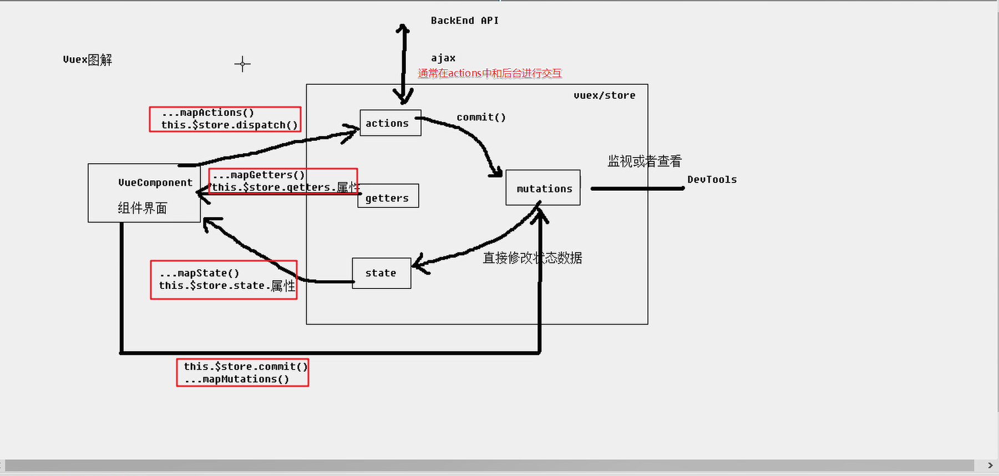
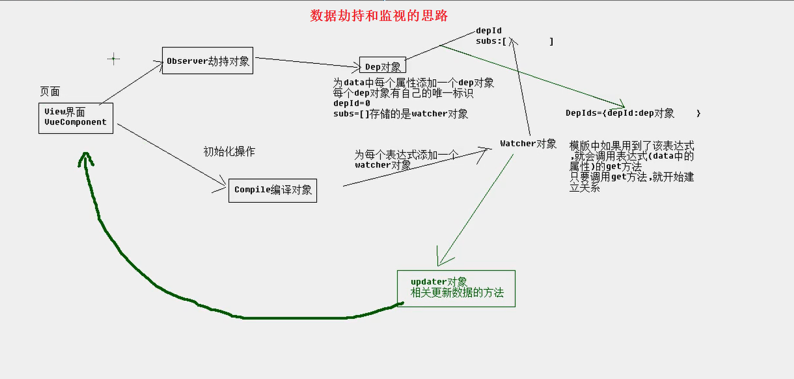

[TOC]

# 1.0 VUE基础

> [Vue官网地址](https://vuejs.org/)    

## 1.0 Vue 核心语法及内容

> **插值语法**  {{}}

```js
{{msg}}  // 插值語法

const vm = new Vue({
  el:"#app",
  data:{
    msg:"hello,world"
  }
})
```

## 1.1 vue 中的指令

### 1.1.1 Vue的内置指令

```js
#1. v-model=""   ----- 指令
	// 用来绑定数据的指令

#2. v-show=""    // 用来表示是否显示当前元素内容的指令, 配置布尔值

#3. v-for=""    // 用来循环遍历的指令(遍历对象,或数组都可以)

#4. v-bind:href=""  或简写  :href=""
		// 强制绑定数据,希望某个 [标签中的某个属性] 值是动态的时候, 使用 v-bind:属性名字=""
		// v-bind 和 v-model 之间的区别 ???
		// v-bind 通常是给标签的属性绑定动态的值, 比如a标签的href属性   v-model直接绑定数据

#5. v-on:click="fn" 或简写  @click="fn"
		// 事件指令,  用来绑定事件的时候使用的指令

#6. v-if="动态的指令"  v-else-if="动态的指令"  v-else
		// 条件渲染指令:  值为 指令的布尔值,  表示是否在 DOM 中显示当前标签元素
		// v-if, v-else-if, v-else 指令表示在DOM中 要么新增一个标签,要么干掉一个标签

#7. v-show="动态的指令"
		// v-show 指令则是设置标签的 display 属性的值是不是 none

#8. v-for=""   指令遍历

#9. v-text=""  纯文本指令  // 相当于 innerText 或 textContent

#10 v-html=""  html 标签内容

#11. ref="p1"  // this.$refs.p1   可以取到当前p1 标识的元素标签

```

### 1.1.2 自定义指令

```JS
## VUE中 两种自定义指令的方式
// 全局指令
        Vue.directive('text-upper', (el, binding) => {
            el.innerHTML = binding.value.toUpperCase()
        })

        const vm = new Vue({
            el: "#app",
            data: {
                msg: "HEllo"
            },
          // 局部指令
            directives: {
                // 从大写变成小写字母
                'text-lower'(el, binding) {
                    el.innerHTML = binding.value.toLowerCase()
                }
            }
        })
```

> **计算属性** 

```js
 // 计算属性操作: 只要属性的值发生改变, 相关联的值也发生变化, 就可以放到计算属性中
            computed: {
                fullName1() {
                    return this.firstName + '-' + this.lastName
                },
                fullName3: { // fullName3 就是 v-model中的数据
                    // 获取值的时候发生
                    get() {
                        return this.firstName + '-' + this.lastName
                    },
                    // 设置值的时候发生
                    set(val) { // val 就是存储的 fullName3 的值
                        const name = val.split('-')
                        this.firstName = name[0]
                        this.lastName = name[1]
                    }
                },
            },
            // 监视属性变化:  第一种方法
            watch: {
                firstName(val) { // 此时传入的 val 本身就是 firstName
                    this.fullName2 = val + '-' + this.lastName
                },
                // lastName(val) { // 此时传入的 val 本身就是 firstName
                //     this.fullName2 = this.firstName + '-' + val
                // },
            }
        })

        // 第二种写法
        vm.$watch('lastName', function (val) {
            // fullName2 值变化
            this.fullName2 = this.firstName + '-' + val
        })
```

```js
#computed: 计算属性, 计算是根据已有的数据改变, 计算已有属性改变会影响改变的数据
	// 计算属性可以实现 数据的双向的绑定

#watch:  监视是监视已有的数据
	// 监视, 只是监视已有数据改变, 会影响的另一个数据, 单向影响数据
```

## 1.2 Vue 中 class和style的操作

```js
 /**
 1.通过vue的方式设置元素的样式,两种方式常用:
   1.1  :className的方式:(:class="{}"或者:class="[]")
   1.2  :style的方式:(:style="{}"或者:style="[]")
 */

# ------------------------------------
// 可以通过Vue 的方式操作页面中元素的样式
        /**
         * 对象的写法
         *  :class="{类名:布尔值}"
         * 
         * 数组的写法
         *  :class="[变量名1,变量名2 ...]"
         *  data:{
         *      变量名1:'',
         *      变量名2:'',
         *  }
         */
```

## 1.3 Vue中自定义插件

>Vue中允许自定义插件, 但是需要通过全局的方法. Vue.use(插件名) 来声明使用自定义插件

> **自定义一个插件: vue-myPlugin.js**

```js
(function (window) {
    // 定义了一个对象
    const MyPlugin = {}
    // install 必须要写的 install方法
    MyPlugin.install = function (Vue) {
        // 1 定义一个全局的方法
        Vue.myGlobalMethod = function () {
            console.log('全局的方法')
        }
        // 2 定义一个指令
        Vue.directive('upper',function(el,binding){
            console.log('哈哈')
        })
        // 3 定义一个实例方法
        Vue.prototype.$myMethod = function () {
            console.log('我是一个实例方法')
        }
    }

    //暴露出
    window.MyPlugin = MyPlugin
})(window)
```

> **在Vue中声明使用插件**

```js
<script src="./vue-myPlugin.js"></script>
    <script type="text/javascript">
        /**
         * Vue中的插件
         * https://cn.vuejs.org/v2/guide/plugins.html
         * 
         * Vue.use()内部会安装插件,内部调用install
         */
        //声明使用Vue的插件:MyPlugin
        Vue.use(MyPlugin)
        // 可以调用全局的方法
        Vue.myGlobalMethod()
        // 局部的方法的调用
        const vm = new Vue({
            el:'#app',
            data:{
                msg:'哈哈123123'
            }
        })
        vm.$myMethod()
    </script>
</body>
```

## 2.0 事件的修饰符

> **阻止浏览器的默认行为及阻止事件冒泡的修饰符**

```js
<a href="http://www.baidu.com" @click="handlerClick1">百度1</a>

<a href="http://www.baidu.com" @click.prevent="handlerClick2">百度2</a>

@click.stop="handle"   // 阻止事件冒泡的修饰符
```

> **按键修饰符** 

```js
@keyup.enter="fn"
@keyup.13="fn"   // enter键
```

## 2.1 Vue中的过滤器

>**filter** 

```js
/**
         * Vue1.0中有自己的过滤器:filter
         * Vue2.0中所有过滤器全部被干掉,如果需要则自己定义
         * 过滤器:对要显示的数据进行特定格式化再显示
         * 1.定义 过滤器: (Vue.filter)的方式定义,则是全局的过滤器
         * Vue.filter(filterName,function(value,[arg1,arg2,...]){
         * return newValue
         * })
         * 2.使用 过滤器:
         * <div>{{myData|filterName}}</div>
         * <div>{{myData|filterName(arg)}}</div>
         * 
         * 去下面的网址找moment.js
         *  https://www.bootcdn.cn/
         * 或者这个网址
         * https://www.bootcdn.cn/moment.js/
         * 把 https://cdn.bootcss.com/moment.js/2.24.0/moment.js 通过script标签引入到当前的页面
         * 
         * http://momentjs.cn/ 官网
         * 
         * 
        */
```

## 3.0 refs 的使用

> refs 的使用
>
> ```js
> // 在 Vue 中通过 给 DOM 元素添加 ref 属性, 可以根据当前的 ref 的属性值获取 DOM 元素.   示例如下
> 
> <p ref="p1">我是一个 p 标签</p>
> this.$refs.p1     // 就可以获取到当前的 DOM 元素 p标签
> ```

# 2.0 VUE脚手架

## 2.1 安装vue脚手架

```js
//1. 安装vue 脚手架
	npm install -g vue-cli    

	vue -V   // 查看vue 版本

//2. 脚手架 2 的版本 创建项目
	vue init webpack vue-demo

```

### 2.1.1 vue脚手架创建项目模板跟文件作用介绍

```js
  /**
   * nm start 后 src中的文件是入口文件(main.js是入口)
   * static目录:全局的使用的资源 js css
   * .eslintignore文件:取消一些eslint检查(是文件的文件的方式)
   * /*.js 根目录下的js文件不再检查
   *  *.js  所有的js文件不再检查
   * .eslintrc.js文件:里面直接是针对某个选项忽略检查的
   *  static/.gitkeep文件,如果文件夹是空的,git就不会管理
   *  config/index.js文件 中 autoOpenBrowser: true,设置是否自动打开浏览器
   * build/webpack.base.config 中  entry: { app: './src/main.js'},可以设置入口文件路径
   */
```

## 2.2 Vue中的组件及源码分析

> **源码说明**
>
> ```js
> #1. main.js 是程序的入口
> 	1. 引入 Vue
>   2. 引入 App
>   3. 实例化 Vue 对象
>   		new Vue({
>         el:"#app",
>         components: { App },
>         template: '<App/>'
>       })
> 
> 	  4.  template: '<App />'  // 添加模板 App
> 
> # ------------------------------------------------------------------
> 
> #2. App.vue 组件中   
> 	1. 引入其他子组件
>   2. 注册 引入的子组件   注册子组件的时候,直接写名字即可
> 	3. 在 模板标签中使用
>   import HelloWorld from './...'
> 
>   	export default {
>       name:"App",
>       components:{
>         HelloWorld
>       }
>     }
> 
> /**
>  * App.vue 就相当于所有组件的父级组件, 里面可以使用其他子组件
>  * 子组件可以被使用多次
>  * App 中使用子组件的流程:
>  *   1. 先引入子组件
>  *   2.  注册子组件
>  *   3. 在标签中即可直接使用组件
> */
> 
> # -----------------------------------------------------------
> #3. 在其他子组件再引入 子组件的时候 遵循以上引入子组件的步骤
> 	// 但是 可以省略 template: '<App />' 这个模板
> ```
>
> 

# 3.0 组件之间的通信方式

>1.  **props 通信**  
>2. **自定义事件的方式通信** 
>

## 3.1 props 通信

> **props 通信的方式是 父级组件和子级组件之间通信的一种方式, 具体使用方法如下**

> 1. **子组件接收数据时的方式有 props: [''] 数组的方式**
> 2. **或者通过 props:{} 对象的方式接收数据**  

> :triangular_flag_on_post: :triangular_flag_on_post: **注意:** 子组件中的函数或方法如果要操作父组件的数据的时候,通常是在父组件定义一个方法, 把这个方法通过标签属性**props**传给子组件, 在子组件中调用该方法,完成子组件对父组件数据的操作

```js
/**
 * Vue 中组件之间的通信方式
 *  1. 通过props 传参, 父级组件给子级组件传参的时候使用
 *      >1. 父级组件通过 强制数据绑定的方式把 data 当中的数据传递给需要数据的子组件
 *          < TodoList :todosApp = "todos" / >
 *
 *      >2. 在子级组件中 在 export default{} 向外暴露的对象中, 
 *           通过 props:['todos'] 数组的方式接收数据
 *           或者通过 props:{todos:Object}  对象的方式接收数据, 对象中可以配置接收数据的类型
 *							props:{
 *								todo: Object,       // 一种直接配置的方式
 *									// 一种把传过来的参数再作为对象的方式 配置
 *                 addTodo:{
 *                     type:Function, // 函数
 *                     required:true // 属性是必须的
 *                 }
 *              } // end props
 *
 *      >3.  接收参数之后就可以在模板中使用 传递过来的参数. 
 *            如果是对象或数组则遍历显示即可. 
 *            如果是普通数据, 字符串等, 直接在模板中通过  插值语法显示即可
 */

```

## 3.2  自定义函数通信

> **自定义事件通信的方式**
>
> ```js
> //1. 在 vue 中也可以通过自定义函数的方式和子组件之间通信, 一般会在自定义的函数名字之前加一个 @ 符号, 写法如下
> #	 <TodoHeader @自定义函数名="addTodo" />
> 	 <TodoHeader @addTodo="addTodo" /> // 通过标签属性传给子组件
> 
> //2. 在子组件中可以通过   this.$emit('自定义事件名', 参数) 方法分发事件. (相当于触发传过来的事件)
> #    	this.$emit('自定义事件名', 参数)
>    this.$emit('addTodo',todo)
> 
> 
> /**
>  * 自定义事件通信方式的方式
>  * 1. 在父组件中定义一个事件函数, 通过标签属性的方式把该自定义事件传给子组件
>  * 2. 在子组件中直接通过 this.$emit() 来触发事件.
>  * 3. 其本质是在子组件调用该自定义事件的时候, 通过传递参数的方式, 把数据传递给父组件
>  */
> ```
>
> **原理** 
>
> ```js
> 1. // 在vue中, 每一个组件, 包括 App 组件, 如果你在组件的声明周期函数中 打印 console.log(this), 会打印出是一个 VueComponent{} 对象, 代表当前的组件实例对象
> 
> 2. // 而 在 vue 中, 所有的组件对象, 包括 App 等其他一些子组件的实例 都是 Vue 这个组件的实例对象的子对象, 他们之间存在继承的关系.
> 
> 3. // 在 vue中, 通过 @事件名,  自定义的事件, 都会放在 Vue 这个组件的 prototype 中, 所以 Vue组件的实例 vm对象及其所有 子组件实例对象,都可以找到 这个自定义事件. 所以就可以在它的子组件中通过  原型链就可以找到   Vue 组件对象的 $emit 这个方法, 完成通信.
> 		this.$emit('自定义事件名字', 参数);
> ```

## 3.3  事件总线的方式实现通信

>**Vue中 可以通过事件总线的方式实现组件之间的通信, Vue自有的一种通信方式**
>
>**事件总线的方式可以完成任意组件之间的通信** 
>
>```js
>$on() 方法 ---- 绑定事件
>$emit() 方法 ---- 分发事件 -- 触发事件
>$off() 方法  ---- 取消绑定
>```

> **事件总线通信的使用**
>
> ```js
> 1. // 在 main.js 中, 手动在 Vue 的原型上添加一个事件总线
> 	 Vue.prototype.$bus = new Vue()
> 
> 	// 通过事件总线的 $on 方法,绑定一个方法
> // 第一个参数: 事件名字
> // 第二个参数: 需要处理的响应函数
>  this.$bus.$on('toggleTodo',(todo) => {
>    this.toggleTodo(todo)
>  })
> 
> 2. // 在其他需要该方法的组件里通过 $emit() 触发该事件, 传入参数
> 	// 第一个参数: 对应事件名字
> // 第二个参数: 传给回调函数的  实参
> 	this.$bus.$emit('toggleTodo',this.todoItem)
> 
> ```

## 3.4 插槽方式实现通信

### 3.4.1 普通插槽

### 3.4.2 具名插槽

### 3.4.3 作用域插槽

>**slot插槽实现通信:**
>
>> **特点:**   占位
>>
>> 1. **实现组件复用**
>> 2. **按需加载组件**
>> 3. **实现父子组件之间通信**
>
>```js
>// 1. 在需要使用插槽的组件中, 声明使用 slot标签指定 name  
>		<slot name="left"></slot>
> <slot name="center"></slot>
> <slot name="right"></slot>
>
>//2. 把 slot 原来的 html 模板拆分, 放到 组件标签体中, 然后声明使用
>	<TodoFooter :todos="todos" :checkAll="checkAll">
>    
>     <label slot="left">
>       <input type="checkbox" v-model="isCheck" />
>     </label>
>     <span slot="center">
>       <span>已完成:{{count}}</span>
>       / 全部{{todos.length}}
>     </span>
>     <button slot="right" class="btn btn-danger" v-show="count>0">清除已完成任务</button>
>
>   </TodoFooter>
>	
>```
>
>

## 3.5PubSub实现通信

> **PubSub的使用**  
>
> > 消息的 订阅与发布 就好比 事件的绑定和 触发事件
> >
> > **特点:**PubSub 消息订阅与发布这种方式实现通信可以实现任意组件之间的通信. 
>
> ```js
> 1. 安装pubsub-js
> 		npm install pubsub-js
> 
> 2. 在需要 消息订阅与发布的文件中, 首先引入 pubsub-js
> 		import PubSub from 'pubsub-js'   // 注意 pubsub引入的时候, 完整的是 pubsub-js
> 
> 	// 订阅消息, 传入一个 事件名字, 一个回调函数.  订阅事件就相当于定义的绑定事件
> 		PubSub.subscribe('MY TOPIC', ()=>{});
> 
> 	//  发布消息, 传入一个与订阅消息相同的 事件名字, 和 数据
> // 发布消息相当于 触发函数, (给定义的函数传递过去参数数据)
> 		PubSub.publish('MY TOPIC', 'hello world!');
> 
> ```
>
> > **对pubsub消息订阅机制的理解**
> >
> > ```js
> > #3. 对 pubsub 事件订阅与发布的理解
> > 	// 事件的订阅与发布可以类比传统的  给元素绑定事件 和 添加响应函数来理解
> > /**
> >  * 1. 在传统的 添加绑定事件时有两步
> >  *    >1. 给元素添加绑定事件函数, 函数传入参数.
> >  *    >2. 给绑定的事件添加响应函数. (注意: 有函数)
> >  * 
> >  * 2. 在消息的订阅与发布中
> >  *    >1. 发布消息(传入参数)   ----> 相当于绑定事件
> >  *    >2. 订阅消息('',fn)   ----> 相当于添加响应函数
> >  *        因为订阅消息中需要两个参数, 第二个参数为回调函数, 
> >  *        回调函数 就相当于我们所说的 事件的响应函数,也就是具体处理逻辑的函数
> >  */
> > ```

# 4.0 Vue中发送请求

## 4.1 Vue-Resource 请求数据

> [vue-resource插件](https://github.com/pagekit/vue-resource) 
>
> **vue-resource 是vue中用来发送异步请求的一个插件**
>
> **vue 2.x 之前的版本使用的一般是这个插件** 
>
> 即: Vue-resource 是Vue 低版本儿中使用的一种发送请求的方式

> **vue-resource 的使用** 
>
> ```js
> 1. //  下载安装这个插件
> 		npm install vue-resource
> 
> 2. // 在 main.js 引入vue-resource插件并且声明使用
> 		// 引入 Vue-Resource 插件
> 		import VueResource from 'vue-resource'
> 		// 声明使用这个 插件, 把 VueResource挂载到 Vue上 	 	
> 		Vue.use(VueResource) 
> 
> 3. // 然后就可以在 mounted(){} 这个钩子函数里发送异步请求
> 	// 向某个地址发送请求, 获取该地址中请求后的数据
>     const url = `https://api.github.com/search/repositories?q=v&sort=stars`;
>     this.$http // 然后可以使用挂载到Vue实例上的 $http方法发送请求
>       .get(url)
>       .then(response => {
>         // 获取了数据
>         const result = response.data;
>         console.log(result);
>         const {name, html_url} = result.items[0]
>         // 更新数据
>         this.repoUrl = html_url
>         this.repoName = name
>       })
>       .catch(error => {
>         console.log(error.message);
>       });
>   }
> ```

## 4.2 axios 发送请求数据

> [axios的gitHub地址](https://github.com/axios/axios)

>**axios 发送请求数据**
>
>```js
>//1. 安装 axios 
>	npm install axios
>
>//2. 直接引入使用 axios 发送请求即可
>// 引入 axios 
>import axios from 'axios'
>	// 使用 axios 发送请求
>
>// 在 挂载完成的勾子函数里发送请求
>async mounted() {
>    try {
>      // 发送请求, 获取 github上的一个技术名称, 及相关链接
>      const url = `https://api.github.com/search/repositories?q=v&sort=stars`;
>
>      const response = await axios.get(url);
>      const result = response.data.items[0];
>      // 更新 data 数据
>      this.repoUrl = result.html_url;
>      this.repoName = result.name;
>    } catch (error) {
>      console.log("错误消息:" + error.message);
>    }
>  }
>```
>
>**axios 也可以按配置选项的方式发送请求** 
>
>```js
>// 发送请求
>	// 参数1: 请求的 url
>	// 参数2: 一个配置对象, 表示请求携带的参数
>  const response = await axios.get(url, {
>    // 配置参数
>    params: {
>      q: searchName
>    }
>  });
>```

# 5.0 路由

> [Vue-router网址: ](https://router.vuejs.org/zh/)

> 1. 前端路由
>
>    ```js
>    前端路由: 前端路由,在页面指定位置可以进行跳转或者局部刷新的操作的一个锚点(链接,地址). 就是一个地址链接
>    ```
>
> 2. 后端路由
>
>    ```js
>    后端路由: 
>    ```

## 5.1 声明式路由

> :triangular_flag_on_post: :triangular_flag_on_post: **每个路由组件中,都有自己的 `$route` 这个对象.** 默认切换路由的时候, 该对象会销毁  
>
> **:triangular_flag_on_post: :triangular_flag_on_post: 路由缓存**
>
> ```js
> // 使用 keep-alive标签可以实现缓存路由, 即: 在切换路由的时候, 被切换的路由不会销毁
>   <keep-alive>
> 	<router-view></router-view>  
> </keep-alive>
> ```

### 5.1.1 Vue-router的使用

> Vue-router的使用
>
> 1. **首先安装 Vue-router**
>
> ```js
> //1. 安装 Vue-router
> 	npm install vue-router
> ```
>
> 2. **配置路由**
>
>    1. **在 src 下创建一个 router文件夹, 添加一个 index.js 用来配置路由**
>
>       ```js
>       // 配置路由
>       // 引入 Vue
>       import Vue from 'vue'
>       // 引入 Vue-Router
>       import VueRouter from 'vue-router'
>       
>       // 引入 需要的路由组件
>       import About from '../pages/About.vue'
>       import Home from '../pages/Home.vue'
>       
>       // 声明使用 Vue-Router插件
>       Vue.use(VueRouter)
>       
>       // 将 VueRouter 这个实例对象默认方式暴露出去
>       export default new VueRouter({
>         routes: [
>           {
>             path:'/about',
>             component: About
>           },
>           {
>             path:'/home',
>             component: Home
>           }
>         ]
>       })
>       ```
>
>    2. **路由组件通常放在 src 下的pages文件夹下**
>
>       > 1. 在src下创建一个 pages 文件夹, 用来放置路由组件
>       > 2. 路由组件 Home.vue 创建完成后, 在 index.js中引入, 详细配置路由
>
>       ```js
>       // 配置路由
>       // 引入 Vue
>       import Vue from 'vue'
>       // 引入 Vue-Router
>       import VueRouter from 'vue-router'
>       
>       // 引入 需要的路由组件
>       import About from '../pages/About.vue'
>       import Home from '../pages/Home.vue'
>       // 声明使用 Vue-Router插件
>       Vue.use(VueRouter)
>       
>       // 将 VueRouter 这个实例对象默认方式暴露出去
>       export default new VueRouter({
>          mode:'history', // 配置去掉 地址栏 # 号
>         routes: [
>           {
>             path:'/about',
>             component: About
>           },
>           {
>             path:'/home',
>             component: Home
>           },
>            {
>             path:'/', // 重定向
>             redirect: '/about'
>           }
>         ]
>       })
>       ```
>
>    3. **在 index.js 中配置完成Vue 后, 将其挂载到 Vue上. (即:在 main.js中注册路由)**
>
>       ```js
>       import Vue from 'vue'
>       import App from './App'
>       import router from './router'
>       
>       Vue.config.productionTip = false
>       /* eslint-disable no-new */
>       new Vue({
>         el: '#app',
>         components: { App },
>         template: '<App/>',
>       
>         // 注册路由器
>         router
>       })
>       ```
>
>    4. **完成路由链接匹配** 
>
>       ```js
>       // 在需要显示 该路由的地方使用 router-link 标签渲染
>       
>       <router-link to="/about">About</router-link>
>       <router-link to="/home">Home</router-link>
>       ```
>
>    5.  **显示匹配到的路由内容**
>
>       ```js
>       <!-- 路由匹配到的内容渲染到这里 -->
>        <router-view></router-view>
>       
>       /**
>        * 解释: 第四步完成路由链接匹配的时候,表示仅仅是匹配到了当前要跳转的是哪个路由, 但是不会显示 匹配到的路由组件中的 具体内容
>        	 如果要显示 匹配到的路由组件中的具体内容, 则只需要在 需要显示该组件的地方使用 <router-view> 标签渲染一下即可
>        	 即:  在哪里 使用 <router-view> 这个标签, <router-link> 匹配到的 路由就会在哪里渲染显示.
>        */
>       ```

### 5.1.2 动态路由匹配(参数路由)

> **动态路由匹配也即参数路由匹配**  
>
> ```js
> //1. 动态路由(参数路由)匹配, 只需要在 router-link 标签中 的 to 属性, 传入一个参数, 然后再路由配置处添加  /:占位符接收即可
> ----------------------------------------------------------
> 
> // 参数路由在路由中传入参数值
> <router-link :to="`/home/messages/detail/${m.id}`">{{m.title}}</router-link>
> 
> // 参数路由在路由配置项中天加接收参数的 占位符
>  path: '/home/messages/detail/:id',  //  /:id 为占位符,用于接收参数
> ```

## 5.2 编程式路由

> 除了声明式路由, 还可以使用 js 代码的方式实现编程式路由跳转
>
> **Router 实例方法中 有个 router 对象, 其中有修改 路由的方法**  因为是实例对象的方法, 所以调用的时候通常是需要加 $router.push或 $router.replace等其他方法来实现路由的跳转

> **编程式路由的实现**
>
> ```js
> <button @click="pushClick(m.id)">push查看</button> // 绑定方法传入参数
> <button @click="replaceClick(m.id)">replace查看</button>
> 
> 
> // 在 methods 中编写 编程式路由的代码
> methods: {
>  // push 查看 ---- 编程式的路由跳转
>  pushClick(id) {
>    this.$router.push(`/home/messages/detail/${id}`);
>  },
>  // replace 查看 ---- 编程式路由跳转
>  replaceClick(id) {
>    this.$router.replace(`/home/messages/detail/${id}`);
>  }
> }
> 
> # 路由中的配置如下
> 	 children: [{
>       path: '/home/messages/detail/:id',
>       component: SubSort
>     }],
> 
> # 在 子组件里 通过 this.$route.params.占位符 获取编程路由传过来的参数
> 		这里是:   this.$route.params.id  可以获取传递过来的参数
> ```

# 6.0 Vuex学习

> ==面试回答时:== 要回答出: **vuex是什么?**   **作用是什么?**   **里面有哪些对象**?  **什么时候用到 Vuex**
>
> ==Vuex的理解:==  
>
> ​	Vuex 是一个集中管理 Vue应用状态数据的仓库. 本质上就是一个 对数据进行集中管理的对象. 

> [Vuex网址参考](https://vuex.vuejs.org/zh/guide/)

> **什么是Vuex?**
>
> ​	组件中的相关的数据, 我们可以抽取出来, 单独的进行管理和操作.
>
> **什么东西抽取出来?**
>
> ​	data 中的数据和 methods中的方法, 进行抽取 , 放到一个仓库中进行集中管理, 这个仓库叫 store 或者是 vuex
>
> **Vuex**    Vuex就是对数据进行集中管理的一个对象
>
> ```js
> 1. 文件夹的名字: vuex, 里面的 js 文件夹的名字:  store.js
> 2. 文件夹的名字: store, 那么里面的js文件的名字: index.js
> 
> 文件夹的名字和文件的名字不是固定的, 但是按照以上的写法比较专业
> 
> # 仓库就是一个对象, 这个对象中有 四个 常用的对象.(一共有5个)
> >1. 一个对象是用来存放数据的(data中的数据直接扔进这个对象中)
> >2. 一个对象是用来存放方法的, (存放methods中的同步的方法)
> >3. 一个对象是用来存放方法的, (存放methods中的异步的方法)
> >4. 一个对象是用来存放 数据的计算属性的 getter相关的方法的(computed中的getter方法)	
> ```

## 6.1 Vuex的使用

> 1. **Vuex 的初次使用几个步骤**
>
> 可以根据里面 Vuex.Store({}) 实例对象中的属性 state, mutations, actions, getters 对象再进行拆分为分别的几个文件

> :triangular_flag_on_post: :triangular_flag_on_post:  **ATTENTION: 注意:** 在 main.js中声明使用 `Vue.use(Vuex)` 的时候, 会在  各个组件的实例上挂载一个  $store 这个对象. 里面有 `commit, dispatch等操作数据的方法` . 可以在组件中打印 `this` 查看.

```js
//1. 安装 Vuex
	npm install vuex --save
  
//2. 需要引入和声明使用. 在store.js中引入Vue, 引入Vuex, 声明使用Vuex
  	// 并且暴露出去一个对象
  	import Vue from 'vue'
		import Vuex from 'vuex'
		Vue.use(Vuex)
		// 向外暴露 一个 Vuex.Store的实例 (可以抽取出来里面的 state,等几个属性对象)
		export default new Vuex.Store({
      state,
      mutations,
      actions,
      getters,
    })

//3. 在 main.js中 注册 vuex仓库
		import store from './vuex/store.js'
		Vue.config.productionTip = false
    /* eslint-disable no-new */
    new Vue({
      el: '#app',
      components: { App },
      template: '<App/>',
      store // 注册Vuex仓库对象
    })
```

### 6.1.1 未拆分组件时 Vuex 的使用

> **vuex中 在 mutations 这个对象中, 每个函数就是一个 mutation**

> 1. **App.vue 文件中的代码详解** 
>
>    ```js
>    <template>
>      <div>
>        <h1>次数:{{$store.state.count}} 奇数or偶数:{{$store.getters.eventOrOdd}}</h1>
>        <button @click="increment">+</button>
>        <button @click="decrement">-</button>
>        <button @click="incrementIfOdd">奇数+</button>
>        <button @click="incrementAsync">异步+</button>
>      </div>
>    </template>
>     
>    <script>
>    export default {
>      name: "App",
>      mounted() {
>        console.log(this)
>      },
>      // 方法
>      methods: {
>        // 修改 data中的状态数据
>        increment() {
>          this.$store.commit('INCREMENT') // commit 方法往 mutation中提交
>          // dispatch 往方法往 action中提交
>          // this.$store.dispatch('increment') 
>        },
>        // 减
>        decrement() {
>          this.$store.commit('DECREMENT')
>        },
>    
>        // 奇数加
>        incrementIfOdd() {
>          // 往actions 中提交用 dispatch
>         this.$store.dispatch('incrementIfOdd')
>        },
>        // 异步加
>        incrementAsync() {
>         this.$store.dispatch('incrementAsync')
>        }
>      }
>    };
>    </script>
>     
>    <style scoped>
>    </style>
>    
>    ```
>
> 2. **vuex目录下 store.js文件中的代码**
>
>    ```js
>    // 需要声明使用
>    import Vue from 'vue'
>    import Vuex from 'vuex'
>    Vue.use(Vuex)
>    // 包含了多个状态数据的对象
>    const state = {
>      count: 0
>    }
>    // 包含了直接修改状态数据的多个方法的对象
>    const mutations = {
>      // 这里可以有多个方法, 每个方法就是一个 mutation
>      // 当前在 同一个文件中可以不用传入 state 对象就可以直接使用,将来可能抽取 state这个对象为一个文件,
>      // 所以在这里传入 state 这个状态数据对象
>      // 这是一个 加的操作
>      INCREMENT(state) {
>        state.count++ // 这个对象里的count属性
>      },
>      // 这是一个 减的操作
>      DECREMENT(state) {
>        state.count--
>      }
>    }
>    // 包含了间接修改状态数据的多个方法的对象
>    const actions = {
>      // 这里可以有多个方法, 每个方法就是一个 action
>      // 修改 data中的状态数据
>      // 这个 increment为一个具体的action方法, 会自动传入一个 context这个对象
>      increment(context) { // Action 函数接受一个与 store 实例具有相同方法和属性的 context 对象
>        context.commit('INCREMENT')
>      },
>      // 减  解构的方式接收 context 中的commit方法
>      decrement({commit}) {
>        commit('DECREMENT')
>      },
>      // 奇数加
>      incrementIfOdd({state,commit}) {
>        if (state.count % 2 !== 0) {
>          commit('INCREMENT')
>        }
>      },
>      // 异步加
>      incrementAsync({commit}) {
>        setTimeout(() => {
>          commit('INCREMENT')
>        }, 1000);
>      }
>    }
>    // 包含了多个状态数据的计算属性的 getter方法的对象
>    const getters = {
>      // 计算属性 eventOrOdd需要参考 state中的count这个状态数据,所以此处需要传入state这个对象
>      eventOrOdd(state) { 
>        return state.count%2===0?"偶数":"奇数"
>      }
>    }
>    // 向外暴露仓库对象
>    export default new Vuex.Store({
>      state,
>      mutations,
>      actions,
>      getters,
>    })
>    ```

#### 6.1.1.1  ...mapState等辅助函数的使用

> **...mapState 和 ...mapGetters 的由来和使用** 
>
> [API参考](https://vuex.vuejs.org/zh/api/#%E7%BB%84%E4%BB%B6%E7%BB%91%E5%AE%9A%E7%9A%84%E8%BE%85%E5%8A%A9%E5%87%BD%E6%95%B0)   组件绑定的辅助函数一项中查找
>
> **组件绑定的辅助函数中, 有 vuex 中自带的几个辅助函数可以方便我们从 vuex 仓库对象中获取 状态数据**
>
> ```js
> // ...mapState 和 ...mapGetters 的使用获取状态数据和计算属性数据
> 
> #1. 把 vuex 中我们需要的辅助函数引入
> import {mapState,mapGetters} from 'vuex'
> #2. 通过辅助函数获取所需要的状态数据和计算属性数据
> 	// ...mapState 相当于 count:(){return this.$store.state.count}
>   ...mapState(['count']),  
>   ...mapGetters(['eventOrOdd'])
> 
> #3. 这样在模板中就可以直接使用插值语法 来使用 count 这个状态数据和 计算属性
> 		<h1>次数:{{count}} 奇数or偶数:{{eventOrOdd}}</h1>
> ```
>
> > **其辅助函数中不只有 ...mapState 和 ...mapGetters , 还包括 提交方法的辅助函数比如:  ...mapMutations 和 ... mapActions用来简化 函数的提交**
> >
> > ```js
> > #1. ...mapMutations 的使用, 往 mutation中提交
> >  // 修改 data中的状态数据
> >     // increment() {
> >     //   this.$store.commit('INCREMENT') // commit 方法往 mutation中提交
> >     // },
> >     // // 减
> >     // decrement() {
> >     //   this.$store.commit('DECREMENT')
> >     // },
> > 
> > 	// 如下代码可以替代 上述代码
> >     ...mapMutations({
> >       increment:'INCREMENT',
> >       decrement:'DECREMENT'
> >     }),
> >       
> > # --------------------------------------------------------------
> > #2. ...mapActions 的使用,  往 action中提交的方法
> > 		// 使用 ...mapActions 替换 下面被注释的 提交方式
> > 		   ...mapActions(['incrementIfOdd','incrementAsync']),
> >          
> >     // 奇数加
> >     // incrementIfOdd() {
> >     //   // 往actions 中提交用 dispatch
> >     //  this.$store.dispatch('incrementIfOdd')
> >     // },
> >     // // 异步加
> >     // incrementAsync() {
> >     //  this.$store.dispatch('incrementAsync')
> >     // }
> > ```

### 6.1.2  Vuex 的拆分使用

> 1. Vuex 使用为了简化,还可以把其中 state, mutations, actions, getters 等对象分别拆分为单个的 js 文件, 最后全都引入 到 store目录中的 index.js 文件中.
>
> 2. 最后把 store目录中 index.js 这个文件 挂载 到 main.js 中进行 Vuex 的仓库的注册
> 3.  **mutation-types.js 用来把  mutations 中每个 mutation 函数的 type 记录成常量**
>
> > **目录结构:**
> >
> > **在 store 这个目录中分别有如下几个  js 文件** 
> >
> > - **index.js   // 用来作为 vuex这个仓库的集中配置**
> >
> >   ```js
> >   // 引入Vue
> >   import Vue from 'vue'
> >   // 引入 Vuex
> >   import Vuex from 'vuex'
> >   // 引入相关的 state 对象
> >   import state from './state'
> >   import mutations from './mutations'
> >   import actions from './actions'
> >   import getters from './getters'
> >   // 声明使用这个 Vuex
> >   Vue.use(Vuex)
> >   // 向外暴露Vuex.Store 这个实例. 然后在 main.js中引入并注册
> >   export default new Vuex.Store({
> >     state,
> >     mutations,
> >     actions,
> >     getters
> >   })
> >   ```
> >
> > - state.js    // 用来作为存放 data 数据的对象 (文件)
> >
> >   ```js
> >   export default {
> >     firstView: true, // 第一次显示的提示信息
> >     loading: false, // 请求的时候显示提示信息
> >     errorMsg: "", // 错误的信息
> >     users: [] // 用来保存获取的用户对象
> >   }
> >   ```
> >
> > - mutations.js  // 包含了直接修改状态数据的多个方法的对象
> >
> >   ```js
> >   // 引入 mutation对应的常量名的文件
> >   import {REQUESTING,REQ_SUCCESS,REQ_ERROR} from './mutation-types'
> >   // 引入 state 管理状态数据的对象
> >   export default {
> >     // 发送请求的时候修改一次数据
> >     // 这里传入的 state 参数, 是state这个管理状态数据的对象
> >     // 因为最后都引入到了 index.js文件, 挂载到了store 中,所以可以直接使用
> >     [REQUESTING](state) { // requesting 相当于一个 mutation
> >       state.firstView = false;
> >       state.loading = true;
> >     },
> >     // 成功之后又修改一次数据
> >     [REQ_SUCCESS](state,users) {
> >       state.loading = false;
> >       state.users = users;
> >     },
> >     // 失败之后修改一次数据
> >     [REQ_ERROR](state, error) {
> >        state.loading = false;
> >        state.errorMsg = error;
> >     }
> >   }
> >   ```
> >
> > - mutation-types.js   // 每个 mutation 的 type
> >
> >   ```js
> >   // 定义 mutations 的 type的常量名
> >   // 请求的时候
> >   export const REQUESTING = "requesting"
> >   // 请求成功的时候
> >   export const REQ_SUCCESS = "reqsuccess"
> >   // 请求失败的时候
> >   export const REQ_ERROR = "reqerror"
> >   ```
> >
> > - actions.js     // 包含了间接修改状态数据的多个方法的对象
> >
> >   ```js
> >   import axios from 'axios'
> >   import {REQUESTING,REQ_SUCCESS,REQ_ERROR} from './mutation-types'
> >   export default {
> >     // 绑定事件
> >     async search({commit},searchName) {
> >       const url = `https://api.github.com/search/users`;
> >       try {
> >         // 发送请求, 修改一次状态数据
> >         commit(REQUESTING)
> >         const response = await axios.get(url, {
> >           // 配置参数
> >           params: {
> >             q: searchName
> >           }
> >         });
> >         // 信息在当前的这个变量中====坑====================
> >         const users = response.data.items.map(item => ({
> >           login: item.login,
> >           avatar_url: item.avatar_url,
> >           html_url: item.html_url
> >         }));
> >         // 更新数据   --- 修改一次状态数据
> >         commit(REQ_SUCCESS, users)
> >       } catch (e) {
> >         // 再次修改一次状态数据 
> >         commit(REQ_ERROR,e.message)
> >       }
> >     }
> >   }
> >   ```
> >
> > - getters.js    // 包含了多个状态数据的计算属性的 getter方法的对象
> >
> >   ```js
> >   export default {}
> >   ```
> >
> > ==最后, 在组件中  调用发送请求,或者修改状态数据的方法.  commit()方法会提交到 mutations对象中==
> >
> > ==dispatch() 方法会提交到 actions 对象中.==   

## 6.2 Vuex 的图解说明



## 

## 6.3 Vuex 刷新页面 状态数据丢失的问题

### 6.3.1 为什么会丢失?

> ```js
> #Vuex 的特点
> 1. Vuex 的数据保存在运行时内存中, vue实例初始化的时候,为其动态分配内存
> 2. 当刷新页面的时候,重新初始化 Vue实例,所以重新为Vuex 分配内存,导致之前保存的数据丢失.
> ```

### 6.3.2 如何解决 3 种方式

> 1. **每次组件加载的时候都动态获取数据保存**
>
>    ```js
>    1. 优点: 保证了数据不丢失的问题
>    2. 缺点: 可能请求的数据是同样没有变化的数据,性能比较差,, 再者因为网络问题, 可能会有延迟
>    ```
>
> 2.  **将Vuex 中的数据每次同步更新到 sessionStorage中**
>
>    ```js
>    # 优点: 
>    	每次刷新页面后,从 sessionStorage中获取保存的数据, 不会丢失.
>    # 缺点: 
>    	state中的数据是动态的, 就需要一直要同步更新到 sessionStorage中, 如果没有页面更新,也向 sessionStorage 中更新数据, 这样处理性能比较差. 所以我们需要考虑到, 只有在页面刷新的时候, 才想 sessionStorage中更新数据.
>    ```
>
> 3.  **==推荐:== 在页面刷新之前获取Vuex数据,保存到缓存中  **  
>
>    ```js
>    # 在页面刷新之前获取 Vuex 的数据, 保存到 sessionStorage中, 在页面加载之后,再从 sessionStorage中获取
>    
>    # 优点:
>    	相比于直接向sessionStorage 中存取数据, 减少了更新 sessionStorage的次数, 性能好.
>    
>    # 重点: window.beforeunload() 监听
>    ```
>
>    > ==具体代码实现:==  
>    >
>    > ```js
>    > # beforeunload 事件. 在页面刷新前调用
>    > // 在 beforeCreate(){} 的勾子函数里,一执行这个勾子函数, 立马调用 window 的 beforeunload 事件,来监听当前页面的刷新的情况, 页面刷新前将数据保存到 sessionStorage中
>    > 
>    > beforeCreate(){
>    >   console.log('xxx')
>    >   sessionStorage.setItem('userInfo',JSON.stringfy(this.$store.state.userInfo))
>    > }
>    > 
>    > 
>    > # 坑一  第二次刷新时, 数据又丢失的问题 
>    >   是因为 第二次刷新时, Vuex 里的数据没了, 在beforeunload监听事件里保存的时候, 保存了一个空数据
>    > # 解决
>    > 	再次刷新的时候, 如果 sessionStorage 里有数据, 再从 sessionStorage 里读取出来,存储到 Vuex中.来避免这个问题.
>    > ```

### 6.3.3 为什么不用 localStorage

> ```js
> 我们处理的问题, 只要保证 刷新页面的时候, 状态数据还存在即可. sessionStorage 存储, 就可以解决刷新页面的时候, 它里面存储的数据是存在的, 
>   
> 而 localStorage 是永久性存储, 每次用完之后还得需要手动删除存储. 比较麻烦.
> ```

# 

# 7.0 Vue源码分析

> [Vue模拟源码GitHub地址](https://github.com/DMQ/mvvm)    

## 7.1 Vue的数据代理

> **Vue的数据代理**
>
> 1. Vue中是可以使用 vm 代替 vm.data来访问data中的数据的,由此可以推出结论: Vue中是 有数据代理存在的.
> 2. vm 对象代理了 data对象, data是被代理者,   vm 是代理者
>
> ```js
> /**
>  * 1. Vue 数据代理: data 对象的所有的属性的操作(读/写) 由 vm 对象来代理操作
>  * 2. 好处:  通过 vm 实例对象就可以方便的操作 data中的数据 3. 实现:
>  *		- 通过 Object.defineProperty(vm,key,{}) 给 vm 添加与 datadata对象的属性 对应的属性
>  *		- 所有添加的属性都包含 get/set 方法
>  *    - 在 get/set方法中区操作 data 中对应的属性
>  */
> 
> # Vue中数据代理的原理:
> 	Vue中的数据代理实际上通过遍历data 对象的所有属性, 通过 Object.defineproperty() 方法, 把 data 对象的所有属性保存到 vm 的实例对象上来实现数据代理.
> ```

>  **Vue模板解析_表达式** 
>
> ```js
> /**
>  * 当实例化 vm 的时候, 会进入到 vm 的对象内部, 调用了 compile 对象进行初始化操作. 
>  	  在该对象内部,  首先会 把 el 这个容器中所有的子节点全部加入到 fragment 文档碎片 对象中,  内部对 文档碎片进行初始化操作.
>  *   首先要遍历文档碎片对象中所有的子节点
>  *    1. 插值表达式的替换(初始化)
>  *    如果这个节点是一个文本节点, 并且这个文本内容的正则就是插值的内容,  那么此时要进行替换工作,  me.compileText(node, RegExp.$1.trim());
>  *		首先找到 compileUtil.text() 方法, 先把插值正则表达式中的 msg 提取出来, 再通过 vm 实例对象, 找到 msg 这个属性, 把值获取到, 然后再通过 textUpdater() 把	 {{msg}}这个文本节点直接使用 msg 的值进行替换, 最终页面中的 {{msg}}就会变成 msg 的值.
>  
> */
> ```


> **模板解析_事件的指令**     
>
> ```js
> # 事件指令
> /**
>  * 初始化的时候, 找到对应的标签, 找到标签中的属性, 获取指令属性, 判断这个指令是不是事件指令,如果是事件指令, 要进行切割, 获取事件的类型及对应的回调函数, 通过 addEventListener() 方法绑定事件.
>  */
> ```
>

>**数据劫持**   
>
>```js
>/**
> *  data 对象中, 一个属性就会产生一个 dep 对象, 每个 dep 对象中都有自己的 id 和 subs 数组
> *  
> * 插值中, 一个表达式就会产生一个 watcher 对象, watcher 对象中的 depIds 对像会添加当前对应的 dep
> */
>
>一个属性, 表达式用了一次:  1个dep对应 1个watcher 关系
>两个属性, 表达式用了一次:  2dep 对应 1watcher关系
>一个属性, 表达式用了多次:  1个dep 对应多个watcher关系
>多个属性, 表达式用了多次:  多个 dep对应多个watcher关系
>
>```

> **双向数据绑定:**   
>
> ```js
> // 双向数据绑定:  模板解析的时候, 为  v-model 对应的标签, 绑定一个 input事件, 并且对应的回调函数, 应该是 modelUpdater() 方法
> 
> // 界面中如果文本框的值改变, 就会自动调用 modelUpdater 方法,把 input 标签中的 value值更新.
> 
> ```

> **数据劫持和监视的思路:**  
>
> 


侯旭日