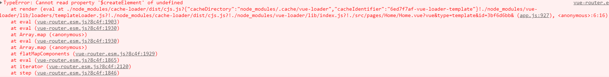
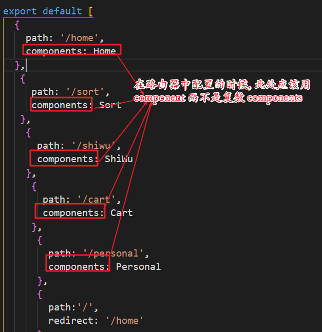

> **错误:**
>
> 

> ```js
> TypeError: Cannot read property '$createElement' of undefined
>     at render (eval at ./node_modules/cache-loader/dist/cjs.js?{"cacheDirectory":"node_modules/.cache/vue-loader","cacheIdentifier":"6ed7f7af-vue-loader-template"}!./node_modules/vue-loader/lib/loaders/templateLoader.js?!./node_modules/cache-loader/dist/cjs.js?!./node_modules/vue-loader/lib/index.js?!./src/pages/Home/Home.vue?vue&type=template&id=3bf6d6bb& (app.js:927), <anonymous>:6:16)
>     at eval (vue-router.esm.js?8c4f:1903)
>     at eval (vue-router.esm.js?8c4f:1930)
>     at Array.map (<anonymous>)
>     at eval (vue-router.esm.js?8c4f:1930)
>     at Array.map (<anonymous>)
>     at flatMapComponents (vue-router.esm.js?8c4f:1929)
>     at eval (vue-router.esm.js?8c4f:1865)
>     at iterator (vue-router.esm.js?8c4f:2120)
>     at step (vue-router.esm.js?8c4f:1846)
> ```
>
> **错误原因:**  
>
> 

