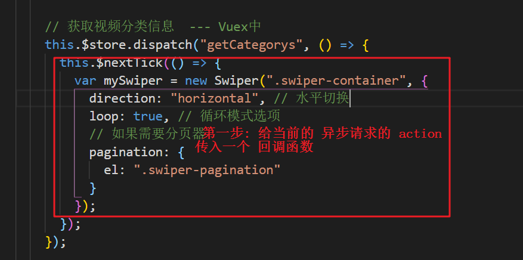

[TOC]

# Vue项目

> **项目前准备:**  
>
> 1. 要使用 stylus 这个 css 预编译器, 所以要全局安装一下 stylus
>
> ```js
> npm install -g stylus 
> ```
>
> 2.  编写 stylus 的代码
>
> ```js
> // 创建一个 index.styl 的文件. 注意,后缀名是 styl  编写 stylus 语法的代码. 然后用 stylus 命令编译
> -w index.styl   监视哪个文件
> -o css          编译后输出 css 文件夹
> 
> stylus -w index.styl -o css
> 
> ```
>
> 3. 定义变量的方式
>
>    ```js
>    // 在 stylus 中定义变量的时候, 变量前一半要加一个 $ 符号来区分与 css 之间的差别
>    
>    //  定义一个 font 变量为 $font
>    $font = 30px
>    
>    // 使用这个变量
>    p
>    	color blue
>      font $font   // 此时 p 标签的 font字体就为 30px
>    ```
>
> 4.  在 css 中 引入混合的方式如下
>
>    ```js
>    # 第一种引入混合的方式
>     @import "./reset.css"
>    
>    # 第二种引入混合的方式
>     @import ".mixins.styl"
>    ```
>

# 1.0 脚手架二

## 1.1 Vue项目搭建上

```js
1. // 通过脚手架2 下载对应的webpack 项目(eslint)
	vue init webpack gshop  (通过脚手架2下载对应的webpack项目(当前只安装 eslint))
  
2. // 干掉 src 中所有内容 (main.js, App.vue) 保留

3.// 创建对应的目录 (整个项目都会用到的目录)

4. // 下载对应的插件 vue-router, stylus, stylus-loader, swiper, axios

5.// 拆分组件, 搭建界面, 搭建路由, 实现页面展示

6.// 安装路由
	npm install vue-router

7. 安装 stylus stylus-loader 插件
	npm install stylus stylus-loader


8. 打包创建出 dist 目录
		npm run build
   // 运行 dist 项目
    serve dist 
```

> 在 src 目录下创建如下 目录介绍:

```js
1. api目录:  里面就是 ajax相关的代码, 
	   index.js -- 根据接口发送请求的代码.
     ajax.js  -- 封装后的ajax代码
   
2. common目录: 公共的静态资源, 如: mixins.styl
3. components目录: 普通组件
4. filter目录:  格式化(过滤器相关) 的代码
5. mock目录:  mock.js 相关的js 代码
6. pages目录: 路由组件
7. router目录: 配置路由的
8. store目录: vuex状态管理数据的相关代码

```

> **配置 忽略 esLint 检查提示** 
>
> 在 ==.eslintrc.js== 文件中 rules 中配置如下代码 
>
> ```js
>   rules: {
>     // allow async-await
>     'generator-star-spacing': 'off',
>     // allow debugger during development
>     'no-debugger': process.env.NODE_ENV === 'production' ? 'error' : 'off',
>     'no-trailing-spaces':'off',
>     'indent':'off',
>     'spaced-comment':'off',
>     'no-trailing-spaces':'off',
>     'no-new':'off',
>     'key-spacing':'off',
>     'comma-dangle':'off',
>     'eol-last':'off',
>     'quotes':'off',
>     'semi':'off',
>     'keyword-spacing':'off',
>     'space-before-blocks':'off',
>     'comma-spacing':'off',
>     'space-before-function-paren':'off',
>     'space-infix-ops':'off',
>     'no-multiple-empty-lines':'off',
>     'block-spacing':'off',
>     'padded-blocks':'off',
>     'arrow-spacing':'off',
>     'no-sequences':'off',
>     'no-unused-expressions':'off',
>     'no-multi-spaces':'off',
>     'no-unused-vars':'off',
>     'camelcase ':'off'
>   }
> ```

> **项目说明:**  
>
> ```js
> # common目录下 stylus目录中 ----- mixins.styl  --> 混合
> 
> # static目录中 css 目录 --- reset.css 重置样式的文件, iconfont.css图标字体样式文件,(直接引入,也可以通过在线的方式移入).  ---- static 目录中 的 reset.css文件在 index.html中引入, 图标字体的在线也引入到该 index.html文件中
> 
> -------------------------------------------------------------------------
> # index.html文件中
> 		1. 移动端的代码,  
>     2. 两个样式(reset.css 和 iconfont.css)  
> 		3. 解决延迟问题的代码
>     
>     		 <!--解决移动端点击事件0.3延迟问题: 使用fastclick库-->
>       <script src="https://as.alipayobjects.com/g/component/fastclick/1.0.6/fastclick.js"></script>
>       <script>
>         if ('addEventListener' in document) {
>           document.addEventListener('DOMContentLoaded', function () {
>             FastClick.attach(document.body);
>           }, false);
>         }
>       </script>
> 
> # --------------------------------------------------------------------------
> 
> # 总结:	
> 	index.html中 有 4 个操作
>   	1. meta 标签
>     2. 重置样式
>     3. 图标字体
>     4. 解决移动端延迟 0.3 的 js 代码
> ------------------------------------------
> # 需要安装的插件:
> 	vue-router stylus stylus-loader 目前已将安装过了
>   axios  swiper  vuex 后期使用时再安装
>   
>   common 目录下 --> stylus目录中  ---> 添加 mixins.styl 混合
>   
>   在 components 目录下 ---> FooterGuide 目录下 --> FooterGuide.vue 组件  ---> 底部导航组件
> ```
>

> **框架整体搭建:**  
>
> 1. **整体框架搭建**
>
> ```js
> //1. 在 components目录中 --> 创建底部的 FooterGuide目录 --> 创建 FooterGuide.vue 组件, 该组件为底部导航的路由组件
> //2. 在App.vue 中引入 FooterGuide.vue 组件, 注册, 并使用
> //3. 在 pages 目录中创建 四个目录, ---> 这四个目录中分别放置对应的路由组件
> 			MSite   Search  Order   Profile
> //4. 在 router 目录中, 创建一个 index.js 文件, 和一个 routes.js 文件.  注册路由 
> //5. 以上总结:  点击 FooterGuide.vue 组件中相关的链接就会跳转到指定的路由组件界面. 
> ```
>
> 2. **在 FooterGuide.vue 中, 为 每个 a 标签添加了动态的类样式**
>
>    ```js
>    //1. 给每个 a 标签添加了动态类样式 和 点击事件
>    :class="{'on':$route.path==='/msite'}" @click="goto('/msite')" 四个
>    
>    //2. 在 methods对象 中:
>     methods:{
>       goto(path){
>         // 使用的是 replace() 方法跳转	---- 编程式路由
>         this.$router.replace(path)  // 路由器的实例
>       }
>     }
>    //3. 在 router目录中 的index.js 中配置路由对象, 在 routes.js 中配置所有的路由, 并且设定重定向,  去 main.js 中注册 路由器 
>    ```

### 1.1.1 Vue路由的配置

> 1. **安装vue 路由插件 npm install vue-router**
>
> 2. **在 router的目录中,  一般创建两个 文件**
>
>    ```js
>    	index.js  // 引入路由的具体配置文件(router.js),然后把index.js 引入到 main.js 文件中
>    
>    	router.js  // 具体配置路由的配置文件
>    ```
>
>    - **在 index.js 中**
>
>      ```js
>      >1. 引入 vue
>      >2. 引入 vue-router
>      >3. 声明使用 VueRouter
>      >4. 配置路由 (向外暴露一个对象,最终把它扔到 main.js中,注册路由路径)
>        export default new VueRouter({
>          mode:"history", // 地址中不出现 #号
>          route
>        })
>      ```
>
>    - **在 routes.js中**
>
>      ```js
>      // 引入对应的路由组件
>      // 引入外卖的路由组件
>      import MSite from '../pages/MSite/MSite.vue'
>      // 引入搜索的路由组件
>      import Search from '../pages/Search/Search.vue'
>      // 引入 订单的路由组件
>      import Order from '../pages/Order/Order.vue'
>      // 引入我的路由组件
>      import Profile from '../pages/Profile/Profile.vue'
>      
>      // 配置路由详细信息(向外默认暴露一个数组)
>      export default [
>        {
>          path: '/msite', // 这里一定要加一个空格,否则会报错
>          components: MSite
>        }
>      ]
>      ```
>
> 3. **配置完成后在 main.js 中引入路由器**
>
>    ```js
>    1. // 引入路由器
>    	import router from './router/index.js'
>    
>    2. // 在 Vue 的实例对象中注册该路由器
>    	new Vue({
>        el: '#app',
>        components: { App },
>        template: '<App/>',
>        router    // 注册路由器
>    	})
>    ```
>
> 4. **最后在 App.vue 组件中, 需要显示 子组件的地方, 配置,渲染显示子组件**  ` <router-view></router-view>` 

### 1.1.2 全局公共组件的抽取和使用

```js
1. // 根据各个组件公用的部分, 我们一般会抽离出一个公共组件, 放在 components 目录里

2. // 为了避免在每个组件中都要引入一次, 这样比较麻烦, 所以我们通常也会把公共的组件, 注册成一个全局的组件来使用
	>1. 所以我们会在 main.js 中,引入抽取的公共组件
			// 引入 Header.vue 组件, 并注册成一个全局组件
			import Header from './components/Header/Header.vue'
	>2. // 注册全局组件
			Vue.component('Header', Header)

3. // 要使用全局组件, 可以在需要使用该全局组件的其他子组件中直接使用,不必再引入
```

### 1.1.3 swiper轮播图插件的使用

> [swiper中文网网址](https://www.swiper.com.cn/)  
>
>  [找到中文教程中, **在 vue 中使用swiper**](https://github.com/surmon-china/vue-awesome-swiper)     打开该网址
>
> [打开中文教程中 swiper5中使用方法](https://www.swiper.com.cn/usage/index.html)    

```js
1. 安装 swiper 插件
	npm install swiper
  
2. // 引入 Swiper
		import Swiper from "swiper";

3. // 引入swiper的 css 样式
		import 'swiper/dist/css/swiper.css'

	// 注意: swiper5 的版本中, swiper.css 路径发生了改变, 修改为如下. 否则样式出不来
		import 'swiper/css/swiper.css'

4. 配置 Swiper 对象
		new Swiper(".swiper-container", {
  		loop: true,
  		// 如果需要分页器
  		pagination: ".swiper-pagination"
		});

5. // 注意: 使用Swiper轮播图插件的时候,必须等到界面全部加载完之后, 这个 Swiper的配置才有效. 
	所以 配置 Swiper的对象在 mounted 这个生命周期勾子函数里.
		
```

### 1.1.4 api目录发送请求

```js
1. // 安装 axios, 封装了一个 promise风格的 ajax
	npm install axios

2. // ajax.js 中写具体封装实现的 ajax的方法, 向外暴露一个方法
  export default function ajax(url, data = {}, method = 'GET') {
    return new Promise((resolve, reject) => {
      let promise
      // 执行异步ajax请求                      
      if (method === 'GET') {
        promise = axios.get(url, {
          params: data
        }) // params配置, 指定的是query参数
      } else {
        promise = axios.post(url, data)
      }
      promise.then(
        response => { // 如果成功了, 调用resolve()
          resolve(response.data)
        },
        error => { // 如果失败了, 不调用reject(), 而是提示错误信息
          alert('请求异常: ' + error.message)
        }
      )
    })
  }

3.  // 在index.js 中 引入 ajax
		import ajax from './ajax.js'

4. // 具体实现接口的编写

# 注意: 发送请求时, 需要启动 服务器端的项目了
      启动  gshop-server_final 服务器端项目
```

### 1.1.5  脚手架2 配置跨域请求问题

> **脚手架2的代理配置, 解决跨域问题** 

```js
1. // 在脚手架项目中. config目录下, index.js 文件中
	proxyTable: {
      '/api': { // 匹配所有 以 '/api' 开头的请求路径
        target: 'http://localhost:5000', // 代理目标的基础路径
        changeOrigin: true, // 支持跨域
        pathRewrite: { // 重写路径: 去掉路径中开头的 '/api'
          '^/api': ''
        }
      }
    },
```

# 2.0 脚手架三

## 2.1 Vue项目搭建

> [vue-cli3 版本官网](https://cli.vuejs.org/zh/)   

> **关于旧版本**
>
> Vue CLI 的包名由 `vue-cli` 改成了 `@vue/cli` . 如果已经全局安装了旧版本的  `vue-cli` (1.x或 2.x), 需要先通过 `npm uninstall vue-cli -g ` 或 `yarn global remove vue-cli`  卸载

### 2.1.1 脚手架二换脚手架三

> **卸载脚手架二更换脚手架三版本** 

```js
1. // 卸载全局安装过的脚手架二
	npm uninstall vue-cli -g

2. // 执行完命令之后,执行如下命令
   vue -V   // 如果报错, 证明就已经完全卸载完成脚手架二

3. // 安装脚手架三版本
	 npm install -g @vue/cli
	 vue -V    // 查看版本

```

> **如果安装脚手架三, 仍还想用脚手架二的一些功能. 可以按照如下处理兼容性问题.** 
>
> Vue CLI >=3 和旧版本使用了相同的 `vue`命令, 所以 VUE CLI 2(`vue-cli`) 被覆盖了. 如果你仍然想要使用旧版本的 `vue init` 功能, 你可以安装一个桥接工具:
>
> ```js
> 1. // 执行以下命令, 可以实现脚手架二和三的兼容 
> 	npm install -g @vue/cli-init
> 	
> // vue init 的运行结果将会跟 vue-cli@2.x 相同
> 
> 	vue init webpack my-project  // 脚手架2创建项目
> 	vue create hello-world			// 脚手架 3 创建项目
> ```

## 2.2 脚手架三创建 vue 项目

```js
1. // 运行命令创建一个新项目
	vue create hello-world

2. // 脚手架 3 启动项目命令
	 npm run serve
```

> **如何把脚手架二的项目移植到脚手架三中**
>
> 1.  把 index.html 文件放到 public 目录中
> 2. 把 静态资源中的css 文件也放到 public目录中. (修改用到里面样式的路径)
> 3.  删掉 脚手架三 src 目录里所有内容. 把原项目脚手架二 src 下面所有的内容放进去

```js
# 项目转移成功后, 下载响应的依赖包
#Summary 脚手架3的东西
1. vue create 项目名   --- 下载项目
2. npm run build      ---  打包
3. serve dist         --- 运行打包的项目

4. 如何把脚手架2 的东西放在脚手架3中 ?
  	>1. 脚手架2中的 index.html  --- 放在 脚手架3中的public目录中
		>2. 脚手架2中的static目录中的 cs 目录放在脚手架3中的public目录(别忘记修改 index.html 中引入重置样式文件的路径)
		>3. 脚手架2中的src目录中的所有内容 复制到 脚手架3中的src目录中
    >4. 在脚手架3中安装相关的包
    	npm install stylus stylus-loader vue-router swiper axios vuex
      
5. 脚手架3 中启动项目
	npm run serve  / yarn serve
```

> ==**出现的问题**==   
>
> ==You are using the runtime-only build of Vue where the template compiler is not available. Either pre-compile the templates into render functions, or use the compiler-included build.==     
>
> **移动项目到脚手架3后,项目打开显示空白页面,没有显示项目资源的问题**
>
> ```js
> 1. //脚手架2 或者脚手架3中依赖的包都是使用的是  ---> vue.runtime.esm.js文件
> 
> 2. //但是在脚手架2中的build目录中的 webpack.base.conf.js文件中重新的配置了访问vue文件的路径的文件(vue.esm.js) 这个文件
> 
> 3. //脚手架3中没有配置过 vue.esm.js文件,那么此时如果使用vue了. (import Vue from 'vue') 默认就去找 vue.runtime.esm.js. (找不到报错)
> ```
>
> **解决问题**
>
> 1.  **在项目的根目录下创建一个 `vue.config.js`**  文件, 并添加如下配置 
>
> ```js
> const path = require('path')
> 
> function resolve(dir) {
>   // return path.join(__dirname, '..', dir)
>   return path.join(__dirname, dir)
> }
> // vue.config.js
> module.exports = {
>   configureWebpack: {
>     resolve: {
>       extensions: ['.js', '.vue', '.json'],
>       alias: {
>         'vue$': 'vue/dist/vue.esm.js',
>         // 表示可以用 @代表 src,  在引入路由的时候可以代替相对路径
>         // 比如引入组件时  ../../components/XXX.vue 可以代替为
>         //               @/components/XXX.vue 为路径起了一个简写的方式
>         '@': resolve('src'),
>       }
>     },
>   },
>   // 配置 多个跨域服务器的配置如下
>   devServer: {
>     proxy: {
>       '/api': {
>         target: 'http://localhost:5000', // 目录地址
>         changeOrigin: true, //是否跨域
>         pathRewrite: {
>           '^/api': '', // rewrite path, 去掉开头的 api 只是后台收到的请求路径去掉了 api, 前台network网路请求中还是全路径
>         },
>       },
>       '/API': {
>         target: 'http://m.you.163.com', // 目录地址
>         changeOrigin: true, //是否跨域
>         pathRewrite: {
>           '^/API': '', // rewrite path, 去掉开头的 API 只是后台收到的请求路径去掉了 API, 前台network网路请求中还是全路径
>         },
>       }
>     },
>   }
> }
> ```

> ==**在package.json中配置自动打开浏览器**==   
>
> ```js
> "serve": "vue-cli-service serve --open",  // 最后添加上了 --open
> ```

## 2.3 配置使用 vuex管理状态数据

```js
#1. 使用 vuex管理状态数据的几个重要步骤
1. 创建一个通常为 store 的目录, 在该目录下创建几个常用的文件
	actions.js
	getters.js
	index.js  // 暴露 export default new Vuex.Store({})
	mutation-types.js
	mutations.js
	state.js

2. 在main.js 文件中引入 store.  并且在 在 new Vue({}) 的实例中注册仓库实例 store
    new Vue({
    render: h => h(App),
    components: { App },
    router,     // 注册路由器 
    store       // 注册 Vuex 仓库
  }).$mount('#app')

```

> **Vuex 执行流程图解**  
>
> 

> **Vuex 管理状态数据的用法:**  
>
> 1. **state.js** 
>
>    ```js
>    // 包含了多个状态数据的对象
>    export default {
>      // 经度
>      longitude: "116.36867",
>      // 纬度
>      latitude: "40.10038",
>      // 地址信息对象
>      address:{},
>      // 食品分类数组
>      categorys:[],
>      // 商铺信息数组
>      shops:[]
>    }
>    ```
>
> 2. **mutations.js** 
>
>    ```js
>    // 包含了多个直接修改状态数据的方法的对象
>    // 引入常量名 ---- mutation 的 types
>    import {RECEIVE_ADDRESS,RECEIVE_CATEGORYS,RECEIVE_SHOPS} from './mutation-types'
>    export default {
>      // 更新 state 中的 地址信息 .
>      [RECEIVE_ADDRESS](state,address) {
>        state.address = address
>      },
>      // 更新 state中的食品分类信息
>      [RECEIVE_CATEGORYS](state, categorys) {
>        state.categorys = categorys
>      },
>      // 更新 state中的商铺列表信息
>      [RECEIVE_SHOPS](state, shops) { 
>        state.shops = shops
>      }
>    }
>    ```
>
> 3. **mutation-types.js**
>
>    ```js
>    // 包含了多个 mutation 的 type的常量名字
>    // 地址信息
>    export const RECEIVE_ADDRESS = 'receive_address'
>    // 食品分类信息
>    export const RECEIVE_CATEGORYS = 'receive_categorys'
>    // 商铺列表
>    export const RECEIVE_SHOPS = 'receive_shops'
>    ```
>
> 4. **getters.js** 
>
>    ```js
>    // 包含了多个状态数据的 计算属性的getter 的方法的对象
>    export default {}
>    ```
>
> 5. **action.js** 
>
>    ```js
>    // 包含了多个间接修改状态数据的 方法的对象
>    // 引入常量名 ---- mutation 的 types
>    import {RECEIVE_ADDRESS,RECEIVE_CATEGORYS,RECEIVE_SHOPS} from './mutation-types'
>    // 引入 api 的相关接口
>    import {reqAddress,reqCategorys,reqShopList} from '../api/index'
>    export default {
>      // 发送请求, 获取地址的信息, commit() 更新
>      // 每一个 action 接受一个和store实例具有相同方法的对象
>      async getAddress({commit,state}){
>        const {longitude,latitude} = state
>        // 发送请求获取数据
>        const result = await reqAddress(latitude, longitude)
>        // 判断  如果发送成功, 则更新数据
>        if (result.code === 0) {
>          const address = result.data
>          // 提交更新后的 数据 到 state, 把 address 新地址传递过去更新
>          commit(RECEIVE_ADDRESS, address)
>        }
>      },
>      // 发送请求获取食品分类信息, commit() 更新
>       async getCategorys({commit}){
>        const result = await reqCategorys()
>        if (result.code === 0) {
>          // 食品分类信息的数组 
>          const categorys = result.data
>          commit(RECEIVE_CATEGORYS, categorys)
>        }
>      },
>      // 发送请求 获取商铺的信息.  commit()
>      async getShops({commit,state}){
>        const {longitude,latitude} = state
>        const result = await reqShopList(longitude, latitude)
>        if (result.code === 0) {
>          const shops = result.data
>          commit(RECEIVE_SHOPS,shops)
>        }
>      }
>    }
>    ```
>
> 6.  **index.js   也就是 store 的实例**  
>
>    ```js
>    // 引入 Vue
>    import Vue from 'vue'
>    // 引入 Vuex
>    import Vuex from 'vuex'
>    // 引入相关的配置对象
>    import state from './state.js'
>    import mutations from './mutations.js'
>    import actions from './actions.js'
>    import getters from './getters.js'
>    
>    Vue.use(Vuex)
>    // 向外暴露 store 对象
>    export default new Vuex.Store({
>      state,
>      mutations,
>      actions,
>      getters,
>    })
>    ```
>
> 7.  **==说明:==**   
>
>    ```js
>    // 由 Vuex 管理的状态数据, 在任何组件里都可以直接获取使用. 所以实现了跨组件通信. (原理:  因为 vuex管理状态数据的 store实例对象, 最终挂载到了 new Vue() 的实例中, 所以每个子组件都可以看到Vue() 实例上的 store 实例对象)
>    
>    // 在其他组件需要使用 Vuex 仓库的数据的时候, 一般有以下两种方式
>    	this.$store.属性名字
>      或者 ...mapState 进行拆包
>      
>    # ------------------------------------------------
>     # 注意: 使用 ...mapState 进行拆包的时候, 要放在计算属性里拆包.  如下
>     	computed: {
>        // store 中的 ...mapState 需要写到计算属性里
>        ...mapState(['address']) // 取出请求回来的 address
>      },
>    ```
>
>    

## 2.4 Vuex 抽取模块管理状态数据

> **Vuex 中抽取模块管理状态数据图解.**   
>
> 

# 3.0 使用 swiper 实现轮播图

> [Swiper官网](https://www.swiper.com.cn/usage/index.html)  查看Api
>
> > ==使用 Swiper时候的问题?==  
> >
> > ```js
> > // 在使用swiper的时候, new swiper 实例的时机应该是 数据有了, 界面渲染完毕了, 才能 new Swiper这个实例对象, 此时轮播图才会有效, 否则轮播图容易失效
> > 
> > # 那么如何处理这种问题? 
> > 
> > ```
> >
> > > **第一种解决方案: watch 监视解决**
> > >
> > > ```js
> > > // 使用数据监视, 监视要获取的数据, 等到要获取的数据发生改变一定时间之后, 再new Swiper() 这个实例使用
> > > 
> > > // 如果 vue中的状态数据发生变化, 会立刻执行 watch中的回调函数, 然后异步更新界面
> > > 
> > > 
> > >   watch: {
> > >     // 监视 categorys, 等 categorys 数据遍历,再 new Swiper实例
> > >     categorys() {
> > >       setTimeout(() => {
> > >         var mySwiper = new Swiper(".swiper-container", {
> > >           direction: "horizontal", // 水平切换
> > >           loop: true, // 循环模式选项
> > >           // 如果需要分页器
> > >           pagination: {
> > >             el: ".swiper-pagination"
> > >           }
> > >         });
> > >       }, 1000);
> > >     }
> > >   }
> > > 
> > > # 不常用, 延迟时间不好控制
> > > ```
> > >
> > > **第二种解决方案: watch解决方式二**  
> > >
> > > > **利用 Vue API 提供的实例方法 $nextTick() 方法**, 保证在DOM 更新之后, 才执行 $nextTick() 中的回调
> > >
> > > ```js
> > >   watch: {
> > >     // 监视 categorys, 等 categorys 数据遍历,再 new Swiper实例
> > >     categorys() {
> > >       this.$nextTick(() => {
> > >         var mySwiper = new Swiper(".swiper-container", {
> > >           direction: "horizontal", // 水平切换
> > >           loop: true, // 循环模式选项
> > >           // 如果需要分页器
> > >           pagination: {
> > >             el: ".swiper-pagination"
> > >           }
> > >         });
> > >       });
> > >     }
> > >   }
> > > ```
> > >
> > > **第三种解决方案** 
> > >
> > > ==给异步的请求 action 传入一个回调, 在异步请求完成之后调用传入的回调函数, 再利用 $nextTick() 这个函数, 保证页 DOM 界面重新渲染只有再执行回调里的new Swiper() 实例这段代码. 也可以保证 swiper的有效性==  
> > >
> > > **第一步** 
> > >
> > > 
> > >
> > > **第二步** 
> > >
> > > 
> > >
> > > **==第四种解决方案:==**  
> > >
> > > 
> > >
> > > 

# 4.0 vee-validate使用

> vee-validate 是 Vue 表单验证的一个插件.
>
> [vee-validate的github地址](https://github.com/logaretm/vee-validate)   
>
> [vee-validate官网地址](https://logaretm.github.io/vee-validate/)   
>
> ==一定注意:==  不同版本的 vee-validate 插件,用法可能会有不同, 详见官网
>
> **安装 vee-validate:**  `npm install vee-validate@2.2.13 ` 注意版本号  目前使用 **2.x版本, 版本不同可能用法不同**, 注意查看官网时, 要查看 2.x的版本.  
>
> 1. 创建一个 vee-validate.js 文件, 配置如下
>
>    ```js
>    import Vue from 'vue';
>    import VeeValidate,{Validator} from 'vee-validate';
>    // 引入 提示信息汇中文化需要用到的 包
>    import zh_CN from 'vee-validate/dist/locale/zh_CN'
>    
>    // 声明使用
>    Vue.use(VeeValidate)
>    
>    // validate 校验本地化(即:让提示信息变成中文)
>    VeeValidate.Validator.localize('zh_CN', {
>      messages: zh_CN.messages,
>      // 如果你希望某个值是中文的, 请以键值对的方式来进行修改, 前面的是属性名字,后面的是该属性名字对应的中文提示
>      attributes: {
>        phone: '手机号码',
>        code: '短信验证码',
>        name: '用户名',
>        pwd: '密码',
>        captcha: '图形验证码'
>      }
>    })
>    
>    // 表单校验的 扩展的方法
>    // phoneVerigy 是扩展用的方法名
>    Validator.extend('phoneVerigy',{
>      getMessage:() => `您输入的手机号码不正确`,
>      validate:(value) => {
>       return /^[1]\d{10}$/.test(value)
>      }
>    })
>    // codeVerify 是验证手机验证码的扩展方法
>    Validator.extend('codeVerify', {
>      getMessage: () => `验证码不正确`,
>      validate: (value) => {
>        return /^\d{6}$/.test(value)
>      }
>    })
>    ```
>
> 2. 在 main.js 中引入创建的 vee-validate 校验用的文件
>
>    `import './vee-validate.js'`
>
> 3.  使用其校验其校验功能
>
>    ```js
>    // 在 input 框下面添加一个 span标签, 添加配置校验功能
>    <input type="tel" maxlength="11" placeholder="手机号" v-validate="'required|phoneVerigy'" v-model="phone" name="phone" />
>                  <span style="color:red" v-show="errors.has('phone')" class="help is-danger">{{ errors.first('phone') }}</span>
>    ```
>
> 4.  使用本地化功能, 可以让错误消息提示 变成中文. 详见`vee-validate.js` 
>
> 5.  ==**vee-validate 校验图解**==  
>
>    

# 5.0 mint-ui 的使用

> [mint-ui官网](http://mint-ui.github.io/docs) 
>
> **安装 mint-ui:**  `npm install mint-ui -S`  
>
> **引入全部的mint-ui**:在 main.js 中引入并声明使用 mint-ui  如果打算按需加载 mint-ui, 可以不用 这一步的引入. 
>
> ```js
> import MintUI from 'mint-ui'
> import 'mint-ui/lib/style.css'
> 
> Vue.use(MintUI)
> ```
>
> **但是通常我们都用按需加载的方式**
>
> ```js
> //1. 如果打算按需引入的方式,需要装 babel-plugin-component 插件
> 	npm install babel-plugin-component -D
> 
> //2. 然后，将 .babelrc 文件添加或修改为：(如果没有babelrc 则是在 babel.config.js文件中配置)
> # 注意, 脚手架2 和 脚手架3 配置的方式可能不一样,如有错,查文档解决
> 		{
>       "presets": [
>         ["es2015", { "modules": false }]
>       ],
>      "plugins": [
>          ["component", {
>           "libraryName": "mint-ui",
>           "style": true
>          }]
>   		]
>     }
> 
> //3. 在 main.js 中 注册全局(公共组件)
> 			import { Button } from 'mint-ui';
> 
> 			Vue.component(Button.name, Button);
> 
> //4. 在需要引入 Button 组件的地方引入即可
> 		<mt-button type="danger">danger</mt-button>
> 
> # 注意: 修改了配置,  一定重启项目才会生效
> ```
>

# 6.0 Mock.js 的使用

> [Mock.js官网](http://mockjs.com/)    打开文档,  或者点击 `开始` 打开github

> **Mock.js 的使用**  
>
> 1. **在项目中安装 mock:**  `npm install mockjs ` 
>
> 2.  **使用 mock** 
>
>    - **使用 mock 大致步骤**
>
>    ```js
>    // mock这个插件, 直接安装, 引入, 不需要像其他插件那样 use()
>    
>    #1. 在项目中创建一个 mock 目录
>    	>- 在 mock这个目录里创建一个 data.json文件, 是一个用来存储 模拟数据的文件
>      >- 在 mock这个目录里再添加一个 mock.server.js, 这个文件是充当服务器的角色, 拦截前端的 ajax请求,并返回模板数据的一个 mockJS的 API 配置的文件
>      
>    #2. 在 main.js 文件中引入 mock 文件
>    		import './mock/mock-server.js'
>    
>    ```
>
>    -  **详细配置 mock.server.js 中拦截的方法**  
>
>      ```js
>      // 引入 data.json 数据文件
>      import data from './data.json'
>      // 引入 mock
>      import Mock from 'mockjs'
>      
>      // 参数一: Mock拦截 ajax请求匹配的路径
>      // 参数二: 拦截请求后返回的数据.一般我们会添加一个code用于给前端标识是否获取数据成功
>      Mock.mock('/goods',{code:0,data:data.goods})
>      Mock.mock('/ratings',{code:0,data:data.ratings})
>      Mock.mock('/info',{code:0,data:data.info})
>      ```
>
> 3.  **编写接口测试** 
>
>    ```js
>    // 编写 ajax接口测试, 检测 mock配置是否能够成功返回数据
>    
>    // 获取点餐数据的接口
>    export const reqGoods = () => ajax('/goods')
>    // 获取评价的数据的接口
>    export const reqRatings = () => ajax('/ratings')
>    // 获取商家的数据的接口
>    export const reqInfo = () => ajax('/info')
>    ```
>
> 4.  **Mock.js 的执行流程和注意点图解**  
>
>    - **mock.js 模拟后台数据执行流程**  
>
> 
>
> - **mock.js 拦截请求,返回数据图解**

> 

# 

# 7.0 better-scroll 的使用

> [better-scroll 官网文档](http://ustbhuangyi.github.io/better-scroll/doc/zh-hans/#better-scroll%20%E6%98%AF%E4%BB%80%E4%B9%88)     
>
> **注意点:**  
>
> ```js
> 如果想要使用 better-scroll 实现列表的滑动, 必须把整个列表放到一个 better-scroll 指定的容器里面, 并且该容器的高度要小于 列表的高度才能实现滑动的效果.
> # 要滑动列表的高度,或宽度, 要大于 容器的高度或宽度
> ```

> **better-scroll 的使用** 
>
> 1. **安装 better-scroll** 
>
>    ```js
>    npm install better-scroll --save
>    ```
>
> 2.  在 要使用 better-scroll的组件里引入
>
>    ```js
>    import BScroll from 'better-scroll'
>    ```
>
>    


