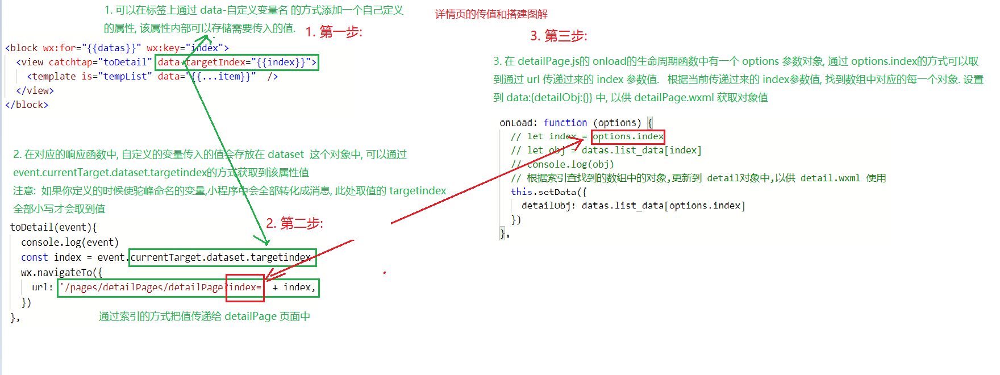

[TOC]

# 微信小程序

# 1.0 小程序基础

> 学习小程序开发之前需要自己先注册一个小程序的账号, 保留记住 appid, 后续会多次用到.

> [注册微信小程序](https://mp.weixin.qq.com/cgi-bin/wx?token=&lang=zh_CN)
>
> [小程序官方文档](https://developers.weixin.qq.com/miniprogram/dev/framework/)  

> [开发文档-框架-全局配置里可以配置app.json](https://developers.weixin.qq.com/miniprogram/dev/reference/configuration/app.html) 

> **小程序中没有数据代理** 
>
> **小程序中 data 的说明** 
>
> ```js
> //1. 小程序中 onload 类型与 vue 中的 mounted.  onload会常用
> 
> //2. 小程序中没有数据代理存在
> 		> vue中 data 里面的属性msg, 外部使用的时候, 直接 this.msg就可使用,
>     > vue中有数据代理, this代理了 data.
>     > vue中的组件中的this 是当前组件的实例对象.
> # ----------------------------------------------------------------
>     > 小程序中没有代理. 
>     > 小程序中的 this 也是一个对象(当前page对象),但是没有代理 data中的数据
>     > 可以通过 this.data.msg 获取值 或者 this.__data__.msg 来获取值
>     console.log(this.data)   // 打印出data这个对象
> 		console.log(this.data.msg)  // 打印出data这个对象里对应属性的属性值
> 		
> 	# 小程序中修改 data中的数据用  setData({}) 方法修改
>   	this.setData({msg:"杨阳,好帅哦"})
>     
> # ----------------------------------------------------------------
> // 3. 方法该放在什么位置?  (配合事件写的一些方法)  事件的回调函数
> 	/**
> 	 * 小程序中的事件分类: 冒泡事件  和 非冒泡事件
> 	 * >1. 小程序中的方法应该和 生命周期的响应函数是 同一个级别的. 即: 放在 onload 周期函数的外面
> 	 * >2. 小程序中的冒泡事件是以 bind 开头修饰的.
> 	 * >3. 小程序中的非冒泡事件是以 catch 开头修饰的.
> 	 */
> 	
> 
> ```

## 1.1 小程序的事件

>**小程序中事件分两种类型** 
>
>[指南->小程序框架->事件系统](https://developers.weixin.qq.com/miniprogram/dev/framework/view/wxml/event.html)    
>
>1. **冒泡事件**
>2. **非冒泡事件**

## 1.2 小程序路由

>[API->路由](https://developers.weixin.qq.com/miniprogram/dev/api/route/wx.switchTab.html)
>
>**小程序中的swiper组件:**   [组件-> 视图容器->swiper](https://developers.weixin.qq.com/miniprogram/dev/component/swiper.html)   

## 1.3 小程序中的模板的创建和使用

> ==:triangular_flag_on_post: :triangular_flag_on_post: 小程序中引入文件的方式== 
>
> 1. **引入模板**  `<import src="/pages/tempList/tempList.wxml"/>`
> 2.  **wxss样式的引入方式:**  `@import '/pages/tempList/tempList.wxss'`
> 3.  **JS 文件引入方式:**     `let variable = require('路径') `

>[框架->WXML语法参考->模板](https://developers.weixin.qq.com/miniprogram/dev/reference/wxml/template.html)   
>
>```js
>//1. 正常创建一个 page, 因为我们只需要用到 模板中需要展示的 wxml的内容, 所以 创建的 js 和 json 文件可以不用删除掉
>//2. 把在 app.json中自动引入的模板的路径删掉, 我们只需要在用到模板的地方自动引入即可
>
># --------------------------------------------------------------------
>//1. 模板代码
>	<template name="tempList">
>  <view>
>    <text> {{index}}: {{msg}} </text>
>    <text> Time: {{time}} </text>
>  </view>
>	</template>
>
>// 2. 在需要使用模板代码的文件里引入该模板 
>	<import src="/pages/tempList/tempList.wxml"/>
>      
>//3. 声明 使用的模板
>	// 通过data属性可以给模板内部传入数据
>  // 数据传入 模板中之后,直接帮我们拆包,所以可以直接使用 item中的属性值
>	<template is="tempList" data="{{...item}}"/> 
>```

## ==SUMMARY:==  

```JS
//1. 小程序: 不需要安装, 用完就走, 
  没有 DOM, 没有数据代理. 
  设置数据:  setData({属性:值})
  组件化的编程方式

一般情况下, 在 onload 生命周期函数中对界面内容进行操作
小程序中样式操使用 rpx 单位:  1rpx = 1物理像素 = 0.5px

//2. app.json中是整个项目的配置文件, 可以设置相关文件的引入和窗口样式. 
		轮播图: swiper 组件
  
//3. 模板: template 标签, 如何使用?
  	template 标签中配合 name属性, 在使用该模板的时候,注意
		使用模板的 wxml 文件中需要引入模板的 wxml 文件
			<import src="路径" />
		使用模板的 wxss 文件中,需要引入 模板的 wxss 文件
			@import "路径"
	
		外部使用模板的时候需要使用 is 属性, is 属性的值为模板的 name名字对应
		
    引入 外部的 js 文件 let variable = require('相对路径')

```

# 2.0 模板遍历及传入数据

>[模板遍历, 列表渲染](https://developers.weixin.qq.com/miniprogram/dev/reference/wxml/list.html)      
>
><template is="tempList" data="{{...item}}"  />  
>	模板传值的时候,只需要通过 data="{{}}" 插值的方式把遍历的 item对象传到 tempList组件中即可.
>	在 tempList组件中使用数据的时候, 直接可以使用 item对象的属性. 因为在该组件中已经默认帮我们把 item的每一个属性值做了拆包处理. 可以直接获取对象里面的值.

# 2.1 详情页的搭建和传值

> **详情页的传值详细图解:**



# 2.2 音乐播放实现

>播放音乐的API接口 [API->媒体](https://developers.weixin.qq.com/miniprogram/dev/api/media/map/wx.createMapContext.html)     2
>
>```js
>// 在任意一个组件页面的js 文件中, 都可以通过 getApp() 这个方法获取到全局 app对象中定义的 data:{} 数据'
>
>//1.如在 app.js 文件中,在 data 里定义一些数据
>		data:{
>      isMusicPlay:false,
>      // 存储的是当前播放音乐的页面的索引值
>      pageIndex:null,
>    }
>      
>//2. 然后在 其他 js 文件中可以直接通过 getApp() 这个方法得到一个对象
>      let appData = getApp()
>      appData.data.isMusicPlay // 可以获取到 app.js文件中data中定义的数据
>
>//3. 可以通过下列方式修改 app.js 文件中全局定义的 data 实现数据缓存
>      appData.data.isMusicPlay = true
>    	appData.data.pageIndex = options.index
>```

# 2.3 tapBar的实现

> [框架->全局配置查看API](https://developers.weixin.qq.com/miniprogram/dev/reference/configuration/app.html)     
>
> **在 app.json中进行配置**
>
> ```js
> // 微信小程序最底部的 切换 tab 的配置
> 
> "tabBar":{
>     "color":"#666",
>     "selectedColor":"#00ff00",
>     "backgroundColor":"#ff0000",
>     "list":[
>       {  
>         "pagePath":"pages/list/list",
>         "text":"文与字",
>         "iconPath":"/images/tab/yuedu.png",
>         "selectedIconPath":"/images/tab/yuedu_hl.png"
>       },
>         {
>           "pagePath": "pages/movies/movies",
>           "text": "电影",
>           "iconPath": "/images/tab/dianying.png",
>           "selectedIconPath": "/images/tab/dianying.png"
>         }
>     ]
>   }
> ```

# 2.4 登录的操作

> 在小程序中, 点击获取用户信息是需要授权的, 但是我们不需要自己写这个授权的方法, 只需要直接调用小程序内部自己实现的授权方法即可:
>
> ```js
> //1. 定义一个按钮: 设置 open-type的属性值为 getUserInfo 即可. 它内部会帮我们实现这个获取用户信息授权的代码.
> 
> <button bindgetuserinfo="loginUser" open-type="getUserInfo">获取用户信息</button>
> 
> //2. 我们只需要在 onload 声明周期函数里通过  getUserInfo 传入一个对象和参数即可获取.
>   // 获取用户信息, 需要授权
>     wx.getUserInfo({
>       success:(res)=>{
>         console.log(res)
>       },
>       fail:(res)=>{
>         console.log(res)
>       }
>     })
> 
> // 按钮登录更新数据的回调
>   loginUser(res){
>     // 获取用户信息
>     if (res.detail.rawData !== undefined){
>       console.log("如果有数据, 更新数据,没有数据则不进入该 if 语句")
>       // 更新数据
>       this.setData({
>         userInfo:JSON.parse(res.detail.rawData)
>       })
>     }
> ```

# 3.0 mpvue的介绍

>[mpvue官网介绍](http://mpvue.com/)    
>
>`mpvue` （[github 地址请参见](https://github.com/Meituan-Dianping/mpvue)）是一个使用 [Vue.js](https://vuejs.org/) 开发小程序的前端框架

## 3.1 mpvue 的使用

> **mpvue 的简单使用步骤**
>
> ```js
> /1. 创建一个机遇 mpvue-quickstart 模板的新项目
> 	vue init mpvue/mpvue-quickstart my-project
> 
> //2. 安装依赖
> 	 cd my-project
> 	 npm install
> 	 npm run dev
> 
> ```
> 

# 4.0 小程序项目

## 4.1 mpvue下载及介绍

> [mpvue官网快速上手](http://mpvue.com/mpvue/quickstart.html)        

# 

# 5.0 koa 搭建服务器

> [koa官网](https://koa.bootcss.com/)   
>
> Koa 是一个新的 web 框架，由 Express 幕后的原班人马打造， 致力于成为 web 应用和 API 开发领域中的一个更小、更富有表现力、更健壮的基石。 通过利用 async 函数，Koa 帮你丢弃回调函数，并有力地增强错误处理。 Koa 并没有捆绑任何中间件， 而是提供了一套优雅的方法，帮助您快速而愉快地编写服务端应用程序。

### 5.1 koa框架搭建服务器的使用

> **安装 koa 和 koa-router** 
>
> - **server.js 服务器搭建**  
>
>   ```js
>   // 引入koa
>   let Koa = require('koa')
>   // 引入koa-router
>   let KoaRouter = require('koa-router')
>   // 实例化
>   let koa = new Koa()
>   let koaRouter = new KoaRouter()
>   // 引入数据
>   let datas = require('./datas/data.json')
>   // 微信小程序引入的fly  注意此处手动在末尾加上 /index
>   var Fly = require('flyio/src/node/index')
>   var fly = new Fly
>   
>   // 根据接口返回内容
>   koaRouter.get('/', (ctx, next) => {
>     // 获取参数
>     let req = ctx.query.req
>     console.log(req)
>     // 返回内容
>     ctx.body = '测试123234234'
>   })
>   // 搜索图书的接口
>   koaRouter.get('/searchBooks', (ctx, next) => {
>     // 获取参数
>     let req = ctx.query.req
>     // 输出参数
>     console.log(req)
>     // 返回数据
>     ctx.body = datas
>   })
>   // 获取凭证的接口
>   koaRouter.get('/getOpenId', async (ctx, next) => {
>     let code = ctx.query.code
>     // 081eqMYL1KMXY71fu6ZL1MUNYL1eqMYJ
>     console.log(code)
>     // appid
>     let appId = 'wx8dc92766a09575de'
>     // 密钥
>     let appSecret = '8cc9978fb559e68c8b37ae4b71ee2788'
>     // 地址
>     let url = `https://api.weixin.qq.com/sns/jscode2session?appid=${appId}&secret=${appSecret}&js_code=${code}&grant_type=authorization_code`
>     let result = await fly.get(url)
>     console.log(typeof result.data)
>     console.log(JSON.parse(result.data).openid)
>     // 返回数据
>     ctx.body = JSON.parse(result.data).openid
>   })
>   // 声明使用
>   koa
>     .use(koaRouter.routes()) // 使用所有的路由
>     .use(koaRouter.allowedMethods()) // 使用所有的方法
>   // 监听端口
>   koa.listen('4000', () => {
>     console.log('服务器启动成功')
>     console.log('当前服务器地址为:http://localhost:4000')
>   })
>   
>   ```
>
> **nodemon 的安装和使用**  
>
> - 安装 **nodemon** 可以实现修改服务器端代码自动重启服务器
>
>   `npm install nodemon -g`  如果全局安装后,就不用再执行这条命令. 直接执行 `npm install nodemon` 在需要的文件中安装即可.
>
> - 再启动服务器的时候 使用命令: `nodemon server.js`  , 此时再修改服务器端代码的时候,只要保存, 服务器就可以自动重启 

# 

# 6.0 fly发送 ajax请求

> [fly 的github地址 ](https://github.com/wendux/fly)   
>
> **在 node 环境下的服务器端,如果要实现 ajax 方式发送请求或者请求转发, 可以使用 fly.js 完成发送请求的功能** 
>
> 一个支持所有JavaScript运行环境的基于Promise的、支持请求转发、强大的http请求库。可以让您在多个端上尽可能大限度的实现代码复用。

## 6.1 fly.js 的使用

> 1. **安装** 
>
>    - **使用 NPM**
>
>    ```js
>    npm install flyio
>    ```
>
>    - 使用 CDN(浏览器中)
>
>    ```js
>    <script src="https://unpkg.com/flyio/dist/fly.min.js"></script>
>    ```
>
>    - UMD(L浏览器中)
>
>    ```js
>    https://unpkg.com/flyio/dist/umd/fly.umd.min.js
>    ```
>
> 2.  **引入 flyio** 
>
>    > **不同JavaScript运行时的入口文件不同** ，请查看文档后面相应平台的引入方式，但在浏览器、Node、React Native中引入的方式是一样的，下面是不同平台下的引入的方式：
>
>    - **浏览器, Node, React Nactive中引入**
>
>    ```js
>    //引入fly实例
>    var fly=require("flyio")
>    ```
>
>    - **上面方式引入的是Fly的默认实例（浏览器、Node、React Native中相同），你也可以自己创建Fly实例：** 
>
>    ```js
>    // 浏览器和React Native
>    var Fly=require("flyio/dist/npm/fly")
>    
>    // Node 入口
>    // var Fly=require("flyio/src/node/index") // 注意此处需要手动添加 /index 
>    var fly=new Fly;   // 一定注意此处没有 小括号
>    ```
>
> 3.  **发送请求**  
>
>    - 发送GET请求
>
>    ```js
>    //通过用户id获取信息,参数直接写在url中
>    fly.get('/user?id=133')
>      .then(function (response) {
>        console.log(response);
>      })
>      .catch(function (error) {
>        console.log(error);
>      });
>    
>    //query参数通过对象传递
>    fly.get('/user', {
>          id: 133
>      })
>      .then(function (response) {
>        console.log(response);
>      })
>      .catch(function (error) {
>        console.log(error);
>      });
>    ```
>
>    - 发送 POST 请求
>
>    ```js
>    fly.post('/user', {
>        name: 'Doris',
>        age: 24
>        phone:"18513222525"
>      })
>      .then(function (response) {
>        console.log(response);
>      })
>      .catch(function (error) {
>        console.log(error);
>      });
>    ```


 


