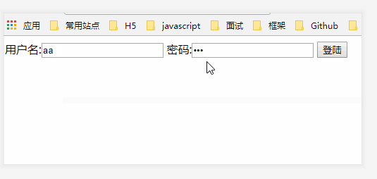

[TOC]

# 1.0  react 基础

## 1.1 React 的基本认识

### 1.1.1 官网

> 1)       英文官网:[ https://reactjs.org/](https://reactjs.org/)    
>
> 2)       中文官网: https://doc.react-china.org/     

### 1.1.2 介绍描述

> 1)       用于构建用户界面的 JavaScript 库(只关注于View)
>
> 2)       由Facebook开源

> React 的基本认识
>
> ```js
> ## 1.1. React基本认识
> ## 1.2. React基本使用
> ## 1.3. JSX的理解和使用
> ## 1.4. 模块与模块化, 组件与组件化的理解
> ```

### 1.1.3 React的特点

> 1)       Declarative(声明式编码)
>
> 2)       Component-Based(组件化编码)
>
> 3)       Learn Once, Write Anywhere(支持客户端与服务器渲染)
>
> 4)       高效
>
> 5)       **单向数据流**  

> React 组件化编程  
>
> ```js
> ## 2.1. 组件的定义与使用
> ## 2.2. 组件的3大属性: state, props, refs
> ## 2.3. 组件中的事件处理
> ## 2.4. 组件的组合使用
> ## 2.5. 组件收集表单数据
> ## 2.6. 组件的生命周期
> ## 2.7. 虚拟DOM与DOM diff算法
> ## 2.8. 命令式编程与声明式编程
> ```

### 1.1.4 React 高效的原因

> 1. **虚拟(virtual) DOM, 不总是 直接操作 DOM**  
> 2. DOM Diff 算法, 最小化页面重绘

> **注意: 此时只是测试语法使用, 并不是真实项目使用**   
>
> **React 的基本认识**  
>
> ```js
> 1). Facebook开源的一个js库
> 2). 一个用来动态构建用户界面的js库
> 3). React的特点
> 		Declarative(声明式编码)
> 		Component-Based(组件化编码)
> 		Learn Once, Write Anywhere(支持客户端与服务器渲染)
> 	高效
> 		# 单向数据流
>     
> #4). React高效的原因
> 	虚拟(virtual)DOM, 不总是直接操作DOM(批量更新, 减少更新的次数) 
> 	# 高效的DOM Diff算法, 最小化页面重绘(减小页面更新的区域)
> ```

## 1.2 React 的基本使用 

### 1.2.1 相关 JS 库

> 1)       **react.js**:     React的核心库
>
> 2)       **react-dom.js**:   引入react扩展库，专门用于操作DOM
>
> 3)       **babel.min.js:**  解析JSX语法代码转为纯JS语法代码的库

### 1.2.2 在页面中引入 js

```js
// react 的核心库
<script type="text/javascript" src="../js/react.development.js"></script>
// react 的扩展库, 专门用于操作 DOM
<script type="text/javascript" src="../js/react-dom.development.js"></script>
// 引入babel, 用于解析 jsx 语法为原生 js 语法
<script type="text/javascript" src="../js/babel.min.js"></script>
```

### 1.2.3 编码

```js
<script type="text/babel"> //必须声明babel
  //1. 创建虚拟DOM元素
const vDom = <h1>Hello React</h1>// 千万不要加引号
//2. 渲染虚拟DOM到页面真实DOM容器中
ReactDOM.render(vDom, document.getElementById('test'))
</script>

```

## 1.3 React JSX

### 1.3.1 虚拟 DOM

> **虚拟 DOM 的两种创建方式**  
>
> 1. **原生 JS 创建虚拟DOM**
> 2. **使用 jsx 语法创建虚拟 DOM**

> 1. React提供了一些API(原生js)来创建一种 `特别` 的一般js对象
>    - var element = React.createElement('h1', {id:'myTitle'},'hello')
>    - 上面创建的就是一个简单的虚拟DOM对象
>
> 2. 虚拟DOM对象最终都会被React转换为真实的DOM
>
> 3. 我们编码时基本只需要操作react的虚拟DOM相关数据, react会转换为真实DOM变化而更新界面

#### 1.3.1.1 原生 JS 创建虚拟DOM

```js
<body>
  <div id="test1"></div>
  <div id="test2"></div>
	
  <script type="text/javascript" src="../js/react.development.js"></script>
  <script type="text/javascript" src="../js/react-dom.development.js"></script>
  <script type="text/javascript" src="../js/babel.min.js"></script>

<!--1. 使用原生 js 创建虚拟 DOM-->
<script type="text/javascript">
  let myID = 'Gene Yang';
  let myData = 'hello,world';
    //1. 创建虚拟 DOM 对象  ('虚拟DOM对象',{对象传id},数据对象)
  let vDOM = React.createElement('h2',{id:myID},myData);
  //2. 渲染虚拟 DOM 到页面
  ReactDOM.render(vDOM,document.getElementById('test1'))
</script>
</body>
```

#### 1.3.1.2 使用 JSX 语法创建虚拟DOM

> 1. 创建虚拟 DOM 对象.
> 2. 渲染虚拟 DOM 对象

```JS
<body>
  <div id="test1"></div>
  <div id="test2"></div>

  <script type="text/javascript" src="../js/react.development.js"></script>
  <script type="text/javascript" src="../js/react-dom.development.js"></script>
  <script type="text/javascript" src="../js/babel.min.js"></script>

<!--2. 使用 jsx 语法创建虚拟 DOM-->
<script type="text/babel">   // 这里一定注意记着改为 babel
  
  //1. 创建虚拟 DOM 对象  
 let vDOM2 = <h2 id={myID.toUpperCase()}> {myData.toUpperCase()} </h2>

  //2. 渲染虚拟 DOM 对象到页面
  ReactDOM.render(vDOM2,document.getElementById('test2'))
</script>
</body>

```

> **虚拟DOM 和 真实DOM的比较** 
>
> ```js
> <!--
>   虚拟DOM:  较轻, 就是一个 js 对象.(通过用 js 代码的方式创建的对象啊)
>   真实DOM: 较重, 实实在在在页面中显示的DOM
> -->
> ```

### 1.3.2 JSX语法

> 1. 全称:  **JavaScript XML**
>
> 2. react定义的一种类似于XML的 JS 扩展语法: XML+ JS
>
> 3. 作用: 用来创建 react 虚拟DOM(元素)对象
>
>    - var ele = <h1>Hello JSX!</h1>
>
>    -  **注意1**: 它不是字符串, 也不是HTML/XML标签
>
>    -  **注意2**: 它最终产生的就是一个**JS对象**
>
> 4. 标签名任意: HTML 标签或其它标签
>
> 5. 标签属性任意: HTML标签属性或其它
>
> 6. 基本语法规则
>
>    - 遇到 < 开头的代码, 以标签的语法解析: html同名标签转换为html同名元素, 其它标签需要特别解析。
>
>    - 遇到以 { 开头的代码，以JS语法解析: 标签中的js表达式必须用{ }包含
>
> 7. babel.js的作用
>
>    - 浏览器不能直接解析JSX代码, 需要babel 转译为纯JS的代码才能运行
>
>    - **只要用了JSX，都要加上type="text/babel",** 声明需要babel来处理

### 1.3.3 渲染虚拟 DOM(元素)

> 1. 语法: `ReactDom.render(virtualDOM, containerDOM)` 
> 2. 作用: 将虚拟DOM元素渲染到页面中的真实容器 DOM 中显示
> 3. 参数说明
>    - 参数一: 纯 js 或 jsx 创建的 虚拟 DOM 对象
>    - 参数二: 用来包含虚拟 DOM 元素的真实 dom 元素对象(一般是一个div)

### 1.3.4 创建虚拟 DOM的2中方式

> 1. 纯 js 方式创建虚拟DOM (一般不用)
>    -  `let vDOM = React.createElement('h1',{id:'myTitleID'},title);`
> 2. JSX: (最终编译时会转成上面 纯 js 创建的格式)
>    - `let vDOM = <h2 id={myID}> {myData}</h2>`

## 1.4 模块与组件和模块化与组件化的理解

### 1.4.1 模块

> 1. 理解:  向外提供特定功能的 js 程序, 一般就是一个 js 文件
> 2. 为什么: js 代码更多更复杂.
> 3. 作用: 复用 js, 简化js 的编写, 提高 js 运行效率

### 1.4.2 组件

> 1. 理解: 用来实现特定(局部)功能效果的代码集合(html/css/js)
> 2. 为什么用到组件
>    - 现代网页的一个界面功能(界面,交互)很复杂
>    - 实现复用
>    - 作用: 复用编码, 简化项目编码,提高运行效率

### 1.4.3 模块化

> 当应用的 js 都是以模块化来编写的, 这个应用就是一个模块化的应用.

### 1.4.4 组件化

> 当应用是以多组件的方式实现, 这个应用就是一个组件化的应用

# 2.0 React 面向组件编程

## 2.1 组件定义的2种方式

> 1. **工厂函数定义组件(简单组件,无状态)**

```js
//1. 工厂函数定义组件
function MyComponent(){
  return <h2>这是工厂函数定义的组件(简单, 无状态)</h2>
}

//2. 渲染组件
 /*如下代码：当渲染组件标签的时候，会触发react底层自动调用定义组件的工厂函数
    经过babel的编译，开启了严格模式，禁止工厂函数里的this指向window*/
    ReactDOM.render(<MyComponent/>,document.getElementById('example1'))
ReactDom.render(<MyComponent/>,document.getElementById('example1');
```

> 2. **ES6 类定义组件(复杂组件/有状态)** 

```js
//2. ES6 类定义组件
class MyComponent extends React.Component{  // Component 一定注意首字母大写
  // 重写父类的 render()
  render(){
    console.log(this); // 这里this是 MyComponent 的实例对象
    return <h2>这是ES6类定义的组件(复杂组件,有状态)</h2>
  }
}

//2. 渲染组件
    /*如下代码：当渲染组件标签的时候，会触发react底层创建一个组件类的实例对象，随后
      使用该实例对象调用了，其身上的render方法*/
ReactDom.render(<MyComponent/>,document.getElementById('example1');
```

> ==**Attention:**==
>
> 1.  **组件名必须首字母大写**  
> 2. **虚拟 DOM 元素只能有一个根元素**
> 3. **虚拟 DOM 元素必须有结束标签**  

### 2.1.1 render() 渲染组件标签的基本流程

> 1. React 内部会创建组件实例对象
> 2. 调用 render() 得到虚拟 DOM, 并解析为 真实 DOM
> 3. ==插入==到指定的页面元素内部   (在Vue 中是 替换)

## 2.2 组件的三大属性

> **state:**  
>
> **props:**   
>
> **refs:**   

### 2.2.1 组件三大属性之一: state

#### 2.2.1.1 理解

> 1. state 是组件对象最重要的属性,  值是对象(可以包含多个数据)
> 2. 组件被称为 "状态机", **通过更新组件的state 来更新对应的页面显示**(重新渲染组件)

#### 2.2.1.2 state 属性的使用

> **因为 ES6 类组件才是有状态的组件,所以这里用 ES6类定义组件, 而不是工厂函数定义组件**

> 1. 初始化状态
>
>    ```js
>      constructor (props) {
>        super(props)
>        this.state = {
>          stateProp1 : value1,
>          stateProp2 : value2
>        }
>      }
>    ```
>
> 2. 读取某个状态值
>
>    ```js
>     this.state.statePropertyName
>    ```
>
> 3. 更新状态--> 组件界面更新
>
>    ```js
>      this.setState({
>        stateProp1 : value1,
>        stateProp2 : value2
>      })
>    ```

```js
 /*
  需求: 自定义组件, 功能如下：
    1. 显示h2标题, 初始文本为: 佩奇是一头猪
    2. 点击标题更新为: 佩奇不是猪
  */


 //1. 定义组件
  class Pig extends React.Component{
    // 构造器
    constructor(props){
      // 调用父类的构造器
      super(props);
      // 初始化状态
      this.state = {
        isPig:false
      };
      // 给当前的实例 添加一个 handlerClick 函数,改变this 为当前实例对象
      this.handlerClick = this.handlerClick.bind(this)
    }
    
    // 自定义一个响应点击的函数
    handlerClick(){
      let isPig = !this.state.isPig
      // 如下代码属于直接更改状态, 不会被 react 所认可, 不会被 react 所监听到
      // this.state.isPig = isPig

      // 要更新状态, 必须使用 this.setState()
      this.setState({
        isPig
      })
    }
    // 重写父类的 render
    render(){
      let {isPig} = this.state;
      // 如下代码在加指定点击事件的时候, 不要加()
      return <h2 onClick={this.handlerClick}>{isPig?'佩奇是一头可爱的猪, , ':'佩奇不是猪, ,'}</h2>
    }
  }
  //2.渲染组件标签
  ReactDOM.render(<Pig/>,document.getElementById('example'))

```

> **简写的方式** 

```js
<div id="example"></div>
<div id="example2"></div>

<script type="text/javascript" src="../js/react.development.js"></script>
<script type="text/javascript" src="../js/react-dom.development.js"></script>
<script type="text/javascript" src="../js/babel.min.js"></script>
<script type="text/babel">
  //1.定义组件
  class Pig extends React.Component{
    //初始化状态
    state = {isPig:true}
    //自定义一个响应点击的函数
    handlerClick = ()=> {
      let isPig = !this.state.isPig
      //如下代码属于直接更改状态，不会被react所认可，不会被react“监听”到
      //this.state.isPig = isPig //不可以直接修改状态数据
      //要更新状态，必须使用this.setState()
      this.setState({isPig})
    }
    //重写父类的render
    render(){
      let {isPig} = this.state
      //如下代码，在指定点击事件的时候，不要加()
      return <h2 onClick={this.handlerClick}>{isPig?'佩奇是一头可爱的猪':'佩奇不是猪'}</h2>
    }
  }

  //2.渲染组件标签
  ReactDOM.render(<Pig/>,document.getElementById('example'))
  ReactDOM.render(<Pig/>,document.getElementById('example2'))
```

#### 2.2.1.3 React 中自定义函数this 问题 

> ==**React 中, 不用箭头函数自定义事件时 处理 this 指向的图解**==        
>
> 

### 2.2.2 组件的三大属性之二:props

#### 2.2.2.1  效果

> 需求: 自定义一个用来显示一个人员信息的组件
>
> 1. 姓名必须指定
> 2. 如果性别没有指定,默认为 男
> 3. 如果年龄没有制定,  默认为 18

#### 2.2.2.2 理解

> 1. 每个组件对象都会有 props(properties 的简写)属性
> 2. 组件标签的所有属性都保存在 props 中

#### 2.2.2.3 作用

> 1. 通过标签属性从组件外向组件内传递变化的数据
> 2. **注意: 组件内部不要修改 props 数据**

#### 2.2.2.4 props 属性使用详解

1. **内部读取某个属性值**

   `this.props.name`

2. **对props 中的属性值进行类型限制和必要性限制**

   > **第一种方式:** **（React v15.5 开始已弃用）** 
   >
   > ```js
   > Person.propTypes = {
   > name: React.PropTypes.string.isRequired,
   > age: React.PropTypes.number.isRequired
   > }
   > ```
   >
   > **第二种方式(新):** 
   >
   > - 使用 prop-types 库进行限制(需要引入prop-types库)
   >
   > ```js
   > Person.propTypes = { // 外小驼峰
   > name: PropTypes.string.isRequired,  // 内大驼峰
   > age: PropTypes.number.isRequired
   > }
   > ```

3. 扩展属性: 将对象的所有属性通过 props 传递

   ```js
   <Person {...person}/>   // 通过 点点点 运算符 打包数据
   ```

4. 默认属性值: 很少用

   ```js
   Person.defaultProps = {
   age: 18,
   sex:'男'
   }
   ```

5. **组件类的构造函数** 

   ```js
   constructor(props){
   super(props)
   console.log(props)//打印所有属性
   ```

#### 2.2.2.5 props 属性使用代码案例

```js
<div id="example1"></div>
<div id="example2"></div>

<script type="text/javascript" src="../js/react.development.js"></script>
<script type="text/javascript" src="../js/react-dom.development.js"></script>
<script type="text/javascript" src="../js/babel.min.js"></script>
<script type="text/javascript" src="../js/prop-types.js"></script>  <!--/ 限制必要性和属性类型-->

<script type="text/babel">

  /*
   需求: 自定义用来显示一个人员信息的组件，包含：姓名、年龄、性别三个信息
      1). 姓名须为字符串类型，且是必要信息
      2). 性别必须为字符串类型，默认值为男
      3). 年龄必须为数字类型，默认为18
  */

  //1. 定义组件   使用 ES6 类定义组件
  class Person extends React.Component{
    render(){
      let {name,age,sex} = this.props;
      return(
              <ul>
                <li>姓名:{name}</li>
                <li>年龄{age}</li>
                <li>性别:{sex}</li>
                <hr/>
              </ul>
      )
    }
  }

  Person.propTypes = {
    // 限制接收参数的类型,以及必要性. . .
    name:PropTypes.string.isRequired,
    sex:PropTypes.string.isRequired,
    age:PropTypes.number.isRequired
  }
  // 设置传参的默认值
  Person.defaultProps = {
    age:33,
    sex:'male'
  };

//1. 工厂函数定义组件  (了解)
//   function Person(prop) {
//     return(
//             <ul>
//               <li>姓名:{prop.name}</li>
//               <li>年龄{prop.age}</li>
//               <li>性别:{prop.sex}</li>
//               <hr/>
//             </ul>
//     )
//   }
  let p1 = {
    name:"Gene",
    age:18,
    sex:"male"
  };
  let p2= {
    name:"杨阳",
    age:23,
    sex:"male"

  }
  //2.渲染组件标签
  ReactDOM.render(<Person name={p1.name}  sex={p1.sex}/>,document.getElementById('example1'))
  ReactDOM.render(<Person {...p2}/>,document.getElementById('example2'))
</script>
```

### 2.2.3 组件三大属性之三:refs与事件处理

#### 2.2.3.1 效果

> 需求: 自定义组件,功能说明如下
>
> 1. 点击按钮,提示第一个输入框中的值
> 2. 当第2个输入框失去焦点时, 提示这个输入框中的值

#### 2.2.3.2 组件的3大属性之:refs属性

> 1. 组件内的标签都可以定义 ref 属性来标识自己
>    - `<input type="text" ref={input=>this.input1=input}/>` 
>    - 回调函数在组件初始化渲染完或卸载时自动调用
> 2. 在组建中可以通过 this.input1 来得到对应的真实的 DOM 元素
> 3. **作用:**  通过 ref 获取组件内容特定标签对象, 进行读取相关数据

#### 2.2.3.3 事件处理

> 1. 通过 `onXxx` 属性指定组件的事件处理函数 (注意大小写)
>
>    - React 使用的是 自定义(合成)事件, 而不是使用的原生 DOM事件
>    - React 中的事件是通过委托方式处理的(委托给组件最外层的元素)
>
> 2. 通过 `event.target` 得到发生事件的 DOM 元素对象
>
>    ```js
>    <button onClick={this.showData}>按钮</button>
>    showData(){
>      let input1 = this.input1
>      alert(input1.value)
>    }
>    
>    ```

#### 2.2.3.4 强烈注意

> 1. 组件内置的方法中的 this 为组件对象
> 2. 在组件类中 **自定义方法中**  **this 为 undefined**
>    - 强制 绑定 this:  通过函数对象的 bind() 方法绑定
>    - 箭头函数 (ES6 模块化编码时才能使用)

## 2.3 refs 与事件处理3种写法

> **初级写法: 官方不再推荐的写法**    ref="字符串"

```js
  <div id="example"></div>

  <script type="text/javascript" src="../js/react.development.js"></script>
  <script type="text/javascript" src="../js/react-dom.development.js"></script>
  <script type="text/javascript" src="../js/babel.min.js"></script>

  <script type="text/babel">
    /*
    需求: 自定义组件, 功能说明如下:
      1. 点击按钮, 提示第一个输入框中的值
      2. 当第2个输入框失去焦点时, 提示这个输入框中的值
   */
    //1. 自定义组件
    class UserInput extends React.Component{
      // 响应点击的事件函数
      handlerClick = () => {  

        // 通过ref 获取 DOM
        //console.log(this); // this 是实例对象
        let {input1} = this.refs
        alert(input1.value);
      };
      // 响应失去焦点的方法
      handlerBlur = (event) => {
        console.log(event.target.value);
      };
      // 重写父类的render
      render(){
        return (
                <div>
                  <input type="text" ref="input1"/>&nbsp;
                  <button onClick={this.handlerClick}>弹出数据</button>
                  <input type="text" placeholder="失去焦点弹出数据" onBlur={this.handlerBlur}/>&nbsp;
                </div>
        )
      }
    }
    //2. 渲染组件
    ReactDOM.render(<UserInput/>,document.getElementById('example'))
  </script>
```

> **新语法1: refs 回调函数的 方式**  不常用

```js
 <div id="example"></div>

  <script type="text/javascript" src="../js/react.development.js"></script>
  <script type="text/javascript" src="../js/react-dom.development.js"></script>
  <script type="text/javascript" src="../js/babel.min.js"></script>

<script type="text/babel">
  /*
  需求: 自定义组件, 功能说明如下:
    1. 点击按钮, 提示第一个输入框中的值
    2. 当第2个输入框失去焦点时, 提示这个输入框中的值
 */
  //1. 定义组件
  class UserInput extends React.Component{
    // 响应点击的事件函数
    handlerClick = () => {  
      // 通过ref 获取 DOM
      //console.log(this); // this 是实例对象
      alert(this.input1.value);
    };
    // 响应失去焦点的方法
    handlerBlur = (event) => {
      console.log(event.target.value);
    };
    // 重写父类的render
    render(){
      return (
              <div>
                <input type="text" ref={input =>this.input1 = input}/>&nbsp;
                <button onClick={this.handlerClick}>弹出数据</button>
                <input type="text" placeholder="失去焦点弹出数据" onBlur={this.handlerBlur}/>&nbsp;
              </div>
      )
    }
  }
  //2. 渲染组件
  ReactDOM.render(<UserInput/>,document.getElementById('example'))
</script>
```

> **新语法2: createRef 方式**  

```js
 <div id="example"></div>

  <script type="text/javascript" src="../js/react.development.js"></script>
  <script type="text/javascript" src="../js/react-dom.development.js"></script>
  <script type="text/javascript" src="../js/babel.min.js"></script>

<script type="text/babel">
  /*
  需求: 自定义组件, 功能说明如下:
    1. 点击按钮, 提示第一个输入框中的值
    2. 当第2个输入框失去焦点时, 提示这个输入框中的值
 */
  //1. 定义组件
  class UserInput extends React.Component{
    // 创建一个 ref 容器
    // 这个容器是一个 "专用容器", 只能保存一个元素
    myRef = React.createRef();

    // 响应点击的事件函数
    handlerClick = () => {
      // 通过ref 获取 DOM
      alert(this.myRef.current.value);
    };
    // 响应失去焦点的方法
    handlerBlur = (event) => {
      console.log(event.target.value);
    };
    // 重写父类的render
    render(){
      return (
              <div>
                {/*如下代码的意思是: 将组建对象身上的myRef中放入当前 DOM 元素*/}
                <input type="text" ref={this.myRef}/>&nbsp;
                <button onClick={this.handlerClick}>弹出数据</button>
                <input type="text" placeholder="失去焦点弹出数据" onBlur={this.handlerBlur}/>&nbsp;
              </div>
      )
    }
  }
  //2. 渲染组件
  ReactDOM.render(<UserInput/>,document.getElementById('example'))
</script>
```

## 2.4 三大属性总结

### 2.4.1 问题: 请区别一下组件的props 和 state 属性

> 1. state: 组件自身 ==内部== 可变化的数据
> 2. props: 从组件 ==外部== 向组件内部传递数据, ==组件内部只读==  
> 3. refs:  

## 2.5 组件的组合

### 2.5.1 效果

> **功能:**  组件化实现此功能
>
> 1. 显示所有 todo 列表
> 2. 输入文本, 点击按钮显示到列表的首位, 并清除输入的文本

  .gif)

### 2.5.2 功能界面的组件化编码流程(无比重要)

> 1. **拆分组件:**  拆分界面, 抽取组件
> 2. **实现静态组件:** 使用组件实现静态页面效果
> 3. **实现动态组件**
>    - 动态显示初始化数据
>    - 交互功能(从绑定事件监听开始)

#### 2.5.2.1 实现静态组件

**第一步拆分组件如下**

> **拆分的组件** 
>
> - App 组件
> - Add 组件
> - Show 组件

> **静态组件的代码实现** 

```js
<div id="example"></div>

  <script type="text/javascript" src="../js/react.development.js"></script>
  <script type="text/javascript" src="../js/react-dom.development.js"></script>
  <script type="text/javascript" src="../js/prop-types.js"></script>
  <script type="text/javascript" src="../js/babel.min.js"></script>
  
  <script type="text/babel">
    // 一: 定义组件
    //1. 定义 App 组件
    class App extends React.Component{
      //初始化状态
      state = {
        todos:['吃饭','睡觉','打豆豆']
      };
      render(){
        return (
          <div>
            <h2>Simple TODO List</h2>
            <Add/>
            <Show/>
          </div>
        )
      }
    }
    //2. 定义 Add 组件
    class Add extends React.Component{
      //初始化状态
      render(){
        return (
                <div>
                  <input type="text" /> &nbsp;
                  <button>Add # 3</button>
                </div>
        )
      }
    }
    //3. 定义show 组件
    class Show extends React.Component{
      //初始化状态
      render(){
        return (
              <ul>
                <li>A</li>
                <li>B</li>
                <li>C</li>
              </ul>
        )
      }
    }

    //二: 渲染组件标签
    ReactDOM.render(<App/>,document.getElementById('example'));

  </script>
```

#### 2.5.2.2 实现动态组件

> **实现动态组件两步**
>
> 1. **动态初始化展示数据** 然后再
>
> 2. #####  **添加交互功能**(从绑定事件监听开始)

##### 2.5.2.2.1 动态初始化展示数据代码实现

```js
<div id="example"></div>

  <script type="text/javascript" src="../js/react.development.js"></script>
  <script type="text/javascript" src="../js/react-dom.development.js"></script>
  <script type="text/javascript" src="../js/prop-types.js"></script>
  <script type="text/javascript" src="../js/babel.min.js"></script>
  
  <script type="text/babel">
    // 一: 定义组件
    //1. 定义 App 组件
    class App extends React.Component{
      //初始化状态
      state = {
        todos:['吃饭','睡觉','打豆豆','看电影']
      };
      render(){
        let {todos} = this.state
        return (
          <div>
            <h2>Simple TODO List</h2>
            <Add count={todos.length}/>
            <Show todo={todos}/>
          </div>
        )
      }
    }
    //2. 定义 Add 组件
    class Add extends React.Component{
      // 限制接收参数的类型以及必要性
      static propTypes = {
        count:PropTypes.number.isRequired
      };
      //初始化状态
      render(){
        let {count} = this.props
        return (
                <div>
                  <input type="text" /> &nbsp;
                  <button>Add # {count}</button>
                </div>
        )
      }
    }
    //3. 定义show 组件
    class Show extends React.Component{
      // 限制接收参数的类型以及必要性
      static propTypes = {
        todo:PropTypes.array.isRequired // 这里 todo是 App组件对象传给 Show 组件的属性
      }
      //初始化状态
      render(){
        let {todo} = this.props; // 这里 props是 App组件对象传给 Show 组件的属性.(也就是本身接收到的属性)
        return (
              <ul>
                {todo.map((item,index) =>{return <li key={index}>{item}</li>})}
              </ul>
        )
      }
    }
    //二: 渲染组件标签
    ReactDOM.render(<App/>,document.getElementById('example'));
  </script>
```

##### 2.5.2.2.2 添加完成交互功能

```js

  <div id="example"></div>

  <script type="text/javascript" src="../js/react.development.js"></script>
  <script type="text/javascript" src="../js/react-dom.development.js"></script>
  <script type="text/javascript" src="../js/prop-types.js"></script>
  <script type="text/javascript" src="../js/babel.min.js"></script>
  
  <script type="text/babel">
    // 一: 定义组件
    //1. 定义 App 组件
    class App extends React.Component{
      //初始化状态
      state = {
        todos:['吃饭','睡觉','打豆豆','看电影']
      };
      /**
       *  状态(数据) 在哪个组件中, 更新状态(数据) 的方法一定在哪个组件中
       */
      addTodos = (data)=>{
        //1. 获取原状态中的数据
        let {todos} = this.state;
        //2. 追加新数据
        todos.unshift(data)
        //3. 更新状态
        this.setState({
          todos:todos
        })
      };
      render(){
        let {todos} = this.state
        return (
          <div>
            <h2>Simple TODO List</h2>
            <Add count={todos.length} addTodos = {this.addTodos}/>
            <Show todo={todos}/>
          </div>
        )
      }
    }
    //2. 定义 Add 组件
    class Add extends React.Component{
      // 限制接收参数的类型以及必要性
      static propTypes = {
        count:PropTypes.number.isRequired,
        addTodos:PropTypes.func.isRequired
      };
      // 自定义一个响应添加的方法
      add = () => {
          // 1. 获取用户输入
         let {userInput} = this.refs;
         let data = userInput.value;
        //2. 验证输入的合法性
        if (!data) {
          return
        }
        let {addTodos} = this.props
        //3. 维护到状态中
        addTodos(data)
        //4. 清空输入
        userInput.value=''
      };
      //初始化状态
      render(){
        let {count} = this.props;
        return (
                <div>
                  <input type="text" ref="userInput" /> &nbsp;
                  <button onClick={this.add}>Add # {count}</button>
                </div>
        )
      }
    }

    //3. 定义show 组件
    class Show extends React.Component{
      // 限制接收参数的类型以及必要性
      static propTypes = {
        todo:PropTypes.array.isRequired // 这里 todo是 App组件对象传给 Show 组件的属性
      };
      //初始化状态
      render(){
        let {todo} = this.props; // 这里 props是 App组件对象传给 Show 组件的属性.(也就是本身接收到的属性)
        return (
              <ul>
                {todo.map((item,index) =>{return <li key={index}>{item}</li>})}
              </ul>
        )
      }
    }
    //二: 渲染组件标签
    ReactDOM.render(<App/>,document.getElementById('example'));
  </script>
```

## 2.6 收集表单数据

### 2.6.1 效果

> **需求:**  自定义包含表单的组件
>
> 1. 输入用户名和密码后, 点击登录提示输入信息
> 2. 不提交表单数据
>
> **如下演示:** 
>
> 

### 2.6.2  受控组件,非受控组件

> 1. 问题: 在 react 中, 如何收集表单输入数据?
> 2. 包含表单的组件分类
>    - **受控组件:**  ==表单项输入数据能自动收集成状态里的数据==    在 react 开发工具里可以看到, 直接把 数据 维护到了  state 中
>    - **非受控组件:** ==需要时才手动读取表单输入框中的数据==    
> 3.  **==input 框的 onChange 事件==**   

### 2.6.3 案例代码实现

```js
<body>
<div id="example"></div>

<script type="text/javascript" src="../js/react.development.js"></script>
<script type="text/javascript" src="../js/react-dom.development.js"></script>
<script type="text/javascript" src="../js/babel.min.js"></script>
<script type="text/babel">
  /*
  需求: 自定义包含表单的组件
    1. 界面如下所示
    2. 输入用户名密码后, 点击登陆提示输入信息
    3. 不提交表单
  */
  /*
    1.初始化：ReactDOM.render(<MyComponent/>)
        --constructor()
        --componentwillMount()
        --render():提供虚拟DOM，可能会调用多次。
        --componentDidMount()：启动定时器、发送Ajax请求、只执行一次。
    2.更新:this.setState({})
        componentwillUdate()
        render()
        componentDidUpdate()
    3.卸载:ReactDOM.unmountComponentAtNode()
        componentWillUnmount()：收尾工作，例如：清除定时器，只执行一次。
  */
  //1. 定义组件
  class Login extends React.Component{
    // 创建 ref 容器
    myRef = React.createRef();
    state={userName:""}
    // 自定义方法
    handlerInput = (event)=>{
        let {userName} = this.state
        let data = event.target.value
        userName = data
        this.setState({userName:userName})
    };

    // 表单提交的方法
    handlerSubmit = (event)=>{
      let pwdDom = this.myRef.current;
      let {userName} = this.state
      alert(`用户名是${userName},密码是${pwdDom.value}`);
      event.preventDefault();
    };
    // 重写 父类的 render()
    render(){
      return (
              <form onSubmit={this.handlerSubmit}>
                用户名: <input type="text" onChange={this.handlerInput}/>
                密码: <input type="password" ref={this.myRef}/>
                <button>登录</button>
              </form>
      )
    }
  }
  //2. 渲染组件标签
  ReactDOM.render(<Login/>,document.getElementById('example'));
</script>
</body>
```

## ==2.7 React 组件生命周期==  

### 2.7.1 效果

> **需求: 自定义组件** 
>
> 1. 让指定的文本做 显示/ 隐藏的渐变动画
>
> 2. 切换持续时间为 2s
>
> 3. 点击按钮从界面中移除组件界面.   **演示如下:**
>
>    .gif)

### 2.7.2 理解

> 1. 组件对象从创建到死亡它会经历特定的声明周期阶段
> 2. React 组件对象包含一系列的勾子函数(生命周期回调函数), 在声明周期特定时刻回调
> 3. 我们在定义组件时, ==可以重写特定的生命周期回调函数==(本身父类的声明周期函数是一个空的函数), 做特定的工作.   

### 2.7.3 声明周期流程图

  

### 2.7.4 声明周期详述

> 1. 组件的==三个生命周期状态==  
>
>    - Mount: **==插入==**真实 DOM。  **Vue中是替换原有根DOM**  
>    - Update: 被重新渲染
>    - Unmount: 被移出真实 DOM
>
> 2. React 为每个状态都提供了 勾子(hook)函数
>
>    - componentWillMount()
>    - componentDidMount()
>    -  componentWillUpdate()
>    - componentDidUpdate()
>    - componentWillUnmount()
>
> 3. 生命周期流程
>
>    - 第一次初始化渲染显示: ReactDOM.render()
>
>      - constructor():  创建对象初始化state
>
>      -  componentWillMount() : 将要插入回调
>      - render() : 用于插入虚拟DOM回调
>      - componentDidMount() : 已经插入回调
>
>    - 每次更新  state:this.==setState()==   
>
>      - componentWillUpdate() : 将要更新回调
>      -  render() : 更新(重新渲染)
>      - componentDidUpdate() : 已经更新回调
>
>    - ==移除组件: ReactDOM.==unmountComponentAtNode(containerDom)
>-  componentWillUnmount() : 组件将要被移除回调

### 2.7.5 重要的勾子

> 1)  render(): 初始化渲染或更新渲染调用
>
> 2) **componentDidMount(): 开启监听, 发送ajax请求**  
>
> 3) componentWillUnmount(): 做一些收尾工作, 如: 清理定时器,
>
> 4) componentWillReceiveProps(): 后面需要时讲

### 2.7.6 生命周期代码实现

```js
<body>
<div id="example"></div>

<script type="text/javascript" src="../js/react.development.js"></script>
<script type="text/javascript" src="../js/react-dom.development.js"></script>
<script type="text/javascript" src="../js/babel.min.js"></script>
<script type="text/babel">
  /*
  需求: 自定义组件
    1. 让指定的文本做显示/隐藏的动画
    2. 切换时间为2S
    3. 点击按钮从界面中移除组件界面（当前组件在页面上消失）
   */
  /*
    1.初始化
        触发条件：ReactDOM.render(<MyComponent/>)
        --constructor()
        --componentWillMount()
        --render():提供虚拟DOM，可能会调用多次。
        --componentDidMount()：启动定时器、发送Ajax请求、只执行一次。
    2.更新
        触发条件：this.setState({})
        componentWillUdate()
        render()
        componentDidUpdate()
    3.卸载:
        触发条件：ReactDOM.unmountComponentAtNode()
        componentWillUnmount()：收尾工作，例如：清除定时器，只执行一次。
  */
  
  class Life extends React.Component{
    constructor(props){
      console.log('--constructor--')
      super(props)
      this.state = {opacity:1}
    }

    componentWillMount(){
      console.log('--componentwillMount--')
    }
    
    death = ()=>{
      ReactDOM.unmountComponentAtNode(document.getElementById('example'))
      //clearInterval(this.timeID)
    }
    
    componentWillUnmount(){
      console.log('--componentWillUnmount--')
      clearInterval(this.timeID)
    }

    componentWillUpdate(){
      console.log('--componentwillUdate--')
    }

    componentDidUpdate(){
      console.log('--componentDidUpdate--')
    }
    
    render(){
      console.log('--render--')
      let {opacity} = this.state
      return (
        <div>
          <h2 style={{opacity}}>react学不会怎么办？</h2>
          <button onClick={this.death}>不活了</button>
        </div>
      )
    }
    componentDidMount(){
      console.log('--componentDidMount--')
      this.timeID = setInterval(()=>{
        let {opacity} = this.state
        opacity -= 0.1
        if(opacity <= 0){
          opacity = 1
        }
        this.setState({opacity})
      },200)
    }
  }
  ReactDOM.render(<Life/>,document.getElementById('example'))
</script>
</body>
```


## 2.8 虚拟 DOM 与 DOM Diff 算法

### 2.8.1 效果展示

  .gif)

> **验证DOM Diff 算法**
>
> ```js
> <body>
> <div id="example"></div>
> <br>
> 
> <script type="text/javascript" src="../js/react.development.js"></script>
> <script type="text/javascript" src="../js/react-dom.development.js"></script>
> <script type="text/javascript" src="../js/babel.min.js"></script>
> <script type="text/babel">
>   /*
>   验证:
>   虚拟DOM+DOM Diff算法: 最小化页面重绘
>   */
> 
>   class HelloWorld extends React.Component {
>     state = {
>       date: new Date()
>     }
> 
>     componentDidMount () {
>       setInterval(() => {
>         this.setState({
>             date: new Date()
>         })
>       }, 1000)
>     }
> 
>     render () {
>       console.log('render()')
>       return (
>         <p>
>           Hello, <input type="text"/>!&nbsp;
>           <span>现在是：{this.state.date.toTimeString()}</span>
>         </p>
>       )
>     }
>   }
> 
>   ReactDOM.render(<HelloWorld/>,document.getElementById('example'))
> </script>
> </body>
> ```

### 2.8.2 基本原理图

  

### 2.8.3 React 中的 key

```js
<body>

<div id="root"></div>

<script type="text/javascript" src="../js/react.development.js"></script>
<script type="text/javascript" src="../js/react-dom.development.js"></script>
<script type="text/javascript" src="../js/babel.min.js"></script>

<script type="text/babel">

  /*
   面试题:
      1). react/vue中的key的作用/内部原理
      2). 为什么列表的key尽量不要用index?
      
   1. 虚拟DOM的key的作用?
      1). 简单的说: key是虚拟DOM对象的标识, 在更新显示时key起着极其重要的作用
      2). 详细的说: 当列表数组中的数据发生变化生成新的虚拟DOM后, React进行新旧虚拟DOM的diff比较
          a. key没有变
              对应item数据没变, 直接使用原来的真实DOM
              对应item数据变了, 对原来的真实DOM进行数据更新
          b. key变了
              --原key变化：销毁原来的真实DOM, 根据item数据创建新的虚拟DOM，随后渲染真实DOM到页面(即使item数据没有变)
              --新key产生：根据item数据创建新的虚拟DOM，随后渲染真实DOM到页面
              
   2. key为index的问题
      1). 添加/删除/排序 => 产生没有必要的真实DOM更新 ==> 界面效果没问题, 但效率低
      2). 如果item界面还有输入框 => 产生错误的真实DOM更新 ==> 界面有问题
      注意: 如果不存在添加/删除/排序操作,仅用于渲染列表用于展示，使用index作为key没有问题。
      
   3. 解决:
      使用item数据的标识数据作为key, 比如id属性值
   */
  
  /*
  * “慢动作回放”:
  *
  * 一、使用id作为key：
  *
  *   原始数据：
  *       {id: 1, name: '小张', age: 13},
          {id: 2, name: '小李', age: 12}
          
  *   原始数据对应的虚拟DOM：
  *       <li key=1>1--小张--13--<input type="text"/></li>
  *       <li key=2>2--小李--12--<input type="text"/></li>
  *
  *   更新之后的数据：
  *       {id: 3, name: '小王', age: 14},
  *       {id: 1, name: '小张', age: 13},
          {id: 2, name: '小李', age: 12}
          
      更新数据之后新的虚拟DOM：
          <li key=3>3--小王--14--<input type="text"/></li>
          <li key=1>1--小张--13--<input type="text"/></li>
  *       <li key=2>2--小李--12--<input type="text"/></li>
  *
  *二、使用index作为key：
  *
  * 原始数据：
  *       {id: 1, name: '小张', age: 13},
          {id: 2, name: '小李', age: 12}
          
  *   原始数据对应的虚拟DOM：
  *       <li key=0>1--小张--13--<input type="text"/></li>
  *       <li key=1>2--小李--12--<input type="text"/></li>
  *
  *   更新之后的数据：
  *       {id: 3, name: '小王', age: 14},
  *       {id: 1, name: '小张', age: 13},
          {id: 2, name: '小李', age: 12}
          
      更新数据之后新的虚拟DOM：
          <li key=0>3--小王--14--<input type="text"/></li>
          <li key=1>1--小张--13--<input type="text"/></li>
  *       <li key=2>2--小李--12--<input type="text"/></li>
  *
  * */

  class PersonList extends React.Component {

    state = {
      persons: [
        {id: 1, name: '小张', age: 13},
        {id: 2, name: '小李', age: 12}
      ]
    }

    add = () => {
      const {persons} = this.state
      persons.unshift({id: persons.length + 1, name: '小王', age: 14})
      this.setState({persons})
    }

    remove = () => {
      const {persons} = this.state
      persons.shift()
      this.setState({persons})
    }

    sort = () => {
      const {persons} = this.state
      persons.sort((p1, p2) => {
        return p1.age - p2.age
      })
      this.setState({persons})
    }
  
    render() {
      const persons = this.state.persons
      return (
        <div>
          <div>
            <button onClick={this.add}>添加一个【小王】</button>
            &nbsp;
            <button onClick={this.remove}>移除第一个</button>
            &nbsp;
            <button onClick={this.sort}>排序</button>
            &nbsp;
          </div>
          <br/>
          <br/>
          
          <h2>使用id作为key</h2>
          <ul>
            {
              persons.map((item) => {return <li key={item.id}>{item.id}--{item.name}--{item.age}--<input type="text"/></li>})
            }
          </ul>
          <br/>
          <br/>
          <h2>使用index作为key</h2>
          <ul>
            {
              persons.map((item, index) => {return <li key={index}>{item.id}--{item.name}--{item.age}--<input type="text"/></li>})
            }
          </ul>
        </div>
      )
    }
  }

  ReactDOM.render(
    <PersonList/>,
    document.getElementById('root')
  )
</script>
</body>
```


# 5.0 组件间通信的方式

## 5.1 方式一:  通过 props 传递

> 1. 共同的数据放在 父组件上, 特有的数据放在自己组建内部(state)
> 2. 通过props 可以传递一般数据和函数数据 , 只能一层一层传递
> 3. 一般数据  ---> 父组件传递数据给子组件  ---> 子组件读取数据
> 4. 函数数据 --> 子组件传递数据给父组件  ---> 子组件调用函数

## 5.2 方式二: pubsubJS

## 使用消息订阅(subscribe)-发布(publish)机制

> 1. 工具库:  PubSubJS
>
> 2. 下载:  `npm install pubsub-js --save`
>
> 3. 使用:
>
>    > 1. import PubSub from 'pubsub-js'         // 引入
>    > 2. PubSub.subscribe('change',function(data){});   // 订阅
>    > 3. PubSub.publish('change',data);  // 发布消息

## 5.3 方式三: redux


