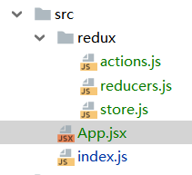
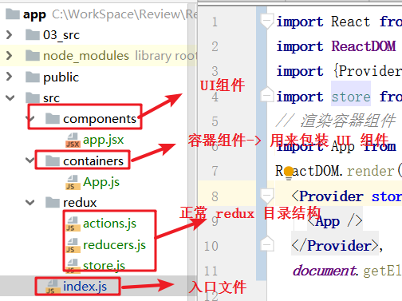
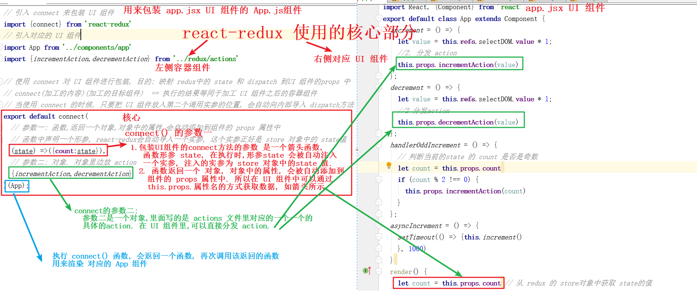
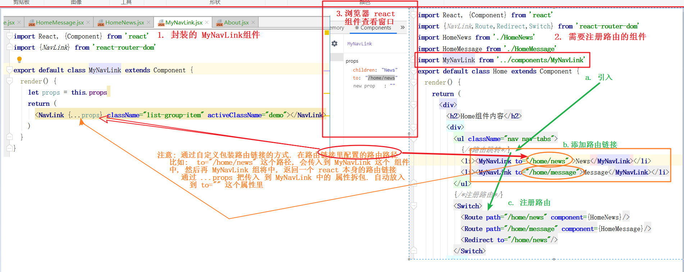
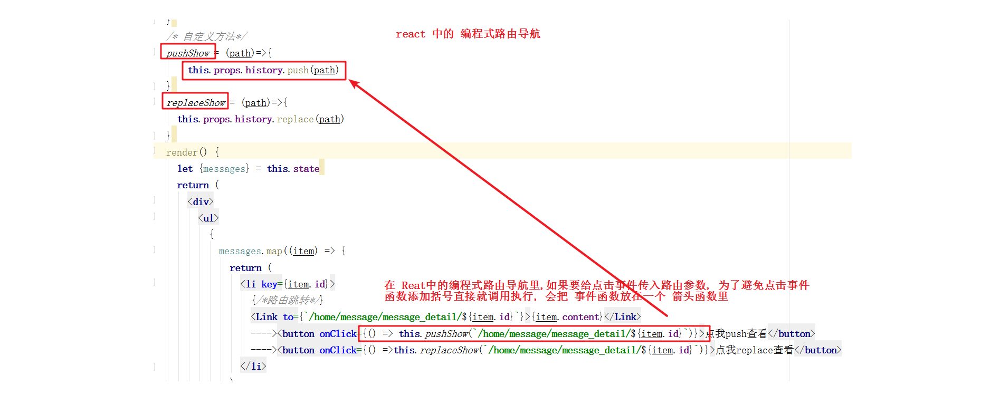
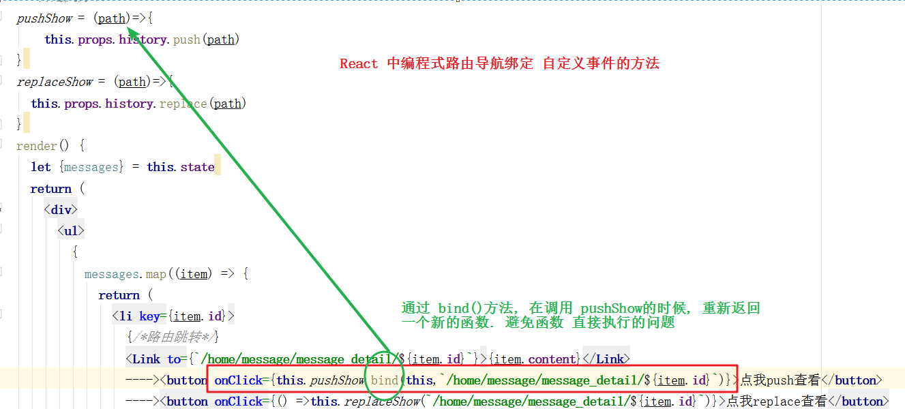
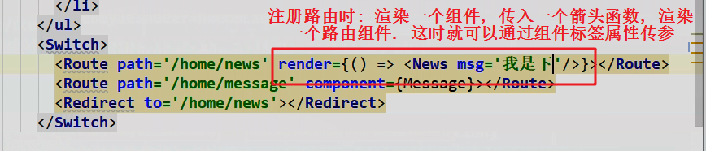
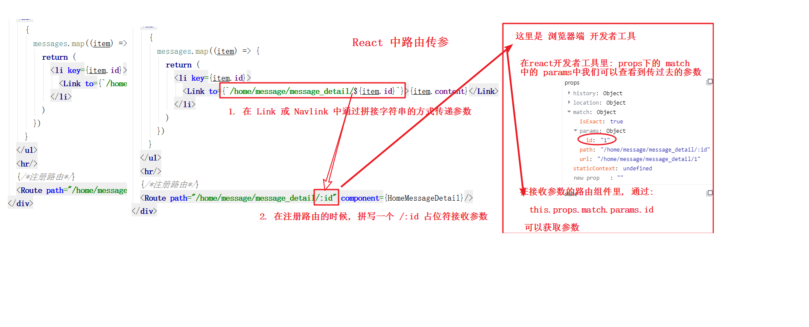

[TOC]

# React应用(基于脚手架)

# 1.0 React 脚手架 

## 1.1 React应用(基于脚手架) 

> 1. xxx 脚手架: 用来帮助程序员 快速创建一个 基于 xxx 库的模板项目
>
>    > 1. 包含了所有需要的配置
>    > 2. 指定好了所有的依赖
>    > 3. 可以直接 安装/编译/运行一个简单效果
>
> 2. react 提供了一个用于创建 react 项目的脚手架库:  create-react-app
>
> 3. 项目的整体技术架构为: react + webpack + es6 + eslint
>
> 4. 使用脚手架开发项目的特点: 模块化, 组件化, 工程化

## 1.2 创建项目并启动 

> ```js
> 1. npm install create-react-app -g
> 	//(如果上述安装不成功: yarn global add create-react-app  如果使用 yarn 安装, 请执行: yarn global bin  将输出的 安装路径 c:xxx 配置到 环境变量中)
> 
> 2. create-react-app  hello-react  (hello-react 项目名称, 自定义)
> 
> 3. cd  hello-react
> 
> 4. npm start
> ```

> **react 脚手架 目录结构**  
>
> ```js
> ReactNews
> 	|--node_modules---第三方依赖模块文件夹
> 	|--public
> 		|--index.html-----------------主页面
> 	|--scripts
> 		|--build.js-------------------build打包引用配置
> 	|--start.js-------------------start运行引用配置
> 	|--src------------源码文件夹
> 		|--components-----------------react组件
> 		|--index.js-------------------应用入口js
> 	|--.gitignore------git版本管制忽略的配置
> 	|--package.json----应用包配置文件
> 	|--README.md-------应用描述说明的readme文
> ```

## 1.3 demo: 评论管理案例

# 

# 

# 2.0 React中 组件间的通信方式

> **React 中组件间通信的方式一共有三种** 
>
> - **通过 props** 属性传递参数
> - **PubSubJS** 消息订阅发布的方式通信
> - **redux**     的方式实现组件间通信

## 2.1 方式一: 通过 props传递

> 1. **共同的数据放在 父组件上**, 特有的数据放在自己组建内部. (state对象中)
> 2. 通过 props 可以**传递一般数据**和**函数数据**, 只能一层一层传递 
> 3. 一般数据:  --->  父组件传递数据给子组件  ---> 子组件读取数据
> 4. 函数数据 ---> 父组件传递个函数给子组件 ---> 子组件通过调用父组件传递过来的数据,传入参数.  ==实质是:  子组件传递数据给父组件.==   
>
> 5. **==兄弟之间传递:==**  
>
>    > **兄弟之间传递:  必须借助于父组件, 如果是:  A--->B , 过程如下**
>    >
>    > ​	首先由 父组件 给 A 组件一个函数属性, 由 A 调用时传参, 参数到达父组件, 并维护到 父组件的状态中.
>    >
>    > ​	当渲染 B 组件标签的时候, 从 父组件中, 再把数据通过标签属性的方式传递给 B 组件.
>
> 6.  祖孙之间的通信
>
>    > 逐层依次传递参数实现通信 

## 2.2 方式二: pubsubJS 消息订阅-发布

> [PubSub的github地址](https://github.com/mroderick/PubSubJS)       
>
> ==**使用消息订阅(subscribe) - 发布(publish) 的机制**==    
>
> **特点:**   
>
> > 理论上适用于所有组件之间的通信.
> >
> > 不用借助任何  "中间人" 来实现
> >
> > 使用频率:   绝大部分功能会采用此方式

> 1. 工具库:  PubSubJS
>2. 下载: `npm  install pubsub-js  --save`
> 3. **使用:**  **详见标题4.0**   PubSub消息订阅-发布  

## 2.3 redux

> 详见 5.0 redux

# 

# 

# 3.0 React ajax请求

> **前置说明:** 
>
> 1. React 本身只关注界面, 并不包含发送 ajax请求的代码
> 2. 前端应用需要通过 **ajax请求**与后台进行交互(json数据)
> 3. react应用中需要集成**第三方ajax库** (或者自己封装). 

> **常用的可以发送 ajax 请求的库** 
>
> 1. **jQuery: 比较重,** 如果需要另外引入不建议使用
>
> 2. **axios:  轻量级**, 建议使用
>
>    > 1. 封装 XMLHttpRequest 对象的 ajax
>    > 2. promise 风格
>    > 3. 可以用在浏览器端和 node 服务器端 
>
> 3. **fetch: 原生函数,**  但老版浏览器不支持
>
>    > 1. 不再使用 XMLHttpRequest 对象提交 ajax 请求
>    > 2. 为了兼容 低版本的浏览器, 可以引入兼容库 fetch.js

## 3.1 axios 

> [axios的 github地址](https://github.com/axios/axios)      

> **axios 的使用**  
>
> 1. **首先, 安装 axios:**  `npm install axios ` 
>
> 2.  **使用 axios 发送请求**  
>
>    - **GET 请求** 
>
>    ```js
>    axios.get('/user?ID=12345')
>      .then(function (response) {
>        console.log(response);
>      })
>      .catch(function (error) {
>        console.log(error);
>      });
>    
>    axios.get('/user', {
>        params: {
>          ID: 12345
>        }
>      })
>      .then(function (response) {
>        console.log(response);
>      })
>      .catch(function (error) {
>        console.log(error);
>      });
>    
>    ```
>
>    - **POST 请求** 
>
>    ```js
>    axios.post('/user', {
>        firstName: 'Fred',
>        lastName: 'Flintstone'
>    })
>    .then(function (response) {
>      console.log(response);
>    })
>    .catch(function (error) {
>      console.log(error);
>    });
>    ```

## 3.2 fetch

> [fetch文档](https://github.github.io/fetch/)   
>
> [fetch中文介绍](https://segmentfault.com/a/1190000003810652)     
>
> **fetch介绍** 
>
> > - 关注分离的方式发送请求
> > - fetch 是 h5 新提出来的发送请求的方式,  在浏览器的 window 对象里存在这样一个 方法: fetch(). 所以使用的时候, 不需要安装任何其他的插件和第三方的库. 
>
> > **fetch 发送请求:**   目前用fetch发送请求的比较少
>
> ```js
>       const url = `https://api.github.com/search/repositories?q=v&sort=stars`
>         fetch(url)
>             .then((response) => {
>                 console.log(response);
>                 // response.json()   // 返回一个 promise 对象
>                 if (response.ok) {
>                     return response.json()
>                 }else{
>                     // return new Promise((resolve,reject)=>{
>                     //     reject('网络不稳定,稍后重试')
>                     // })
>                     // 或者如下简写 Promise
>                     return Promise.reject('网络不稳定,稍后重试')
>                 }
>             })
>             .then((data) => {
>                 console.log("成功了");
>                 console.log(data);
>             })
>             .catch((err) => {
>                 console.log("失败了");
>                 console.log(err,typeof err);
>                 console.log(err.toString(),typeof err);
>             })
> ```
>
> - **坑**
>
>   ```js
>   # 坑: 如果你发送的 协议,地址,域名都正确, 也就是你成功的发送请求到服务器,  但是没有匹配到正确的路径,  fetch 依然会进入成功的回调.  所以需要自己手动 抛出一个错误的 promise()
>   ```

# 

# 

# 

# 4.0 PubSub 消息订阅-发布

> [PubSub的github地址](https://github.com/mroderick/PubSubJS)      

> **PubSubJS 使用**   
>
> 1. **安装 pubsub**   `npm install pubsub-js`  
> 2.  **使用 pubsub**  
>
> ```js
> //1. 安装:  npm install pubsub-js
> 
> //2. 在需要使用 pubsub API 的文件中引入 pubsub
> 		import PubSub from 'pubsub-js'
> 
> # -----------------------------------------------------------------
> //3. 发布消息
> 			// 参数一: 字符串类型的标识, 和 消息订阅的第一个参数保持一致.
> 			// 参数二: 需要传递的数据
> 		  PubSub.publish('searchUser',keyWord)
> 
> //4. 订阅消息
> 			// 参数一: 字符串类型的标识, 和 消息发布的第一个参数保持一致
> 			// 参数二: 传入一个回调函数, 处理订阅后消息后的逻辑
> 			 PubSub.subscribe('searchUser',(msg,data)=>{
>          // 回调函数中第一个参数:  msg, 是我们的消息名字 searchUser
>          // 回调函数中的第二个参数: 接收传过来的  数据
>         console.log(msg,data);
>    		 })
> ```

# 


# 5.0 redux 

> [redux英文文档](https://redux.js.org/)    
>
> [redux中文文档](https://cn.redux.js.org/)    
>
> [Github地址](https://github.com/reactjs/redux)   

## 5.1  redux 是什么?

> ==**redux 是一个独立的库, 是一个独立的库, 是一个独立的库**==. 重要的事情说三遍   

> 1. **redux 是一个 独立** 专门用于做**状态集中管理的 JS 库**. (**不是react插件库**) , 只不过 在 react中使用更加合适
> 2. 它可以在 react, angular, vue 等多个项目中, 但基本 **与 react配合使用较多.**   
> 3. **作用:**  **集中式管理** react 应用中多个组件共享的状态数据.  

## 5.2  redux 能干什么?

> **集中式管理 react 应用中多个组件共享的状态数据.**  用于给多个组件进行数据共享

> **一般什么情况下使用 redux?** 
>
> - 总体原则:  能不用就不用, 如果不用比较吃力才考虑使用
> - 某个组件的状态 需要共享的时候才考虑 redux
> - 某个状态需要在 任何地方都可以拿到的时候考虑用 redux
> - 一个组件需要改变全局状态的时候才考虑 redux
> - 一个组件需要 改变另一个组件的状态的时候,  才用 redux

## 5.3  redux 怎么用 ?

> **redux 核心 API**  
>
> 1. createStore()
>    - 作用:  用于创建包含指定 reducer 的 store 对象
> 2. 编码:
>    - import {createStore} from 'redux'
>    - import reducer from './reducer'
>    - const store = createStore(reducer)

> **redux 的三个 核心概念** 
>
> > **action**  
> >
> > - Action 是把数据从应用传到 store的有效载荷. 它是 store数据的 **唯一**  来源. 一般来说, 会通过 store.dispatch() 来将 action 传到  store对象
> >
> > **reducer  ** 
> >
> > - reducers 指定了应用状态变化如何响应 actions 并发送到 store 的.  记住:  actions 只是描述了有事情发生了这一事实, 并没有描述应用如何更新 state  
> > - ==reducer 的本质是一个一个的方法==  
> > - reducer 提供修改 store 中的state 状态数据,  修改的行为发生在 reducer
> >
> > **store** 
> >
> > - ==**Store 是一个对象**==:   Store 就是一个 把它们练习到一起的对象.  Store 有以下职责
> >   - 维持应用的 state 数据
> >   - 提供 `getState() ` 方法获取 state
> >   - 提供 `dispatch(action)` 方法更新 state
> >   - 通过 `subscribe(listener)` 注册监听器
> >   - 通过 `subscribe(listener)`  返回的函数注销监听器
>
> **再次强调一下**:  **==Redux 应用只有一个单一的 store==** .  当需要拆分数据处理逻辑时,  应该使用 reducer 组合, 而不是创建多个 store . 

## 5.4 redux基本使用

> **redux 简单 demo目录结构**  




> 1. **安装redux"**  ` npm install redux   `  
>
> 2. **使用 redux**  
>
>    ```js
>    //1. 在 src 下添加一个 redux目录. 
>    //2. 然后在 redux 目录里创建redux的核心对象 
>    		// store.js 文件	
>    		// reducers.js 文件
>    		// actions.js 文件
>    
>    ```
>
> > ==**案例代码**==  
>
> **App.jsx 组件** 
>
> ```js
> import React, {Component} from 'react'
> import {incrementAction,decrementAction} from './redux/actions'
> export default class App extends Component {
>   componentDidMount() {
>     console.log(this.props.store.getState());
>   }
>   // 自定义方法
>   // 累加
>   increment = () => {
>     // 1. 获取 select的 value值
>     let value = this.refs.selectDOM.value * 1
>     //2 生成 action 对象
>     let actionObj = incrementAction(value);
>     //3. 分发 action 本质: 调用 reducer, 将action对象传给 reducer
>     this.props.store.dispatch(actionObj)
>   }
>   // 递减
>   decrement = () => {
>     // 1. 获取 select的 value值
>     let value = this.refs.selectDOM.value * 1
>     //2 分发action
>     this.props.store.dispatch(decrementAction(value))
>   }
>   // 奇数加
>   handlerOddIncrement = ()=>{
>     // 判断当前的state 的 count 是否是奇数
>     let count = this.props.store.getState()
>     if (count%2 !==0){
>       this.props.store.dispatch(incrementAction(count))
>     }
>   }
>   // 异步加
>   asyncIncrement = ()=>{
>       setTimeout(()=>{
>           this.increment()
>       },1000)
>   }
>   render() {
>     // 从 redux 的 store对象中获取 state的值
>     let count = this.props.store.getState();
>     return (
>       <div>
>         <h1> count: {count} </h1>
>         <select ref='selectDOM'>
>           <option value="1">1</option>
>           <option value="2">2</option>
>         </select>
>         &nbsp;&nbsp;&nbsp;&nbsp;
>         <button onClick={this.increment}>+</button>
>         &nbsp;&nbsp;
>         <button onClick={this.decrement}>-</button>
>         &nbsp;&nbsp;
>         <button onClick={this.handlerOddIncrement}> increment if odd</button>
>         &nbsp;&nbsp;
>         <button onClick={this.asyncIncrement}> increment async</button>
>       </div>
>     )
>   }
> }
> ```
>
> **actions 对象** 
>
> ```js
> // actions: 提供最新数据的,  是 store 对象 唯一的数据源
> /*
> * action 本质: 是一个对象
> *    但是定义的时候, 需要定义成一个方法.
> *    所以调用这个方法获取返回值的时候, 我们可以返回一个对象
> * */
> // 累加的 action
> export const incrementAction = (number) =>({type:'increment',data:number});
> // 递减的 action
> export const decrementAction = (number) =>({type:'decrement',data:number});
> 
> ```
>
> **reducers文件** 
>
> ```js
> //1. 定义reducers
> /**
>  *  reducer 的本质是一个一个的方法
>  *  作用:
>  *    1. 服务 store对象, 为 store 对象提供初始化 state 状态值
>  *    2. 帮助 store 对象修改 state 的状态值
>  *    3. 数据源需要通过 actions 获取
>  *    4. 修改完的数据交给 store对象的 state 中
>  *
>  *  action 为我们提供的是一个对象
>  *  action = {data:最新的数据, type: 修改数据的类型 }
>  */
> // counterReducer 这个方法需要两个参数: state, action
> function counterReducer(state=0, action) {
>   console.log('counterReducer()',state,action);
>   // 修改状态
>   switch (action.type) {
>     case 'increment':
>       // 原有的 state 数据 + action.data
>       // 一旦 return, 就会自动放在 store 对象里面 最新的 state 上去更新
>       return state + action.data
>     case "decrement":
>       return state - action.data
>     default:
>       // return 初始化的 state
>       return state
>   }
> }
> export default counterReducer
> ```
>
> **store.js 文件** 
>
> ```js
> import {createStore} from 'redux'
> import counterReducer from './reducers'
> 
> //1. 创建 store 对象, 管理 reducer
> let store = createStore(counterReducer)
> //2. 暴露 store对象. 管理所有组件的状态. 所以倒给整个应用的入口文件
> export default store
> ```
>
> **index.js 入口文件**    
>
> ```js
> import React from 'react'
> import ReactDOM from 'react-dom'
> import store from './redux/store'
> import App from './App'
> ReactDOM.render(
>   <App store={store}/>,
>   document.getElementById('root'))
> // ------------------------------------------------------
> // 监听 store 对象发生是否变化的 方法
> store.subscribe(() => {
>   console.log("我监听到 store 你变化了. . .");
>   // 监听到store变化之后, 再次重新渲染一下组件
>   ReactDOM.render(
>     <App store={store}/>,
>     document.getElementById('root'))
> })
> ```
>
> 

> **总结:** 
>
> 1. store
>
>    - 管理 state
>    - 管理 reducer
>
> 2. reducer
>
>    - 负责修改 state 状态值的
>    - 数据源需要 action 来提供
>
> 3. action
>
>    - action 本质是对象: {type:修改state的方式, data:参与修改 state的数据}
>    - 定义action的时候: 定义一个函数, 目的是动态给 action设置 data
>
> 4. dispatch
>
>    - 作用:  分发 action
>    - 到底做什么了:
>      - 传递了 action 对象
>      - 间接导致 store 去 调用 reducer
>
> 5. 获取 state 状态数据
>
>    - ```
>     this.props.store.getState()
>     ```
>  ```
> 
>  ```
>
> ```
> 
> 6.  监听 state 变化. | 在 index.js 入口文件处, 监听, 监听完再次重新渲染组件
> 
>    - store.subscribe(()=>{})
> 
> ​```js
> console.log("我监听到 store 你变化了. . .");
> 
> // 监听到store变化之后, 再次重新渲染一下组件
> ReactDOM.render(
> <App store={store}/>,
> document.getElementById('root'))
> 
> ```
>
> ```
> 
> ```

> **==redux 的使用 思路==**  
>
> ```js
> 1.分析业务逻辑
> 	>1. 要托管什么数据
>   >2. 怎么修改数据(方向)
> 
> #-------------------------------------------------------------------------
> 2. 使用 redux
> 	>1. 创建 store 对象, 暴露
>   >2. 创建 reducer
>  		>- 关注 reducer 的行为
>     >- reducer: 返回状态值给 store对象
>     >- 初始化给 store对象状态值
>     >- 分发 action的时候, 根据 action的 type类型以及 action.data决定 如何修改状态, 并将修改后的状态值, 交给 store
>     >- 如何匹配 action.type:  switch,  case
>     
> # -------------------------------------------------------------------------
> 3. 设计 action
> 	>1. action 本质是一个对象: {type:行为, data:数据}
>   >2. 但是我们通常定义为函数, 返回对象: 为了能够动态的设置 data数据
>   
> # -------------------------------------------------------------------------
> 4. 组件 和 redux 交互
> 	>1. 组件中一定要获取到 store 对象
>   >2. 获取 redux 中的状态: this.props.store.getState()
> 	>3. 组件中分发 action: this.props.store.dispatch(action)
> 
> # --------------------------------------------------------------------------
> 5. 监听 store 是否变化, 重新渲染整个组件
> 	#注意: 因为需要重新渲染整个组件, 所以效率并不高, 所以实际开发的时候, react中不会使用 redux 库. 
>   # 而是使用 react-redux 这个专门为 react使用的 react 插件库
> ```

# 

# 

# 6.0 react-redux

> **react-redux 介绍:**
>
> > ```js
> > 1. react-redux 是一个 react 插件库.
> > 
> > 2. 专门用来简化 react 应用中使用redux
> > 
> > 3. react-redux 底层也是基于 redux 封装的.
> > ```
>
> **react-redux 中将所有组件分成两大类**  
>
> 1.  **UI 组件**  
>
>    ```js
>    1. 只负责 UI 呈现, 几乎没有 和 redux 耦合
>    2. 通过 props 接收数据,(一般数据和函数)
>    3. 不适用 任何 Redux 的 API
>    4. 一般保存在components 文件夹下
>    ```
>
> 2.  **容器组件 ** 
>
>    ```js
>    1. 负责管理数据和 业务逻辑, 不负责 UI 的呈现
>    2. 使用 Redux 的API
>    3. 一般保存在 containers 文件夹下
>    ```

## 6.1 react-redux 的使用

> react 中直接使用 redux 的时候, 全局渲染组件, 效率不高.
>
> **但是**:  **react-redux** 实现了 管理状态数据的时候, **只是局部渲染**.   

> > **react-redux 相关 API **  
> >
> > - **Provider**
> >
> >   ```js
> >   // 让所有组件都可以得到 state 数据
> >   <Provider sotre={store}>
> >     <App />
> >   </Provider>
> >   ```
> >
> > - **connect()**
> >
> >   ```js
> >   // 用于包装 UI 组件生成容器组件
> >   connect(
> >   	mapStateToProps,
> >     mapDispatchToProps
> >   )(Counter)
> >   ```
> >
> > - mapStateToProps
> >
> >   ```js
> >   // 函数: 将 state数据转换为 UI 组件的标签属性
> >   function mapStateToProps(state){
> >     return {
> >       count: state
> >     }
> >   }
> >   ```
> >
> > - mapDispatchToProps 
> >
> >   ```js
> >   // 函数: 将分发 action 的函数转换为 UI 组件的标签属性
> >   
> >   ```

## 6.2 基本使用 步骤

> **react-redux 小练习 目录结构**   
>
> 

> 1. **安装 react-redux 插件**: `npm install react-redux`  
>
> 2. **在 入口文件 index.js 文件中引入 'react-redux'**   
>
>    ```js
>    // 引入 Provider
>    import {Provider} from 'react-redux'
>    
>    // 用 Provider 标签包括需要渲染的组件标签
>    <Provider store={store}>
>        <App />,
>    </Provider>
>    ```

> **react-redux 使用案例代码实现** 
>
> - **index.js 文件** 
>
> ```js
> import React from 'react'
> import ReactDOM from 'react-dom'
> import {Provider} from 'react-redux'
> import store from './redux/store'
> // 渲染容器组件
> import App from './containers/App'
> ReactDOM.render(
>   <Provider store={store}>
>     <App />
>   </Provider>,
>   document.getElementById('root'))
> ```
>
> -  **components 目录下的 app.jsx 的 UI 组件**  
>
> ```js
> import React, {Component} from 'react'
> export default class App extends Component {
>   // 自定义方法
>   // 累加
>   increment = () => {
>     // 1. 获取 select的 value值
>     let value = this.refs.selectDOM.value * 1;
>     //2. 分发 action
>     this.props.incrementAction(value)
>   };
>   // 递减
>   decrement = () => {
>     // 1. 获取 select的 value值
>     let value = this.refs.selectDOM.value * 1;
>     //2 分发action
>     this.props.decrementAction(value)
>   };
>   // 奇数加
>   handlerOddIncrement = () => {
>     // 判断当前的state 的 count 是否是奇数
>     let count = this.props.count
>     if (count % 2 !== 0) {
>       this.props.incrementAction(count)
>     }
>   };
>   // 异步加
>   asyncIncrement = () => {
>     setTimeout(() => {
>       this.increment()
>     }, 1000)
>   }
>   render() {
>     // 从 redux 的 store对象中获取 state的值
>     let count = this.props.count
>     return (
>       <div>
>         <h1> count: {count} </h1>
>         <select ref='selectDOM'>
>           <option value="1">1</option>
>           <option value="2">2</option>
>         </select>
>         &nbsp;&nbsp;&nbsp;&nbsp;
>         <button onClick={this.increment}>+</button>
>         &nbsp;&nbsp;
>         <button onClick={this.decrement}>-</button>
>         &nbsp;&nbsp;
>         <button onClick={this.handlerOddIncrement}> increment if odd</button>
>         &nbsp;&nbsp;
>         <button onClick={this.asyncIncrement}> increment async</button>
>       </div>
>     )
>   }
> }
> ```
>
> - **containers 目录下的 App.js 容器组件: 用来包装 UI 组件**  
>
> ```js
> // 引入 connect 来包装 UI 组件
> import {connect} from 'react-redux'
> // 引入对应的 UI 组件
> import App from '../components/app'
> import {incrementAction,decrementAction} from '../redux/actions'
> 
> // 使用 connect 对 UI 组件进行包装, 目的: 映射 redux中的 state 和 dispatch 到UI 组件的props 中
> // connect(加工的内容)(加工的目标组件)  == 执行的结果等同于加工 UI 组件之后的容器组件
> // 当使用 connect 的时候, 只要把 UI 组件放入第二个调用实参的位置, 会自动向内部导入 dispatch方法
> export default connect(
>   // 参数一: 函数,返回一个对象,对象中的属性 会自动添加到组件的 props 属性中
>   // 函数中声明一个形参, react-redux会自动导入一个实参, 这个实参正好是 store 对象中的 state值
>   (state) =>({count:state}),
>   // 参数二: 对象. 对象里边放 action
>   {incrementAction,decrementAction}
> )(App);
> ```
>
> > **redux 目录**
>
> - **actions.js 文件** 
>
> ```js
> // actions: 提供最新数据的,  是 store 对象 唯一的数据源
> /*
> * action 本质: 是一个对象
> *    但是定义的时候, 需要定义成一个方法.
> *    所以调用这个方法获取返回值的时候, 我们可以返回一个对象
> * */
> // 累加的 action
> export const incrementAction = (number) =>({type:'increment',data:number});
> // 递减的 action
> export const decrementAction = (number) =>({type:'decrement',data:number});
> ```
>
> - **reducers.js 文件**  
>
> ```js
> //1. 定义reducers
> /**
>  *  reducer 的本质是一个一个的方法
>  *  作用:
>  *    1. 服务 store对象, 为 store 对象提供初始化 state 状态值
>  *    2. 帮助 store 对象修改 state 的状态值
>  *    3. 数据源需要通过 actions 获取
>  *    4. 修改完的数据交给 store对象的 state 中
>  *
>  *  action 为我们提供的是一个对象
>  *  action = {data:最新的数据, type: 修改数据的类型 }
>  */
> // counterReducer 这个方法需要两个参数: state, action
> function counterReducer(state=0, action) {
>   console.log('counterReducer()',state,action);
>   // 修改状态
>   switch (action.type) {
>     case 'increment':
>       // 原有的 state 数据 + action.data
>       // 一旦 return, 就会自动放在 store 对象里面 最新的 state 上去更新
>       console.log("-----",state,action.data);
>       return ++state
>     case "decrement":
>       return state - action.data
>     default:
>       // return 初始化的 state
>       return state
>   }
> }
> export default counterReducer
> ```
>
> - **store.js 文件** 
>
> ```js
> import {createStore} from 'redux'
> import counterReducer from './reducers'
> 
> //1. 创建 store 对象, 管理 reducer
> let store = createStore(counterReducer)
> //2. 暴露 store对象. 管理所有组件的状态. 所以倒给整个应用的入口文件
> export default store
> ```

## 6.3 react-redux 使用详细图解

**react-redux demo 核心部分** 



## 6.4 redux 的异步编程

## redux-thunk 异步中间件

> **redux 本身不能处理异步行为,** 所以需要用到异步中间件  `redux-thunk`  
>
> 

> **redux-thunk 异步中间件的使用**   
>
> 1. **安装 redux-thunk** 
>
>    ```js
>    npm install  redux-thunk --save
>    ```
>
> 2.  在 store 中声明允许使用异步中间件
>
>    ```js
>    #// 在 redux 中添加 applyMiddleware 允许使用中间件
>    import {createStore,applyMiddleware} from 'redux'
>    import counterReducer from './reducers'
>    // 引入 react 的中间件
>    import thunk from 'redux-thunk'
>    #//1. 创建 store 对象, 管理 reducer. 声明使用异步中间件thunk. 此时就可以在 action 中处理异步任务了.
>    let store = createStore(counterReducer,applyMiddleware(thunk))
>    //2. 暴露 store对象. 管理所有组件的状态. 所以倒给整个应用的入口文件
>    export default store
>    ```

> **总结: ** 
>
> 1. redux 处理异步任务
>
> ```js
> 1. redux 本身不能处理异步任务
> 2. 需要使用中间件: redux-thunk
> 3. 安装异步中间件:  npm install redux-thunk
> 4. 在创建 store 对象的时候, 声明使用 中间件: 
> 		import {createStore,applyMiddleware} from 'redux'
> 		let store=createStore(counterReducer,applyMiddleware(thunk))
> 
> ```
>
> 2. 同步 action 和 异步 action 定义方式
>
>    ```js
>    1. 同步 action: 直接定义方法返回对应的 action
>    2. 异步 action: 核心思想: 异步action 返回值还是一个函数, redux 会自动将 dispatch 注入. 什么时候分发action 使用者说了算
>    
>    		export const asyncIncrementAction = function (number) {
>          return dispatch => {
>            // 处理异步行为: 发送异步请求, 开启定时器
>            setTimeout(()=>{
>              dispatch(incrementAction(number))
>            },2000)
>          }
>        }
>    ```
>
>    


## 6.5 redux-devtools 调试工具

> 1. 在 谷歌浏览器中的应用商场安装 redux-devtools 工具
>
> 2.  但是只在 谷歌浏览器中安装 redux-devtools 工具, 还看不到内容, 需要在你的电脑本地安装扩展程序.
>
>    ```
>    npm install redux-devtools-extension --save-dev  
>    ```
>
> 3.  在 store.js 文件中, 引入 `redux-devtools-extension` 的一个工具中的 composeWithDevTools 方法.
>
>    ```js
>    import {composeWithDevTools} from 'redux-devtools-extension'
>    
>    // 用 composeWithDevTools() 方法放入 applyMiddleware(thunk) 这个参数
>    let store = createStore(counterReducer,composeWithDevTools(applyMiddleware(thunk)))
>    
>    ```
>
> 4.  然后重新启动项目, 在浏览器的 redux 插件中就可以看到 redux 的内容
>
>    

# 

# 

# 7.0 路由  react-router-dom

> **路由** 
>
> 1. **什么是路由?**   
>    - 一个路由就是一个 映射关系(key-value的映射关系) 
>    - key 为路径 , value 可能是 function / component 
> 2. **路由分类**   
>    - 后台路由: node服务器端, value是function, 用来处理客户端提交的请求, 返回一个响应数据
>    - 前台路由:  浏览器端路由, value是component, 当请求的路径是 path 时, 浏览器端没有发送 http 请求, 但界面会更新显示对应的组件
> 3.  **后台路由 **    
>    - 注册路由:  router.get(path,function(req,res))
>    - 当 node 接收一个请求的时候, 根据请求路径找到匹配的路由, 调用路由中的函数来处理请求, 返回响应数据
> 4. **前台路由**   
>    - 注册路由:  <Route path="/about" component={About}> 
>    - 当浏览器的 hash 变为 #about 时, 当前路由组件就会变为 About 组件

## 7.1 react-router-dom 路由的使用

> **router 路由**  
>
> 1. 路由器:  <BrowserRouter>  <HansRouter>
> 2. 路由:     <Route>
> 3. 路由链接: <Link />   <NavLink />
> 4.  ==路由性能优化:  Switch ---> 只要匹配成功, 就停止匹配==   

## 7.2  声明式路由的使用

> - 声明式路由
> - 编程式路由

> [react-router-dom插件官网](https://reacttraining.com/react-router/web/guides/quick-start)    
>
> **1.  下载 react-router-dom:**  
>
> ```js
> npm install --save react-router-dom@4   
> ```
>
> 2. 在需要用路由的地方按需要引入路由器中的 api. 然后使用配置路由
>
> ```js
> // 在父级组件里, 如果需要使用路由组件, 按照如下步骤配置
> import {NavLink,Route,Redirect,Switch} from 'react-router-dom'
> 
> //1. 配置路由链接. (即: 点击该路由链接, 跳转到对应的 路由)
> <NavLink className="list-group-item" activeClassName="demo"  to="/about">About</NavLink>
> 
> # 声明式路由上可以添加 replace={true} 属性, 来表示其是否可以留下历史记录.(即: 路由跳转后能够回退)
> <NavLink className="list-group-item" replace={true} activeClassName="demo" to="/home">Home</NavLink>
> 
> 
> //2.  注册路由:  react中, 路由组件内容是在注册路由的位置显示的
> 		   <Switch>
>        <Route path="/about" component={About}/>
>        <Route path="/home" component={Home}/>
>        <Redirect to="/about"/>
>     </Switch>
> 
> #//3. 注意: 在 index.js中, 一定要用路由器, 包裹住渲染的根组件, 即: App 组件
> 			// 引入 
> 		import {BrowserRouter} from 'react-router-dom'
> 
> 			// 包裹住 App 根组件
> 		   <BrowserRouter>
>      <App />
>  	</BrowserRouter>,
> ```

## 7.3 嵌套路由 & 包装路由

> 通常,  路由链接里经常会有许多相同的 **类属性** 或 其他属性,  有时候,为了简化路由的编写, 我们自己也会实现路由的包装, 把路由上共同的属性提取出来, 包装出一个自己的 **路由链接**
>
> 1.  **封装一个 MyNavLink 组件, 并暴露出去以供其他组件使用** 
>
> ```js
> import React, {Component} from 'react'
> import {NavLink} from 'react-router-dom'
> 
> export default class MyNavLink extends Component {
>   render() {
>     let props = this.props
>     return (
>       <NavLink {...props} className="list-group-item" activeClassName="demo"></NavLink>
>     )
>   }
> }
> 
> ```
>
> 2.  **包装 NavLink 实现的图解**   
>
> 
>
> 


## 7.4 编程式路由

> **编程式路由导航**  
>
> > 编程式路由导航,   **如果在绑定 onClick事件需要传递参数的话,**  如果事件后面加上了 括号, 就会直接调用执行. 所以会 一直循环执行该函数. 因此我们有如下两种 解决办法
>
> 1. **通过传入 箭头函数, 执行返回一个新的函数的方式解决** 
>
> 
>
> 2. **通过 bind的方法, 返回新的函数** 
>
>    

## 7.5 React中 路由 传参 

> 1. **params 传参** 
>
>    - **注册路由:**  <Route path="路由路径/:key" component=P{路由组件}>   
>    - **请求路由链接:**  <Link to=`路由路径/value`>  
>    - **组件内部获取参数数据:**  `this.props.match.params.key = value`    
>
> 2.  **通过 props 传参**  
>
>    - **注册路由:**  <Route path="/home/news" render={()=> <News msg="我是通过props向路由组件传递的参数" /> }></Route>
>    - **请求路由链接:**  同上
>    - **组件内部获取参数数据**  `this.props.key=value`
>
>    

> **路由组件传参的方式:**   
>
> - 通过在写路由链接的时候, 可以动态传递参数
> - 在 注册路由的时候,  可以在路由路径后面拼写一个 **/:id** 占位符来接收参数 
> - 在接收路由参数的路由组件里, 可以在 其 props 下的 match 里面 params 参数里可以查看和获取传递过来的参数  this.props.match.params  
>
> **路由组件传递参数图解:**  
>
> 

## 7.6 react中路由实现原理

> ```js
> <Route path="/" component={Test}>Test</Route>
> <Route path="/about" component={About}>About</Route>
> <Route path="/home" component={Home}>Home</Route>
> <Redirect from="/aaa" to="/about"></Redirect>
> ```
>
> 在react路由中, 注册路由时,  路由中的 path 匹配的时候, ==默认是模糊匹配.==   当请求匹配路径的时候,  容易出现问题
>
> ```js
> # 如上面:  当你请求路径 /about 的时候, 因为根路径 "/" 在 "/about"上面, 所以当匹配的时候, 会优先匹配根路径对应的路由组件 "/",  匹配完之后, 又会继续匹配 "/about". 所以此时页面上会渲染出两个路由组件的内容.
> 
> # 所以一般要把 根路由放在所有匹配的路由的最下面 如下
>   <Route path="/about" component={About}>About</Route>
>   <Route path="/home" component={Home}>Home</Route>
>   <Redirect from="/aaa" to="/about"></Redirect>
>   <Route path="/" component={Test}>Test</Route>
> ```

## 7.7 路由性能优化

> **==注意:==**  **路由的 exact 属性, 虽然可以实现路由的精准匹配, 但是也不能随意都添加 exact来控制让路由精准匹配, 因为当一个路由有二级或三级子级路由的时候,  用了 exact 属性, 会导致 子路由无法匹配**   

> **==基于 6.6 路由模糊匹配出现的问题.==** 我们要想办法解决. 可以发现. 路由里面有一个属性.  **==exact==** . 用来实现路由精准匹配. 
>
> > **==模糊匹配出现的问题是: 容易出现匹配多个路由的问题==**   
>
> ```js
> # 注册路由时, 添加 exact 属性. 实现精确匹配  
> <Route exact={true} path="/about" component={About}>About</Route>
>   <Route path="/home" component={Home}>Home</Route>
>   <Redirect from="/aaa" to="/about"></Redirect>
>   <Route path="/" component={Test}>Test</Route>
> ```
>
> **==但是==**  精准匹配, 虽然解决了模糊匹配的问题, 但是它匹配完之后, 依然会继续向下查找匹配是否还有其他相同的路由. 比如如下. 在开始匹配一个根路径. 在结束也匹配一个根路径
>
> ```js
>  # 开始匹配一个根路径
> <Route path="/" component={Test}>Test</Route>
> <Route exact={true} path="/about" component={About}>About</Route>
>   <Route path="/home" component={Home}>Home</Route>
>   <Redirect from="/aaa" to="/about"></Redirect>
> # 结束也匹配一个根路径.
>   <Route path="/" component={Home}>Home</Route>
> 
> # ----------------------------------------------
> # 此时我们会发现, 如果你请求 "/" 根路由. 匹配完第一个 Test 后, 还会继续向下匹配. 最终又 匹配到 最后那个 "/" 根路由对应的 Home
> 
> # 因此还是存在路由匹配性能差的问题
> ```
>
> **==解决路由匹配性能差的问题==**    
>
> **在注册路由的时候, 最外层添加一个 ==Switch== 标签包裹所有路由**   
>
> ```js
> <Switch>
> 	 # 开始匹配一个根路径
> <Route path="/" component={Test}>Test</Route>
> <Route exact={true} path="/about" component={About}>About</Route>
>   <Route path="/home" component={Home}>Home</Route>
>   <Redirect from="/aaa" to="/about"></Redirect>
> # 结束也匹配一个根路径.
>   <Route path="/" component={Home}>Home</Route>  
> </Switch>
> 
> # -------------------------------------
> 
> # 采用这种方式匹配路由的时候,  如果我们再 请求 "/" 根路径的时候, 它在匹配完第一个 "/" 路径对应的 Test 组件的时候, 不会再继续向下匹配 第二个 "/" 根路径对应 的 Home 组件了. 
> 
> # 因此, 用这种方式可以实现路由的性能优化 
> ```
>

## 7.8 路由重定向

> 路由重定向: Redirect
>
> - <Redirect to="重定向之后的路由路径"> : 不配合 Switch有强制性, 每次都会重定向
> - Redirect 通常会配合 Switch 使用
> - <Redirect from="重定向之前的路径" to="重定向之后的路由路径">
> - **Redirect 路由组件不要放在路由的最前边, 通常放在最后面.**   如果 Redirect 放在最前边的时候,  **容易出现路由重定向成功, 但是 无法显示重定向之后的路由组件的内容.** (因为 Switch的原因)      


# 

# 

# 8.0 antd

> [antd官网地址](https://ant.design/index-cn)   
>
> `antd` 是基于 Ant Design 设计体系的 React UI 组件库，主要用于研发企业级中后台产品。 

## 8.1 antd 的使用

> **antd 的基本使用**  
>
> 1. 安装 antd: `npm install antd --save`   
>
> 2.  使用 antd 的组件
>
>    ```js
>    //1. 安装 antd 第三方组件库
>    //2. 引入 需要用到的 antd 组件
>    	// import Button from 'antd/es/button';
>        import {Button} from "antd";
>    
>    //3. 引入 antd 的样式
>    	 import 'antd/dist/antd.css'
>    
>    ```
>
> **antd 的按需引入**  
>
> 1. 使用 antd 的按需引入, 需要安装一下  ` npm install react-app-rewired customize-cra` 这两个库
>
> 2.  修改 package.json 文件中的 **scripts**   
>
>    ```js
>    "start": "react-app-rewired start",
>    "build": "react-app-rewired build",
>    "test": "react-app-rewired test",
>    "eject": "react-scripts eject"
>    ```
>
> 3.  在项目的根目录创建一个  `config-overrides.js` 文件, 用于修改默认配置
>
>    ```js
>    module.exports = function override(config, env) {
>      // do stuff with the webpack config...
>      return config;
>    };
>    ```
>
> 4.  使用 **babel-plugin-import**  
>
>    > [babel-plugin-import](https://github.com/ant-design/babel-plugin-import) 是一个用于按需加载组件代码和样式的 babel 插件（[原理](https://ant.design/docs/react/getting-started-cn#按需加载)），现在我们尝试安装它并修改
>
>    -  **安装 babel-plugin-import**   `npm install babel-plugin-import`  
>
>    -  修改 **config-overrides.js** 文件
>
>      ```js
>      const {override, fixBabelImports} = require('customize-cra');
>      
>      module.exports = override(
>        fixBabelImports('import', {
>          libraryName: 'antd',
>          libraryDirectory: 'es',
>          style: 'css',
>        }),
>      );
>      ```
>
> 此时再使用组件的时候, 就可以直接使用我们需要的组件就可以了, **不需要再手动全局引入所有的样式.  实现了样式的按需加载**    


