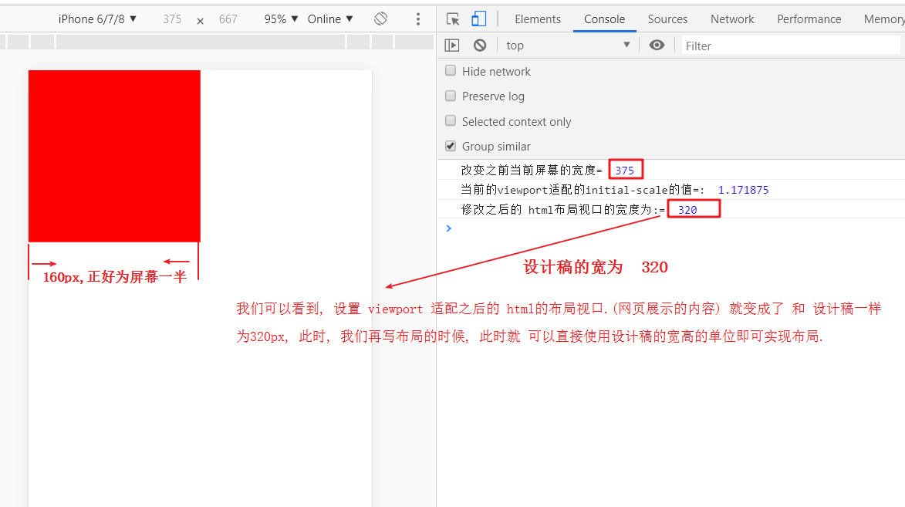
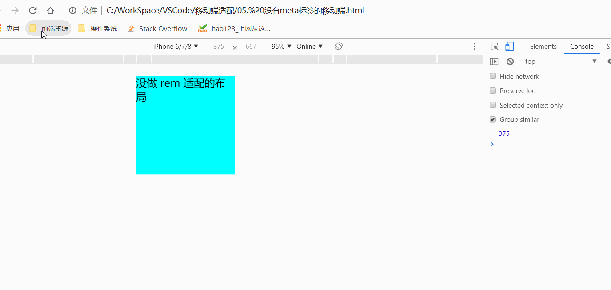
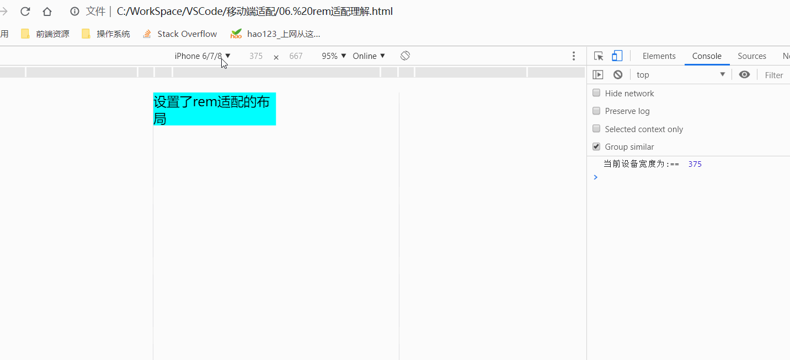

[TOC]


# 1.0 屏幕尺寸,分辨率,像素密度

1. 屏幕尺寸(**英寸**), 屏幕分辨率, 屏幕像素密度

   1. 屏幕尺寸：   (设备厂商规定,不能修改大小)

      指屏幕的对角线的长度，单位是英寸，1英寸=2.54厘米。

       常见的屏幕尺寸有2.4、2.8、3.5、3.7、4.2、5.0、5.5、6.0等。
   
   > ==屏幕尺寸 和 屏幕分辨率 设备厂商规定, 都不能修改==  
   >
   > ==屏幕越大,不一定越清晰,  分辨率越大, 也不一定越清晰. 而是 像素密度越大, 成像才会越清楚.==   
   >
   > **但是:**  ==在相同的尺寸下, 分辨率越高, 就越清楚== 

```js
# 屏幕分辨率(固定)：（iphone6  750*1334(像素点数)）(设备厂商规定,不能修改大小)
		指在横纵向上的像素点数，  单位是px，1px=1个像素点。一般以纵向像素*横向像素来表示一个手机的分辨率，
	   如1920*1080。（这里的1像素指的是物理设备的1个像素点）
	            
# 屏幕像素密度/ 像素密度/ 屏幕密度：  (总像素点 / 英寸大小) 
		屏幕上每英寸可以显示的像素点的数量, 单位是ppi (DPi)，即“pixels per inch”的缩写。
		屏幕像素密度与 屏幕尺寸和 屏幕分辨率有关

```

```js
//    iPhone  物理尺寸(pt:Point)(英寸)   		分辨率(px)
//    4S        320*480(3.5英寸)    	 			640*960
//    5,5c,5S   320*568(4英寸)       				640*1136
##    6         375*667(4.7英寸)     				750*1334 (iPhone6 实际的物理像素 750)
//    6P        414*736(5.5英寸)     				1242*2208(1080*1920)
    
//    4之前      1pt = 1px
//    4之后,6之前 1pt =  2px
//    6p         1pt = 3px
```

# 1.1 物理像素,CSS像素

设备像素 /  物理像素:  (分辨率)

- 买手机的时候会有一个 n x m 的分辨率，那是屏幕的n x m个呈像的点.
- 一个点（小方格）为一个物理像素, 它是屏幕能显示的最小粒度.

```js
## 设备像素 (物理像素)
1. 设备像素也被称为物理像素,他是显示设备中一个最微小的物理部件。
	 每个像素可以根据操作系统设置自己的颜色和亮度。
     任何设备的物理像素的 数量都是固定的 
 
## CSS像素   (与设备无关的像素)
1. CSS像素是一个抽象的单位，主要使用在浏览器上，用来精确的度量（确定）Web页面上的内容。
  - 它是为web开发者创造的，在css或者javascript中使用的一个抽象的层
  - 一般情况下，CSS像素被称为与设备无关的像素（device-independent像素），简称为“DIPs”
  #  - 在一个标准的显示密度下 (普通屏) ，普通屏下一个CSS像素对应着一个设备像素
  - 
    
## CSS像素和 物理像素的关系
	- 一个width为200px的元素，它占据了200个css像素，但200个css像素占据多少个物理像素取决于:   屏幕的特性(是否是普通屏 或 是否是高密度,即像素比）和用户的缩放行为。

	- 在苹果的视网膜屏幕上，视网膜的像素密度是普通屏幕的两倍，这个元素就跨越了400个设备像素,  如果用户放大，它将跨越更多的设备像素

## 设备独立像素 (设备无关像素)
1. 设备独立像素(也叫密度无关像素)，可以认为是计算机坐标系统中得一个点.  这个点代表一个可以由程序使用的虚拟像素(比如: css像素)，
	然后由相关系统转换为物理像素。
    
    
## 位图像素: 
1. 一个位图的像素是栅格图像(如：png, jpg, gif等)最小的数据单元,
	1个位图像素对应于1个物理像素，图片才能得到完美清晰的展示
    
## 对于web开发者而言：
	我们使用的每一个css和javascript定义的像素本质上代表的  都是css像素，我们在开发过程中,  并不在意一个css像素到底跨越了多少个设备像素。我们  将这个依赖于屏幕特性和用户缩放程度的   复杂计算交给了浏览器。
	 
            
## 像素比
1.像素比:
	它的官方的定义为：设备物理像素 和 设备独立像素的比例.
    也就是 devicePixelRatio = 物理像素 / 独立像素
	window.devicePixelRatio

```

# 1.2 视口 和 浏览器窗口

>  在普通的桌面端，视口的默认宽度和浏览器窗口的宽度一致。

```js
	在移动端,浏览器厂商面临着一个比较大的问题,他们如何将数以万计甚至可以说是数以亿计的pc端网页完整的
呈现在移动端设备上,并且不会出现横向滚动条?
	我们都知道pc端网页一般都为960px或者1024px，那么要完整的放下它们，我们移动端浏览器必须要有个容器放下它吧，
而且只有有了这个容器我们才能很好的规定到底我移动端的浏览器到底能放下多大的页面吧（可能大于960也可能大于1024）。
	这个数值最好大于960，而且设备间的这个容器大小是没有太大差异的	

	而且基于用户体验我们更关心width
```

> 移动端浏览器厂商是不是得做点什么了（这个容器应该由浏览器厂商设置）
>
> ==移动端 浏览器默认的 布局视口 大部分都是  980==   

1. 在 PC 端:

   我们浏览器的 布局视口是要小于我们的屏幕的，一般默认情况下是等于

2. 在 移动端

```js
 我们浏览器的视口（布局视口）是要远大于我们的屏幕的独立设备像素的  
 移动端浏览器厂商要实现的目标：
 	在小屏幕的移动设备上，尽可能的缩小网站来让用户看到网站的全貌
```

# 1.3 PC 视口

```js
#1. 不包含滚动条   document.documentElement.clientWidth
  获取浏览器窗口 # 文档显示区域 # 的宽度，不包括滚动条。
// 最干净的, 最常用的, 不包含滚动条

# " 文档区域的高度 和 宽度 "
1. console.log(document.documentElement.clientWidth);
2.  console.log(document.documentElement.clientHeight)
-----------------------------------------------------
    
#2.包含滚动条      window.innerWidth
// 获取浏览器可视区域的宽度，也就是文档页面的宽度, 包含滚动条
2. console.log(window.innerWidth);

#3. window.outerWidth整个浏览器宽度,包括检查侧边栏,边框滚动条
// 获取浏览器窗口宽度, 表示整个浏览器窗口的宽度, 包括边框.
3. console.log(window.outerWidth);
------------------------------------------------
#4. 获取屏幕的宽度  screen.width
// 获取屏幕的宽度.
4. console.log(screen.width)
```

# 1.4 meta 标签

> **meta(苹果发明的，桌面浏览器不支持)**

> :smile:  :smile::smile: ​ meta 标签的常见的几个属性
>
> ==没有 meta标签==
>
> ```js
> 缺点: 文本过小, 体验效果差, 页面压缩
> 优点:  不写meta标签是 等比缩放
> 
> # 没写 meta 标签时
> iPhone6
> 		物理像素: 750
> 		设备独立像素: 375
> 		css像素:  980
> ```
>
> ==有meta 标签== 
>
> ```js
> 优点:  元素显示清晰,   整个像素体系变得完整
> 缺点:   写 meta标签是 不等比缩放
> 
> #写了meta标签之后
> iPhone6
> 		物理像素: 750
> 		设备独立像素: 375
> 		css像素:    375  # 此时设备独立像素 就 等于了 设备独立像素(而设备独立像素其实就是我们看到的视觉视口的宽度)
> ```
>
> ==meta标签的常见几个属性详解== 

```js
#  <meta name="viewport" content="width=device-width">
	 # width: 指的是 布局视口
   # device-width: 设备独立像素  375

#	initial-scale 初始缩放比例 (系统缩放)
	//缩放是根据理想视口来计算的, 这个缩放不同于我们用户的缩放, 它会使  布局视口 跟随 我们的视觉视口 一起转变. 所以只设置 initial-scale = 1. 其实等同于只设置 width=device-width

	user-scalable 是否允许缩放 （no||yes）,默认允许
	
	minimum-scale 允许缩放的最小比例
	maximum-scale 允许缩放的最大比例 
	target-densitydpi 
		-- dpi_value 70–400 //每英寸像素点的个数
		-- device-dpi 设备默认像素密度2
		-- high-dpi 高像素密度	
		-- medium-dpi 中等像素密度
		-- low-dpi 低像素密度
		-- webkit内核不再支持了
	height

<meta name="viewport" content="width=device-width,height=device-height,user-scalable=no,
initial-scale=1.0,minimum-scale=1.0,maximum-scale=1.0,target-densitydpi=device-dpi" /> 
```

# 1.5 width

> width: 就是用来控制布局视口的大小的，width=device-width会使布局视口的大小变成理想视口的大小
>
> （即独立设备像素代表的值）

```js
95%的浏览器都支持width=device-width

```

> **inital-scale**

```js
1. 缩放是根据理想视口来计算的，这个缩放不同于我们用户的缩放，它会使布局视口 跟随着我们的 视觉视口一起转变
	所以只设置inital-scale=1 其实等同于只设置width=device-width	 
# 以 iPhone6 为例
# 只设置 initial-scale=2 的时候
	html 的默认布局视口会 变成 187.5   //   375/2  device-width / initial-scale = 布局视口

# 只设置 initial-scale=0.5 的时候
	html 的默认布局视口会变成 750.    //   375/0.5  device-width / initial-scale = 布局视口

```

## 1.5.2 完美视口

```js
<meta name="viewport" content="width=device-width,initial-scale=1.0,user-scalable=no" />
```

```js
  如果你页面中存在太大的元素，你的meta标签只使用width=device-width，initial-scale=1.0中的
一个，有些浏览器会扩展布局视口的宽度来容纳这个元素，这里的兼容性很复杂，但你两个都使用了，
大部分浏览器都不会改变布局视口了
```

## 1.5.3 width与inital-scale之间的冲突

```js
布局视口  在width与inital-scale产生分歧时会选择他们中比较大的那一个

-----------------------------------------------------
###minimum-scale 允许缩放的最小比例
###maximum-scale 允许缩放的最大比例   	
	没有这些指令，默认为20%-500%
	有这些指令后可扩大到10%-1000%
安卓webkit不支持这两个属性（默认缩放范围为25%-400%）,  ie压根不认识他们俩
```


```js
##1. 没有meta 标签
 - 缺点: 文本过小, 体验效果差, 页面压缩
 - 优点: 等比
 - 以 iPhone 为参考
 	物理像素：750
    设备独立像素：375
    css像素：980
 ----------------------------------------------
##2 有 meta 标签
	- 优点: 元素显示清晰
      整个像素体系变得完整了 (1 css像素 == 4 物理像素) dpr=2
	- 缺点: 不等比 (适配)

	物理像素：750
    设备独立像素：375
    css像素：375
    
    设备独立像素 = css像素 
	dpr = 物理像素/设备独立像素  = 物理像素/css像素

```

# 1.6 三个视口

## 1.6.1 layout viewport和visual viewport

1. **布局视口**

> **layout viewport:** 

```js
手机上，为了容纳为桌面浏览器设计的网站，默认的布局视口的宽度远大于屏幕的宽度
```

```js
1. 布局视口的出现，在极大程度上帮助了桌面网站到移动设备上的转移。
   可以通过document.documentElement.clientWidth来获取 

2. 在pc端，单独一个width为20%的元素最终拿到的值要根据初始包含块的width来决定，
   因为我们横向的布局都是按初始包含块开始填的，在移动端一样，不过我们这个时候应该叫它布局视口。
```

2. **视觉视口**

> **visual viewport:**

```js
1. 视觉视口与设备屏幕一样宽，并且它的css像素的数量会随用户的缩放而改变
2. visual viewport的宽度可以通过 window.innerWidth 来获取，
    但在Android 2, Oprea mini 和 UC 8中无法正确获取

```

3. **理想视口**

> 理想视口

```js
我们分析知道：布局视口的默认宽度并不是一个理想的宽度，对于我们移动设备来说，最理想的情况是
	用户刚进入页面时不再需要缩放。这就是为什么苹果和其他效仿苹果的浏览器厂商会引进理想视口！

```

```js
只有是专门为移动设备开发的网站，他才有理想视口这一说。而且只有当你在页面中加入viewport的meta标签，
理想视口才会生效。

<meta name="viewport" content="width=device-width" />
这一行代码告诉我们，布局视口的宽度 应该与 理想视口 的宽度一致

    # width: 布局视口
	# device-width: 设备独立像素的值     375

	# 布局视口 = 视觉视口 = 理想视口 = 375
```

## 1.6.2 meta 标签

> <meta name="viewport" content="width=device-width" />
>	width [pixel_value | device-width] width 
> 		-- 直接去设置具体数值大部分的安卓手机是不支持的 但是IOS支持

```js
1.在桌面浏览器中,最干净的那个视口就是约束你的css布局的视口,它决定了用户能看到什么
	
2.在移动设备上,视口被分为了两个:布局视口限制了你的css布局,视觉视口会决定用户能看到什么

3.在移动设备上,还有一个理想视口,它是对于特定设备上特定浏览器的布局视口的一个理想尺寸

4.可以把布局视口的尺寸设置为理想视口,本质上,这就是移动端设计的基础
```

## 1.6.3 缩放:

> **默认情况下（没有meta标签）**
>
> ```js
> 1. 布局视口的宽度要大于视觉视口，且此时没有理想视口这一说。
> 2. 由于视觉视口决定了用户能看到什么，我们想要让用户看到整个布局视口的内容，我们需要使 视觉视口 的尺寸跟 布局视口一样大
> ```

```js
1. 我们可以认为布局视口和视觉视口（默认情况下也应该由独立像素定义尺寸）之间有一段距离，
   这段距离的长短决定了缩放的程度。但仅仅是可以这么认为
   真正的缩放控制的不是他们之间的距离，他们之间本身也没有距离。
   从技术层面上来讲,缩放就是放大或缩小css像素大小（面积）的过程,改变的是视觉视口的尺寸（放大操作，看见的东西越来越少）
------------------------------------------------------------------------------
1.  放大
    会使一个css像素的面积变大
    一个css像素所包含的物理像素个数变多
    视觉视口所包含的css像素的个数变少

2. 缩小（默认情况下（没有meta标签）其实已经有了一个缩小操作了）
    会使一个css像素的面积变小
    一个css像素所包含的物理像素变少
    视觉视口所包含的css像素的个数变多

```

```js
1. 布局视口，视觉视口，理想视口 其实最终代表的都是屏幕的尺寸, 在屏幕这一块尺寸中，不同的视口它包含了多少个css像素的个数 （布局视口里面包含的css像素个数不变, 视觉视口，理想视口会随缩放而改变）
----------------------------------------------------------------------------
1. 布局视口：
    默认情况下				980个css像素
    加meta标签后			设备独立像素所代表的值

2. 视觉视口：
    用户放大或者系统放大时   视觉视口所包含的css像素的个数变少
    用户缩小或者系统缩小时   视觉视口所包含的css像素的个数变多

3. 理想视口
    由于理想视口只有在加meta后才会出现，理想视口的尺寸等于设备独立像素所代表的值
---------------------------------------------------------------------------
###思考视口的主线
    1.三个视口最终代表的就是屏幕尺寸
    2.只不过在不同的条件下，三个视口所包含的css像素的个数存在差异
```

```js
###缩放
	从技术层面上来讲,缩放就是放大或缩小css像素大小的过程,改变的是视觉视口的尺寸

# 放大
	所包含的css像素的个数变少（视觉视口应该包含你设备独立像素值所对应的css像素）

# 缩小（默认情况下（没有meta标签）其实已经有了一个缩小操作了）
    会使一个css像素的面积变小
    一个css像素所包含的物理像素变少
    视觉视口所包含的css像素的个数变多
------------------------------------------------------------------------
### 移动端的缩放没有改变布局视口的任何东西！！！！！！！！！！！！！！！！！

pc端：
	缩放会改变视口（视口变小）

移动端：
	缩放会改变视觉视口的尺寸，不会改变布局视口的尺寸
```

1.6.4 PC端与移动端缩放

> ==PC缩放==  
>
> ```js
> PC缩放:
> 	页面布局会发生改变
>   元素大小不变, CSS 像素面积变了
>   布局视口区域变小了 
> 
> ```
>
> ==移动端缩放==  
>
> ```js
> # 移动端放大:
>     布局不变, 出现横向滚动条,  布局视口不变
>     css像素面积变大, 元素本身具体像素值不变.
>     css像素面积变大,  css 像素占据的物理像素个数变多
> 
>     视觉视口变小 ( 可见的内容 ), 视觉视口里面盛装的 css 像素个数变少
>      
> # 移动端缩小
> 	 	布局不变,  布局视口也不会发生改变
> 		css 像素面积变小, 元素具体像素值不变
> 		css 像素面积变小之后, css 像素占据物理像素的个数变少
>     视觉视口变大( 可见的内容 ), 视觉视口里边盛装的 css 像素个数变多.
>     
> ```
>
> ==移动端的缩放没有改变布局视口的任何东西     !!!!!!!!!!==     

# 1.7 移动端基础事件

> :triangular_flag_on_post::triangular_flag_on_post: ​移动端 的​事件 只能通过 dom2 的方式注册事件

```js
# 移动端 的​事件 只能通过 DOM2 的方式注册事件
# 最好不要用 box.ontouchstart = function() {} 这种方式.
----------------------------------------------------

# DOM2 事件监听的方式注册事件
box.addEventListener('touchstart',function () {
        console.log('start')
    });
    box.addEventListener('touchmove',function () {
        console.log('move')
    });
    box.addEventListener('touchend',function () {
        console.log('end')
    });
```

# 

# 2.1 event 移动端参数

```js
###1.手指列表 (数组)
changedTouches      目标元素目标事件上的手指列表
targetTouches		目标元素上的手指列表
touches				屏幕上的手指列表.

###2. 获取文档内容高度的方法(干净的方法)
	document.documentElementclientHeight;

###3. 获取 视口的 高度
	content.offsetHeight;

```


# 2.2 适配方案

## 2.2.1  rem 适配

> 1. em 单位是通过元素自身的 font-size 来控制的一个单位
>
> 父级的 font-size 能够 影响子级 em 的取值是因为 font-size可以继承
>
> 2. rem 单位是通过 html  根元素的 font-size 来确定
> 3.  常见页面分份儿: 10,  16,  20

> **rem介绍**  
>
> - rem 是什么?
> - ==rem适配也是目前应用最多的适配方案==    
>
> ```js
> 它的全称是 font size of the root element  #（即:根元素的字体大小）
> 它是CSS3中新增加的一个尺寸（度量）单位，根节点（html）的font-size决定了rem的尺寸，也就是说它是一个相对单位，相对于(html)。
> ```
>
> - **浏览器的默认字体**  
>
> ```js
> 浏览器的 html 根元素 默认的 font-size是16px，1rem默认就等于16px。（chrome最小字体为12px）
> 
> # 即:  1rem = 根元素 html 的 font-size.
> ```
>
> -  **设置 html 根元素的  font-size 来改变 rem 尺寸** 
>
> ```js
>  html{
>        font-size:20px;
>  }
>  .box{
>    width:1rem;
>    height:1rem;
>    background-color:purple;
>  }
> 
> # 此时 将根元素html的font-size设置为20px，此时box的宽高都为20px，也就是1rem = 20px
> ```

> ==rem  适配的代码.==  

```js
// 1. 添加 meta 标签
  <meta name="viewport" content="width=device-width,initial-scale=1,user-scalable=no" />
      
//！()()  立即执行函数 
		!(function(){
//2. 获取设备 屏幕宽度
      var width = document.documentElement.clientWidth;
//3. 创建style标签
      var styleNode = document.createElement('style');
      styleNode.innerHTML = 'html{font-size: '+ width/16 +'px !important;}'; 
      document.head.appendChild(styleNode);		
		})();

```

> ==rem适配代码详解== 
>
> ```js
> <!DOCTYPE html>
> <html lang="zh-CN">
> <head>
>   <meta name="viewport" content="width=device-width,initial-scale=1.0, user-scalable=no">
>   <title>Gene </title>
>   <style type="text/css">
>     * {
>       margin: 0;
>       padding: 0;
>     }
> 
>     #box {
>       width: 1rem;
>       height: 1rem;
>       background-color: cyan;
>     }
>   </style>
> </head>
> <body>
>   <div id="box"></div>
>   <script type="text/javascript">
>     !(function (params) {
>       // 获取屏幕的宽度
>       // 添加了 meta标签的width=device-width 此时布局视口宽度 是 iPhone6 标准 375
>       var width = document.documentElement.clientWidth 
>       console.log(123123123123,width);
> 
>       // 创建一个 style 节点
>       var styleNode = document.createElement("style")
>       // style 节点里设置 html 的字体大小
>       // styleNode.innerHTML = 'html {font-size:' + width + 'px;}' // 此时 1 rem = 375px
> 
>       styleNode.innerHTML = 'html {font-size:' + width / 16 + 'px;}' // 此时 1 rem = 23.4375
>       document.head.appendChild(styleNode)
>     })()
>     console.log("做了meta标签适配的布局视口宽度",document.documentElement.clientWidth);
>   </script>
> </body>
> </html>
> ```
>
> 

## 2.2.2 viewport 适配

>viewport 适配
>
>​	ui 设计稿: 320
>
>把屏幕区域无论是 375 还是 (414), 统一变成设**计稿统一的宽度 320** 
>
>==即: 统一把屏幕的宽度设置成和设计稿一样的宽度==  
>
>1. 布局视口: width: 320   **(直接设置值的情况安卓不兼容)**  
>2. initial-scale =  ???  直接等比缩放
>  -  放大操作 : initial-scale > 1;
>  - 设计稿为 320             目标设备的设备独立像素为 375  放大多少倍才能在 该设备上等比完整显示  ?????.    则  initial-scale = 375 / 320
>  - 通常情况下, 设计稿规定大小, 但是 不同设备 的设备独立像素不同,所以375这个值是通过 动态获取当前机型的 设备独立像素的方式 来跟  设计稿做比值运算,    求出的比值  再 重新赋值给meta 标签

1.  **viewport 适配 代码如下**  

```js
<!DOCTYPE html>
<html lang="en">
<head>
  <meta charset="UTF-8">
  <meta name="viewport" content="width=device-width,initial-scale=1, user-scalable= no">
  <title>probeGene</title>
  <style>
    * {
      margin: 0;
      padding: 0;
    }
    #box {
      width: 160px;
      height: 160px;
      background-color: red;
    }
  </style>
</head>
<body>
  <!-- div 就相当于模拟整个页面的设计稿, 要实现能跟设备宽实现等比缩放-->
  <div id="box"></div>
  <script type="text/javascript">
    // 获取屏幕宽度  375 ( 或者其他值 )
    var width = document.documentElement.clientWidth;
    console.log("改变之前当前屏幕的宽度= ",width);
    // 设计稿的 宽度
    var targetW = 320;
    // 求出比例  (屏幕宽度 / 设计稿宽度)
    var scale = width / targetW;
    console.log("当前的viewport适配的initial-scale的值=: ",scale);
    // 获取meta标签
    var metaNode = document.querySelector("meta[name=viewport]");
    // 将 求出的 比例 设置给 meta 标签. 
    metaNode.setAttribute("content", "initial-scale=" + scale + ", user-scalable= no")
    console.log("修改之后的 html布局视口的宽度为:= ",document.documentElement.clientWidth);
  </script>
</body>
</html>

```

> ==viewport适配的详解== 
>
> 

2. **viewport 适配的优缺点**  

```js
###viewport 适配的优点:
1. 用 viewport 做适配, 可以不用考虑所有布局相关的兼容性问题,可以直接当 PC 的页面来布局排列.(可以布局简单, 写起来会比较容易)

### viewport 适配的缺点
1. 如果设计稿非常小, 那么 当设计稿放在一个 很大的屏幕上的时候, 放大倍数比较多的时候, 容易虚, 失真.    (有些设备支持性不太好).
  
```

## 2.2.3   1px适配 

>1px 适配 的最终目的是 让  **1 个CSS像素** 跟  **1个物理像素相等.** 即: 1px 适配 = 物理像素
>
>

```js
# 1PX 适配 == 物理像素

```

# 

---

# 3.0

# 

----

# 4.0

# 

# 5.0 ==适配总结==  

> 1. **什么是适配?** 
>
>    - 适配:  是为了让   **用一套网页布局的代码, 在不同的移动端的设备上显示的效果一样.**
>
>    ```js
>    1. 在移动端默认的 页面的大小(布局视口)是  980px(css像素) 
>    
>    ```

## 5.1 没有做 适配

> ==没有设置 rem 适配的 演示==  
>
> 

> **代码:** 
>
> ```js
> <!DOCTYPE html>
> <html lang="zh-CN">
> <head>
>   <meta name="viewport"
>     content="width=device-width,initial-scale=1.0,maximum-scale=1.0,minimum-scale=1.0 user-scalable=no">
>   <title>Gene </title>
>   <style type="text/css">
>     * {
>       margin: 0;
>       padding: 0;
>     }
>     .box {
>       width: 187.5px;
>       height: 187.5px;
>       font-size: 20px;
>       background-color: cyan;
>     }
>   </style>
> </head>
> <body>
>   <div class="box">
>     没做 rem 适配的布局
>   </div>
>   <script type="text/javascript">
>     console.log(document.documentElement.clientWidth);
>   </script>
> </body>
> </html>
> ```
>
> **分析:** 
>
> ```js
> # 从演示效果我们可以看到, 同一套代码,在不同设备上的布局显示效果不一样
> 
> # 我们以 iPhone6 为例设置的盒子 宽高为 187.5 px(css像素). 在 iPhone6 的机器上,正好占设备的一半. 但是 在不同的设备宽度下,  同样的这个盒子显示的效果不一样. 所以我们需要实现  用一种单位 来设计的代码布局, 能够适合不同的 手机设备. 所以此时我们就需要根据机型做出适配.
> ```

## 5.2 做了适配的演示及代码

> ==做了 rem 适配的演示及== 
>
> 

> **代码:**  
>
> ```js
> <!DOCTYPE html>
> <html lang="zh-CN">
> <head>
>   <meta name="viewport"
>     content="width=device-width,initial-scale=1.0,maximum-scale=1.0,minimum-scale=1.0 user-scalable=no">
>   <title>Gene </title>
>   <style type="text/css">
>     * {
>       margin: 0;
>       padding: 0;
>     }
>     .box {
>       width: 0.5rem;
>       height: 50px;
>       font-size: 20px;
>       background-color: cyan;
>     }
>   </style>
> </head>
> <body>
>   <div class="box">设置了rem适配的布局</div>
>     <script>
>       !(function () {
>       // 获取屏幕的宽度
>       var width = document.documentElement.clientWidth
>       console.log("当前设备宽度为:== ",width); // 打印出不同设备的宽度
>       // 创建一个 style 节点
>       var styleNode = document.createElement("style")
>       // 这里设置 html 的font-size之后不再等分几份. 即: 这里 1rem = width(获取的设备宽度)
>        styleNode.innerHTML = 'html {font-size:' + width + 'px;}'
>       document.head.appendChild(styleNode)
>       })()
>     </script>
> </body>
> </html>
> ```
>
> **分析解释** 
>
> ```js
> # 我们可以发现, 设置了 rem 适配后的这一套代码的 显示的布局, 无论在 哪种宽度的移动设备上, 刷新显示之后, 我们发现, 采用了 rem 为单位的这个盒子,始终占 当前设备的一半.  所以显示的布局效果不会发生改变, 会给用户看到很好的效果. 所以我们做移动端要考虑到适配的情况. 
> ```
>
> 


